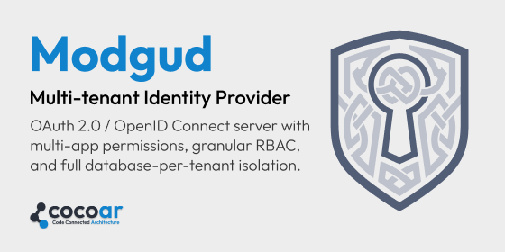

# Modgud



**Self-hosted multi-tenant Identity Provider for ASP.NET Core.**
OAuth 2.0 / OpenID Connect server with database-per-realm isolation,
multi-app permission catalogs, Keycloak-style `resource_access`
emission, full 2FA spectrum, GDPR self-service.

[](LICENSE)
[](https://dotnet.microsoft.com/)
[](./docs/roadmap.md)

## What you get

- **Multi-tenant by design** — every realm gets its own PostgreSQL
  database via Marten's `MasterTableTenancy`. Domain-based routing
  maps `Host` headers to tenants. No `tenant_id` columns; physical
  database separation prevents query-level tenant mixing.
- **Multi-app permission model** — Apps are first-class. Permissions
  are 2-segment (`<resource>:<action>`) inside an app's catalog. Two
  bypass tiers, no more. Application roles bind to one App; a pure
  `realm:admin` role is the explicit realm-local exception. Groups
  carry a `BoundTo` activation list.
- **Keycloak-shaped `resource_access` authorization claims** — when a
  token targets a registered OAuth API and requests `roles` and/or
  `permissions`, Modgud emits a block keyed by that API's exact
  audience, with bypass pre-expansion and per-RS subset narrowing.
  `Modgud.AspNetCore.ResourceServer` projects only its configured
  audience block into native role and permission claims.
- **Full 2FA spectrum + WebAuthn** — TOTP, Email-OTP, FIDO2/Passkey,
  Magic Link, recovery codes. 2FA enforcement middleware with grace
  period and per-user override.
- **OIDC and SAML 2.0 federation** — Microsoft Entra ID and
  standards-compatible OIDC or SAML identity providers. Modgud consumes SAML
  as an SP; it does not issue SAML assertions. JIT user provisioning +
  JavaScript claim-mapping (`UserUpdateScript`).
- **Dynamic Client Registration (RFC 7591)** with triple opt-in
  (realm master / per-API / per-scope), audience-target containment,
  full audit-event trail.
- **GDPR-ready** — Article-20 self-service export, three-step
  account deletion with confirmation token, Marten data-masking +
  `ArchiveStream` for irreversible PII erase with audit-chain
  integrity preserved.
- **Observability built-in** — OpenTelemetry metrics + traces,
  Prometheus scrape endpoint, custom IdP meter, in-app live
  activity feed.
- **Two instances, updates without downtime** — run two containers
  against one PostgreSQL behind a sticky reverse proxy and replace
  them one after the other; Wolverine coordinates projections and
  the outbox, Quartz runs clustered, live updates cross nodes over
  a Postgres backplane. No second stateful service. The database
  itself is still one — this is update- and container-resilience,
  not a full HA story yet. See
  [Running two instances](./docs/operate/deployment.md#running-two-instances).
- **Recovery CLI** — shell-authorized first installation plus
  break-glass admin paths (`install-link`, `bootstrap-admin`,
  `reset-2fa`, `magic-link`, `rebuild-projections`) when the UI can't
  help you.

## Quick links

| | |
|---|---|
| [📘 Get Started](./docs/getting-started/) | What this is, requirements, first-time setup |
| [⚡ Quickstart (Docker)](./docs/getting-started/quickstart.md) | From `docker compose up` to first login in 10 minutes |
| [🧑‍💻 Developing locally](./docs/contribute/developing-locally.md) | Running from source: dev loop, `*.localhost` realms, recovery CLI, tests |
| [🧠 Concepts](./docs/concepts/) | Realms, apps, permissions, OAuth, tokens — the mental model |
| [🛠️ Operate](./docs/operate/) | Deployment, observability, recovery CLI, feature flags |
| [👤 Administer](./docs/admin/) | Users, groups, roles, OAuth clients, login providers |
| [🔌 Integrate](./docs/integrate/) | Plug your ASP.NET Core / SaaS app into Modgud |
| [📖 Reference](./docs/reference/) | OAuth / Auth / Admin / Realm endpoint reference |
| [🗺️ Roadmap](./docs/roadmap.md) | What ships today, what's coming, what's intentionally out of scope |
| [📦 Releases](https://github.com/cocoar-dev/modgud/releases) | Versioned releases with hand-written release notes — the canonical changelog |

## Status

**Pre-1.0, actively developed.** The [Roadmap](./docs/roadmap.md)
is the canonical view of what's shipped and what's coming next — it
gets revised when something lands.

Built by [COCOAR e.U.](https://cocoar.dev). See
[CONTRIBUTING.md](./CONTRIBUTING.md) for how PRs and issues are
handled.

## Build it yourself

```bash
# Prereqs: .NET 10 SDK, Node 22 + pnpm (via Corepack), Docker

# Backend (port 9099)
cd src/dotnet
docker exec cocoar-postgres psql -U postgres -c "CREATE DATABASE modgud;"
cd Modgud.Api
ASPNETCORE_ENVIRONMENT=Development dotnet run --no-launch-profile

# Frontend (port 4300, separate terminal)
cd src/frontend-vue
pnpm install
pnpm dev
```

That is the short version. [Developing locally](./docs/contribute/developing-locally.md)
is the full one and the page that is kept in sync with the code: the
Postgres container, what the first boot actually does, reaching tenant
realms at `*.localhost`, the recovery CLI, demo seed data, tests and
Playwright.

On an empty database, issue a short-lived installation URL with
`recover install-link`. The browser form (or the same API from CI) creates the
first ordinary realm, marks it as the Control Plane, and creates its first
`realm:admin`. [First-time setup](./docs/getting-started/first-time-setup.md)
covers the complete interactive and automated flow.

## Contributing

PRs welcome for typos and small fixes — for anything bigger, please
open a [Discussion](https://github.com/cocoar-dev/modgud/discussions)
first. The [Contributing guide](./CONTRIBUTING.md) has the full
ground rules.

Security vulnerabilities **do not** go through the public issue
tracker — see [SECURITY.md](./SECURITY.md) for the private channel.

## About the name

**Modgud** takes its name from **Móðguðr**, the watcher of
*Gjallarbrú* in Norse mythology — a bridge between worlds, where
she challenged every traveler with the same question an IdP asks:
*"Who are you, and what brings you here?"* A fitting namesake.

## License

Licensed under the [Apache License, Version 2.0](./LICENSE).
"Modgud" and the Modgud shield are trademarks of COCOAR e.U. —
see [TRADEMARK.md](./TRADEMARK.md) for the practical rules.

Copyright © 2025–2026 [COCOAR e.U.](https://cocoar.dev), Vienna,
Austria.
