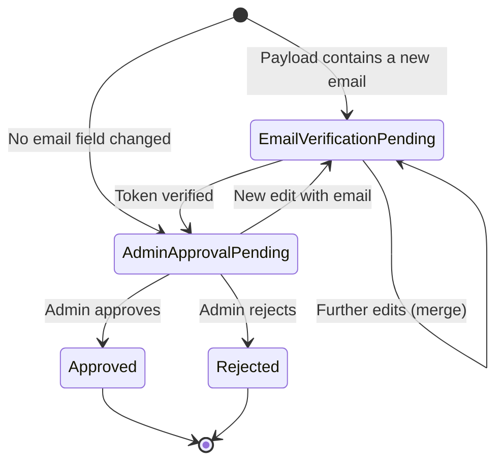
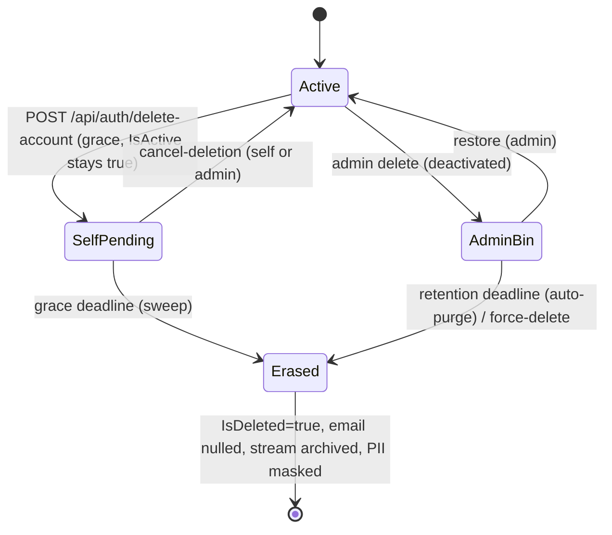

# Modgud.Authentication — slice blueprint

How the authentication slice is built. This page is pure
implementation reference — for the user-facing story see the public
docs (`/concepts/authentication`, `/integrate/login-flows`,
`/integrate/two-factor`, `/integrate/login-providers`).

## Project layout

Standalone C# project at `src/dotnet/Modgud.Authentication/`, kept
separate from `Modgud.Api` so the authentication core (Identity
adapter, login flows, 2FA, OIDC external auth, sessions, GDPR,
AuthLog, recovery CLI) can evolve independently from the IdP-specific
layers stacked on top. Consumed by `Modgud.Api` via `ProjectReference`.
Wires up through two entry points:

| Entry point | Where called | What it does |
|---|---|---|
| `services.AddModgudAuthentication(opts)` | `Program.cs` | DI registrations (Identity, Fido2, services, hosted services) |
| `martenOpts.UseModgudAuthentication()` | Marten configure callback | document mappings, event aliases, inline projections, masking rules |

The slice owns everything below `/api/account/*`, `/api/admin/users/*`,
`/api/admin/idp-config/*`, `/api/admin/auth-log/*`, plus the
`recover` CLI subcommand surface. It does **not** own:

- HTTP endpoints for groups/roles/principals (those belong to
  `Modgud.Authorization`)
- Realm routing (`RealmMiddleware` in `Modgud.Api`)
- OAuth/OIDC server endpoints (OpenIddict + Marten stores in
  `Modgud.Api`)

## Configuration interfaces

The slice depends on three interfaces that the Api layer registers as
singletons against its own settings types — keeps the slice decoupled
from `AppSettings`.

| Interface | Fields | Implemented by |
|---|---|---|
| `IAuthSettings` | `AuthenticationMinimumLevel`, `MagicLinkSelfService`, `TwoFactorGracePeriodDays` | `AppSettings` |
| `IServerConfiguration` | `AppUrl`, `PublicUrl` | `StartUpConfiguration` |
| `IMagicLinkConfiguration` | `Enabled`, `ExpirationMinutes`, `RateLimitMinutes` | `MagicLinkConfiguration` |

```csharp
builder.Services.AddSingleton<IAuthSettings>(sp => sp.GetRequiredService<AppSettings>());
builder.Services.AddSingleton<IServerConfiguration>(sp => sp.GetRequiredService<StartUpConfiguration>());
builder.Services.AddSingleton<IMagicLinkConfiguration>(sp => sp.GetRequiredService<MagicLinkConfiguration>());
```

## Dependencies

| Hard | Reason |
|---|---|
| Marten 9+ | Document storage (Identity, challenges, change requests, AuthLog, IdpConfig) + event store |
| WolverineFx.Marten | Handler discovery (RecoveryCli, IdP event handlers) |
| ASP.NET Core Identity | `UserManager`, `SignInManager`, `IUserStore` interfaces |
| Fido2NetLib | FIDO2/WebAuthn attestation + assertion |
| OtpNet (via Identity DefaultTokenProviders) | TOTP code generation + verification |
| Jint | JavaScript runtime for `UserUpdateScript` (OIDC claim mapping) |
| Serilog | `AuthLogSink` implements `ILogEventSink` |
| Modgud.Authorization | `PrincipalProjectionBase` for the app-specific projection |

## ASP.NET Identity adapter

`ApplicationUser` is the Identity entity. Storage is event-sourced
under the hood: `EventSourcedUserStore` implements the dozen-or-so
Identity store interfaces (`IUserStore`, `IUserPasswordStore`,
`IUserEmailStore`, `IUserLockoutStore`, …) by reading a Marten
aggregate built from the user's event stream.

`AppSignInManager` is a thin override of the Identity
`SignInManager<ApplicationUser>` that lets the slice intercept
`SignInOrTwoFactorAsync` to drive the `Modgud.2FA` partial cookie
manually.

## Cookies & schemes

The slice owns four cookie schemes. All except `Modgud.Session` are
ASP.NET Identity cookies; `Modgud.Session` is ASP.NET Core session
backed by Marten `DistributedMemoryCache`.

```
┌────────────────────────────────────────────────────────┐
│  Modgud.Auth          ASP.NET Identity App-Cookie      │
│  HttpOnly, SameSite=Lax, Secure (Prod)                 │
│  ExpireTimeSpan = 30 days, SlidingExpiration = true    │
│                                                        │
│  Session cookie:    RememberMe=false → expires when    │
│                     the browser closes                 │
│  Persistent:        RememberMe=true → 30 days          │
│  Passkey/MagicLink: always persistent, 30 days         │
└────────────────────────────────────────────────────────┘

┌────────────────────────────────────────────────────────┐
│  Modgud.2FA           2FA partial cookie               │
│  Valid 5 minutes — holds the UserId between            │
│  the password step and the TOTP/Email-OTP step         │
└────────────────────────────────────────────────────────┘

┌────────────────────────────────────────────────────────┐
│  Modgud.External      OIDC external cookie             │
│  SameSite=Lax (browser keeps the cookie across the     │
│  IdP redirect)                                         │
│  Valid 10 minutes — Callback → app sign-in             │
└────────────────────────────────────────────────────────┘

┌────────────────────────────────────────────────────────┐
│  Modgud.Session       ASP.NET Session                  │
│  HttpOnly, SameSite=Strict, 5 min idle                 │
│  Only for passkey attestation options (challenge       │
│  store)                                                │
└────────────────────────────────────────────────────────┘
```

`SameSite=Lax` on `Modgud.Auth` is mandatory: `Strict` drops the
cookie on the top-level GET that the external OIDC IdP redirects back
to, which breaks federated SSO. Cross-site POST protection is handled
by `CsrfDefenseMiddleware` (rejects state-changing requests where
`Sec-Fetch-Site` indicates cross-origin) plus, of course, the
`Lax`-by-default browser behaviour.

In production all cookies are `Secure`. In dev `Secure=None` so the
Vite proxy at `http://localhost:4300` can write them.

Realm boundary = cookie domain (Host header). Cookies are not
path-scoped — each realm sits on its own domain. No cross-realm
cookie leakage is possible because the browser scopes by domain.

## 2FA enforcement middleware

`TwoFactorEnforcementMiddleware` runs on every authenticated request
when `IAuthSettings.AuthenticationMinimumLevel >= 1`.

```
Authenticated request
   │
   ▼
TwoFactorEnforcementMiddleware
   │
   ├─ Whitelisted endpoint? (/api/account/me, /logout, /mfa/*,
   │    /email-otp/*, /passkey/*, /change-password)
   │      → pass through
   │
   ├─ User has 2FA OR TwoFactorExempt → pass through
   │
   ├─ SecureSetupDueAt > now → response header carries
   │    GracePeriod=true; request proceeds (non-blocking modal in FE)
   │
   └─ SecureSetupDueAt <= now → 403
        { RequiresSecureSetup: true, GracePeriod: false }
```

`SecureSetupDueAt` is set on the first authenticated request after
level activation (`now + TwoFactorGracePeriodDays`, optionally
overridden per user). When the last 2FA method is removed at level
≥ 1, `SecureSetupDueAt = now` is set immediately — no fresh grace
window. `TwoFactorExempt` is a per-user bypass; the audit log records
who flipped it.

The login endpoint additionally short-circuits ahead of the
middleware: Level 2 → immediate 403 on password login; Level ≥ 1 +
no 2FA + no grace → `RequiresSecureSetup` response from
`/api/account/login` directly.

## OIDC scheme registration (runtime)

The federated-login schemes are not declared at boot — they are
materialised from the `LoginProvider` Marten documents on demand.

```
┌─────────────────────────────────┐
│ POST /api/admin/idp-config      │
│   adds LoginProvider (event)    │
└──────────────┬──────────────────┘
               │
               ▼
┌─────────────────────────────────┐
│ Inline projection updates       │
│ IdpConfig read model            │
└──────────────┬──────────────────┘
               │ Wolverine event
               ▼
┌─────────────────────────────────┐
│ OidcSchemeBootstrapper          │
│ rebuilds the OpenIdConnect      │
│ handler registry — only the     │
│ providers flagged Enabled get   │
│ a scheme                        │
└─────────────────────────────────┘
```

The bootstrapper also runs at startup over every realm — each tenant
DB is opened, providers are read, schemes registered under
`<realm-slug>.<provider-id>` so the redirect-URI namespace doesn't
collide.

`UserUpdateScript` is a Jint-evaluated JS body. Input: the OIDC
claims principal. Output: a JSON patch over the `ApplicationUser`
shape. JIT-create is gated on the script returning a usable `Email`.
The Jint engine is sandboxed: no file IO, no `eval`, capped script
length and runtime by `ScriptInputLimits`.

`ExternalIdentityLink` is the link between `(issuer, subject)` and
the local user. One user can have many links.

## UserChangeRequest

The slice provides a state-machined change-request flow for profile
self-service. The frontend's "edit profile" form does **not** mutate
the user directly — it submits an opaque JSON payload that the slice
materialises as a `UserChangeRequest` aggregate.



**Invariants:**

- **One open request per `(UserId, Type)`** — multiple edits merge
  into the same request via `MutableJsonMerge.MergeDestructive`.
  Prevents silent overwrites when the user edits twice in quick
  succession.
- **Payload is opaque JSON.** `ProfileUpdateDto` uses `Optional<T>`
  fields, so a `null` for `LastName` is distinguishable from
  "field not edited."
- **Revert collapses.** On merge, fields equal to the current user
  value are dropped from the payload — clean self-cancellation, no
  noise in the diff that the admin reviews.
- **Email approval gates on the recipient.** Even after the admin
  approves, the new address is *pending verification* until the
  recipient clicks the link sent to it. The user's effective email
  stays the old one in between.

Admin notification on
`EmailVerificationPending → AdminApprovalPending` is routed via
`IPrincipalEmailResolver` to all members of groups holding the
`realm:admin` role.

## Sessions

`UserSession` is a Marten document (not event-sourced — sessions are
ephemeral state, no audit value in replaying them). Created on every
successful login:

| Field | Source |
|---|---|
| `UserId` | Auth system |
| `SessionId` | Random GUID |
| `IpAddress` | `HttpContext.Connection.RemoteIpAddress` (proxy-aware via `ForwardedHeaders`) |
| `Browser`, `BrowserVersion` | UAParser from `User-Agent` |
| `OperatingSystem`, `OsVersion` | UAParser |
| `DeviceType` | UAParser → Desktop / Mobile / Tablet |
| `CreatedAt`, `LastActiveAt`, `ExpiresAt` | UTC timestamps |

`SessionTracker` is registered as a middleware-like component that
updates `LastActiveAt` on every authenticated request — throttled
(60-second window per session) so write traffic stays sane.

`DeviceInfoService` is a singleton pure UAParser wrapper.
`SessionService` is scoped (holds an `IDocumentSession`).

Self-service endpoints:

```http
GET    /api/account/sessions
DELETE /api/account/sessions/{id}
DELETE /api/account/sessions          # Logout everywhere (except current)
```

Admin variant under `/api/admin/users/{id}/sessions`.

## AuthLog

```
Serilog.ILogger.LogInformation("Auth: Login successful. User={UserName} IP={IP}", ...)
       │
       ▼
AuthLogSink (ILogEventSink)
  Filter: MessageTemplate.Text.StartsWith("Auth:")
       │
       ▼
Channel<AuthLogDocument> (unbounded)
       │
       ▼
AuthLogPersistenceService (BackgroundService)
  Batch: up to 100 documents, every 2 seconds or on channel drain
       │
       ▼
Marten (per tenant: mt_doc_authlogdocument)
  Cleanup: hourly, 7-day retention
```

The log lands in the tenant store of the active realm — every realm
has its own audit log. The `RealmTenantResolver` reads
`HttpContext.Items["TenantId"]` set by `RealmMiddleware`; background
calls fall back to `system`. Recovery-CLI entries (`Auth: Recovery …`)
are captured because the CLI uses the same Serilog pipeline.

Retention is realm-uniform — not configurable per realm; tracked as
a follow-up.

## Account deletion lifecycle (grace + recycle bin)

Deletion is **reversible until the final, irreversible permanent erase**. Two entry paths share one terminal state, distinguished by `UserDeletionState.DeletionInitiator`:

- **Self-service** (`POST /api/auth/delete-account`) — the user is left `IsActive=true` so they can still sign in and cancel during a **grace window**. The next sign-in hits a login interstitial: `LoginView` polls `GET /api/auth/deletion-status` and, if a self-service deletion is pending, routes to `/deletion-pending` before the app redirect. `POST /api/auth/cancel-deletion` aborts (callable by the user — and by an admin, as a support escape hatch).
- **Admin recycle bin** (`DELETE .../user/{id}`, bulk `DELETE .../user`) — the user is **deactivated** (`IsActive=false`, cannot sign in). `POST .../user/{id}/restore` (bulk `POST .../user/restore`) clears the pending deletion and reactivates; force-delete (`DELETE .../user/{id}/permanent`) erases immediately, ahead of retention.



Both pending states keep `IsDeleted=false`, so the **email stays reserved** for the whole restorable window (see the email invariant below). `AccountLifecycleSweepJob` (Quartz, `account-lifecycle-sweep`) is the timer: it sends grace reminders, erases expired self-service pending users, and — when `AutoPurgeEnabled` — auto-purges admin recycle-bin users past `AdminRetentionDays`. All windows are per-realm `DeletionSettings` (`GraceDays` / `ReminderLeadDays` / `AdminRetentionDays` / `AutoPurgeEnabled`), replacing the old hardcoded 7-day confirm-token deadline. Because admin delete is reversible (and auto-purge can be disabled), a compromised admin binning users en masse is recoverable until retention elapses or someone force-deletes — replacing the old "confirmation email always lands at the user" safeguard.

Live access is revoked on **entry** into either pending state (`AccessRevocationReason.Deletion`, from Hotfix C / #21) — a binned user's OAuth tokens stop working immediately while the record stays restorable — not only at erase.

### Email invariant

`NormalizedEmail` carries a **declarative partial unique index `WHERE is_deleted = false`** per realm DB (`MartenStoreOptionsExtensions`), so the address is reserved across active + both pending states and released only at permanent erase. (Historically a self-removing `EmailUniquenessMigration` built this index out-of-band so it could scrub legacy deleted-user PII and refuse on active duplicates rather than crash boot on a non-unique dataset; it was removed 2026-06-02 once no pre-index instances remained, and the index is now declared directly in the Marten config.)

### Permanent erase

`PerformPermanentEraseAsync` is the **single point** that flips `IsDeleted=true` and nulls the email; it resolves the tenant via `TenantContext.CurrentOrNull` first, so the sweep job erases in the correct realm DB. On erase:

- `ArchiveStream(userId)` — Marten archives the stream. Live read-model queries (`Query<T>`) no longer surface archived events. Only `OpenSession().Events.QueryAllRawEvents()` still sees them.
- Marten **data masking** rewrites PII fields in the archived events. Live events are never touched — masking applies on archive only. Rationale: while the user is active, events are fresh and correct; once deleted, they are made unreadable but not removed (audit requirement).
- `ApplicationUser`, `UserSecurityData`, `UserSession`, `ExternalIdentityLink` documents are deleted outright (the external-link PII scrub from Hotfix C / #21).

```csharp
options.Events.AddMaskingRuleForProtectedInformation<UserCreated>(x =>
    new UserCreated(x.UserId, "[DELETED]", "[DELETED]", null, null, null));

options.Events.AddMaskingRuleForProtectedInformation<UserLoggedIn>(x =>
    new UserLoggedIn(x.UserId, "[DELETED-IP]", x.OccurredAt));
```

`AuthLogDocument` rows are masked in place (PII fields → `***ERASED***`) but kept; the stable user id remains so the audit chain is still walkable without revealing personal data.

## Recovery CLI

`Modgud.Authentication` ships a `recover` CLI subcommand that runs in
the Api process under
`dotnet Modgud.Api.dll recover <subcommand> [args]`. Used for
break-glass scenarios (locked-out admin, broken 2FA, projection
rebuild). Subcommands:

| Subcommand | Purpose |
|---|---|
| `list` | List users in a realm |
| `bootstrap-admin` | Create the first admin in a realm (CLI variant) |
| `reset-2fa` | Disable 2FA on a user |
| `set-email` | Override the verified email |
| `magic-link` | Issue a one-shot login link out-of-band |
| `rebuild-projections` | Rebuild all inline projections of a tenant |

Each invocation emits `Auth: Recovery …` log lines so the action is
captured in the AuthLog like any normal flow.

## PrincipalProjectionBase bridge

`PrincipalProjectionBase` (an abstract class in
`Modgud.Authorization`) is the contractual seam between the two
slices. `Modgud.Authentication` ships a concrete subclass —
`AuthPrincipalProjection` — that adds `Apply` methods for the
slice's own user events (`UserCreatedEvent`, `UserUpdatedEvent`, …).
The combined projection writes polymorphic `Person` documents into
the authorization-slice's `mt_doc_principal` table via Marten
sub-class mapping. See [`authorization.md`](./authorization.md) for
the receiving side.
