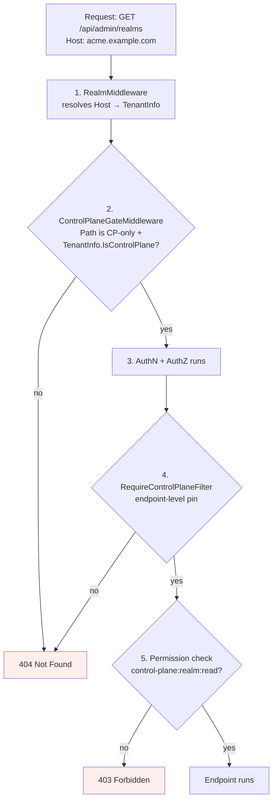

# Control Plane / Data Plane

Modgud separates **cross-realm administration** (realm CRUD, the
first-run setup wizard) from **tenant self-service** (everything else)
on three independent layers. A request that hits a Control-Plane endpoint
from a tenant host has to defeat all three to succeed — and they're
deliberately decoupled so a regression in one doesn't open the others.

## Why bother

Every realm in modgud is a fully autonomous IdP — its own DB, users,
OAuth clients, login providers (see [Realms](./realms.md)). But one
operation is inherently cross-realm:

- **Realm CRUD** — `POST /api/admin/realms` provisions a *new* tenant DB
  and seeds the initial admin via an emailed bootstrap invite (see
  "First-admin onboarding" below).

It doesn't belong on a tenant. A tenant should not even be able to
*discover* that a global admin surface exists at this hostname.

## Model

Exactly **one** realm per deployment is the Control Plane —
**structurally**, not as a separately-stored flag.
`Realm.IsControlPlane` is computed:

```csharp
public bool IsControlPlane => Slug == RealmSlugRules.SystemSlug;
// SystemSlug = "system"
```

Three structural facts make this an "exactly one" guarantee without
any runtime validation:

1. The slug `"system"` is in `RealmSlugRules.ReservedSlugs` — no
   `CreateRealm` call can claim it.
2. The system realm is seeded once at first boot
   (`EnsureSystemRealmExistsAsync`).
3. `Slug` is immutable after creation — the realm document carries
   the slug for life.

So no `Update` can promote a tenant realm to Control Plane, no `Create`
can spawn a second one, no flag can be flipped off. The Control Plane
is wherever the slug is — and that's always exactly the system realm.

`RealmProvisioningService` does still block deactivating or deleting
the system realm — losing the Control Plane would lock the deployment
out of cross-realm administration — but those are the only two
remaining guards.

::: tip Naming
The permission namespace is `control-plane:*`, deliberately decoupled
from the product slug `modgud`. If the IdP product is ever
rebranded, cross-realm permissions don't need a migration.
:::

## Three-layer defence



### Layer 1 — Routing gate

`ControlPlaneGateMiddleware` (in `Modgud.Api/Middleware`) runs
**before** authentication. For paths under `/api/admin/realms`, it
inspects the resolved `TenantInfo` and 404s the request when
`IsControlPlane=false` (or when no tenant resolved at all
— fail-closed).

**404, not 403**: the existence of the endpoint must be invisible to
tenants. A portscan of `tenant-a.example.com` looks identical to a
server that never had those endpoints.

### Layer 2 — Endpoint filter

`RequireControlPlaneFilter` (in `Modgud.Infrastructure/Realms`) is
attached to the route group of every Control-Plane-only endpoint —
currently `/api/admin/realms/*`. It performs the same `IsControlPlane`
check the routing gate does.

This is **belt and suspenders**: a future routing-table change can't
quietly leak the surface, and a future endpoint added without the
routing prefix doesn't slip past the gate. Either layer alone closes
the gap; both together mean a single mistake doesn't open it.

### Layer 3 — Permission namespace

The permissions `control-plane:realm:read` and `control-plane:realm:write`
live on a separate `App` slug. `AppRealmSeeder` only registers the
`control-plane` app **into the Control-Plane realm's tenant DB**:

```csharp
// AppRealmSeeder.SeedAsync — called once per realm DB, on creation
await SeedAppIfMissingAsync(session, slug: AppSlugs.Modgud, ...);
if (isControlPlane)
{
    await SeedAppIfMissingAsync(session, slug: AppSlugs.ControlPlane, ...);
}
```

A tenant realm doesn't have the app registered. A `Group` or `Role` in
a tenant DB can't grant `control-plane:realm:write` because the
`PermissionService` validates against the tenant's own resource
registry — and that registry doesn't list the `control-plane` app.

## Hostname routing — DB is source of truth

The system realm is seeded with the localhost-style domains
`["system.localhost", "localhost", "127.0.0.1"]` so a fresh checkout
boots without any ENV setup. For a deployed installation, the
operator adds the public hostname via the Recovery CLI:

```bash
docker exec modgud dotnet Modgud.Api.dll \
  recover realm-add-domain --slug system --domain auth.example.com
```

The `IRealmCache` is invalidated immediately — no container restart
needed. From the next request onwards, `Host: auth.example.com`
resolves to the system realm and `ControlPlaneGateMiddleware` lets
`/api/admin/realms/*` through.

There's no separate ENV variable mirroring the hostname list. The
realm's own `Domains` field is the single source of truth — kept in
the DB next to the rest of the realm metadata.

## First-admin onboarding

A freshly provisioned realm has no users. There is **no anonymous
"first-run" wizard** — that would be a "first-come-takes-the-instance"
race window. Three explicit-trust paths replace it:

### Path 1 — Recovery CLI, direct password (operator-local)

Filesystem trust. The operator runs:

```bash
docker exec <container> dotnet Modgud.Api.dll recover bootstrap-admin \
    --email admin@example.com \
    --username admin \
    --password 'StrongPass1!' \
    --realm system
```

Atomic seed of `ApplicationUser` (Identity-Password-Rules enforced —
the CLI does NOT bypass policy), the three default roles (System Admin
/ User Manager / Viewer) and the Administratoren group. Idempotent:
re-running for a second admin appends them to the existing group
instead of duplicating.

### Path 2 — Recovery CLI, invite mode (delegated trust)

Same CLI without `--password`. The CLI writes a `PendingAdminInvite`
into the tenant DB and prints the magic-link URL on stdout (also sent
by email when SMTP is configured). The recipient clicks, sets a
password via `/bootstrap?token=...`, gets auto-signed in.

```bash
dotnet Modgud.Api.dll recover bootstrap-admin \
    --email max@acme.com \
    --realm acme
```

### Path 3 — HTTP, control-plane admin issues an invite

`POST /api/admin/realms` is the only HTTP path that creates a realm.
It is CP-only (gated by all three layers above) and now requires
`InitialAdmin: { UserName, Email, Firstname?, Lastname? }`. The backend
atomically:

1. Creates the realm (DB, OAuth scopes, login providers, app seeding)
2. Switches into the new tenant via `TenantContext.Enter(slug)`
3. Issues a `PendingAdminInvite` and sends the email
4. Returns `{Realm, InitialAdminInvite { UserName, Email, ExpiresAt, MagicLinkUrl }}`

The SPA reveals the `MagicLinkUrl` once after creation — useful in
SMTP-less dev and air-gapped scenarios where the email won't arrive.
A `POST /api/admin/realms/{slug}/resend-bootstrap-invite` endpoint
issues a fresh token (and revokes any open ones) for the same
recipient identity if the original is lost.

### Token lifecycle

- 32-byte URL-safe random plaintext, SHA-256-hashed in the DB
- 7-day TTL (`PendingAdminInvite.DefaultExpirationDays`)
- Single-use: `UsedAt` is set on success; reuse → 400 `BootstrapInvite.TokenUsed`
- Reissue revokes prior open invites for the same email — there is at
  most one consumable invite per recipient per realm

### Anti-race-window

The "elimination" of SETUP-01 is not just an upgrade of the gate —
the gate itself is gone. None of the three paths is anonymous and
unauthenticated:

- Path 1 + 2: filesystem trust (whoever can `docker exec` already
  owns the host)
- Path 3: authenticated CP-admin trust (already proved their identity
  via the regular login)
- The bootstrap endpoint that sets the password (`POST
  /api/account/bootstrap-admin`) IS anonymous, but only consumes a
  token that one of the trusted paths already issued. Without a valid
  token the endpoint can't elevate anyone — same posture as a
  password-reset link.

## What a tenant sees

The SPA reads `IsControlPlane: bool` from the anonymous
`/api/app-info` endpoint:

| Host                     | Sidebar shows "Realms" | `/api/admin/realms` |
|---|---|---|
| auth.example.com (CP)    | ✅ if user has `control-plane:realm:read` | 200 OK |
| acme.example.com (tenant)| Never                   | 404 Not Found |

## Layer-by-layer test pinning

| Layer | Tests | Where |
|---|---|---|
| Routing gate | `ControlPlaneGateMiddlewareTests` | `Modgud.Tests.Unit/Api/Middleware/` |
| Endpoint filter | `RealmsEndpointsTests.RequireControlPlaneFilterTests` | `Modgud.Tests.Unit/Api/Features/Admin/` |
| End-to-end | `ControlPlaneSeparationTests` (tenant→404, CP→OK, exactly-one-CP invariant on create + promote + demote, app-info IsControlPlane) | `Modgud.Api.Tests/Security/` |
| Realm-cache resolution | `RealmCacheLookupTests` | `Modgud.Tests.Unit/Realms/` |

A regression in any one layer is caught by the layer's tests; a
regression in middleware ordering or wiring is caught by the
end-to-end suite.
