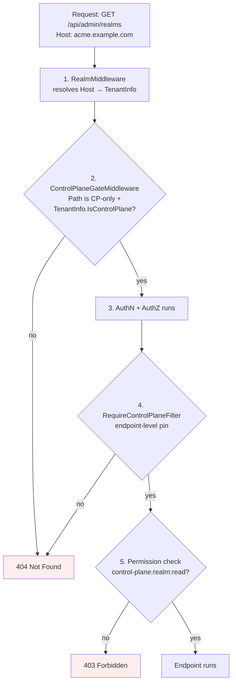

# Control Plane / Data Plane

Modgud separates **deployment-wide installation and cross-realm
administration** (first installation, realm CRUD) from **tenant self-service**
(everything else)
on three independent layers. A request that hits a Control-Plane endpoint
from a tenant host has to defeat all three to succeed — and they're
deliberately decoupled so a regression in one doesn't open the others.

## Why bother

Every realm in modgud is a fully autonomous IdP — its own DB, users,
OAuth clients, login providers (see [Realms](./realms.md)). But some
operations are inherently cross-realm:

- **Realm CRUD** — `POST /api/admin/realms` provisions a *new* tenant DB
  and seeds the initial admin via an emailed bootstrap invite (see
  "First-admin onboarding" below).
- **Declarative realm provisioning** — importing, applying, and
  exporting a realm from a manifest (see
  [Realm provisioning](/admin/realm-provisioning)) — lives under the
  same `/api/admin/realms/*` route group and the same three-layer
  defence described below.

It doesn't belong on a tenant. A tenant should not even be able to
*discover* that a global admin surface exists at this hostname.

## Model

Exactly **one** realm per deployment is the Control Plane — the realm that
carries the **stored** `Realm.IsControlPlane` flag:

```csharp
public bool IsControlPlane { get; set; } // stored, transferable
```

The first-installation API stamps the first ordinary realm with the flag only
after its first `realm:admin` has been created. No realm is special by slug.
The flag is **transferable** to any active realm, so a deployment that starts
single-tenant can later hand cross-realm administration to another realm.

### Authority = realm:admin in the flag-holding realm

There is deliberately **no** `controlplane:admin` permission. Cross-realm
authority is the ordinary `realm:admin` permission *within whichever realm
holds the flag*. That removes a privilege-escalation vector: a delegable
cross-tenant permission could be self-granted by a tenant admin through
normal role assignment, whereas a flag that only a control-plane-gated
operation (or the operator CLI) can move cannot. As a consequence,
transferring the flag hands cross-realm administration to the target realm's
existing `realm:admin` users with no permission migration. (The transfer
also re-seeds the `control-plane` app catalog into the target realm so
*scoped* `control-plane:realm:*` roles can be granted there too.)

### The "exactly one" invariant

It is enforced defensively, not by a DB constraint:

- `TransferControlPlaneAsync` clears the flag on every other holder in the
  same transaction — self-healing an accidental multi-holder state down to
  exactly the target.
- The initial realm receives the flag only while the global realm registry is
  empty. Normal realm creation never sets it, and startup never assigns or
  moves it, so a transfer remains durable across reboots.

`RealmProvisioningService` still blocks deactivating or deleting the realm
that currently holds the flag — losing it would lock the deployment out of
cross-realm administration.

::: tip Naming
The permission namespace is `control-plane:*`, deliberately decoupled
from the product slug `modgud`. If the IdP product is ever
rebranded, cross-realm permissions don't need a migration.
:::

## Three-layer defence



### Layer 1 — Routing gate

`ControlPlaneGateMiddleware` (in `Modgud.Api/Middleware`) runs
**before** authentication. For paths under `/api/admin/realms`, it
inspects the resolved `TenantInfo` and 404s the request when
`IsControlPlane=false` (or when no tenant resolved at all
— fail-closed).

**404, not 403**: the existence of the endpoint must be invisible to
tenants. A portscan of `tenant-a.example.com` looks identical to a
server that never had those endpoints.

### Layer 2 — Endpoint filter

`RequireControlPlaneFilter` (in `Modgud.Infrastructure/Realms`) is
attached to the route group of every Control-Plane-only endpoint —
currently `/api/admin/realms/*`. It performs the same `IsControlPlane`
check the routing gate does.

This is **belt and suspenders**: a future routing-table change can't
quietly leak the surface, and a future endpoint added without the
routing prefix doesn't slip past the gate. Either layer alone closes
the gap; both together mean a single mistake doesn't open it.

### Layer 3 — Permission namespace

The permissions `control-plane:realm:read` and `control-plane:realm:write`
live on a separate `App` slug. `AppRealmSeeder` only registers the
`control-plane` app **into the Control-Plane realm's tenant DB**:

```csharp
// AppRealmSeeder.SeedAsync — called once per realm DB, on creation
await SeedAppIfMissingAsync(session, slug: AppSlugs.Modgud, ...);
if (isControlPlane)
{
    await SeedAppIfMissingAsync(session, slug: AppSlugs.ControlPlane, ...);
}
```

A tenant realm doesn't have the app registered. A `Group` or `Role` in
a tenant DB can't grant `control-plane:realm:write` because the
`PermissionService` validates against the tenant's own resource
registry — and that registry doesn't list the `control-plane` app.

## Transferring the control plane

The flag moves via two paths, both of which clear every other holder in one
transaction:

- **In-app:** `POST /api/admin/realms/{slug}/transfer-control-plane` — POST to
  the realm that should *become* the control plane, from the current
  control-plane host (the route group's `RequireControlPlaneFilter` enforces
  the latter). Gated by `control-plane:realm:write`.
- **Operator break-glass:** `recover control-plane transfer <slug>` (and
  `recover control-plane list` to see the current holder) — for when the
  control-plane realm has no usable admin. See
  [Recovery CLI](../operate/recovery-cli).

After a transfer the **old** host 404s `/api/admin/realms` (its realm is no
longer the control plane) and the **new** host's `realm:admin` users gain the
surface. Plan the move so the target realm already has at least one
`realm:admin`, otherwise the new control plane is management-empty until you
recover one via the CLI.

## Hostname routing — DB is source of truth

The first-installation form requires the first realm's domain and primary
domain. Additional hostnames are managed on the realm or with
`recover realm-add-domain`; there is no seeded hostname or special slug.

`IRealmCache` is invalidated when realm metadata changes. From the next request
onward, a matching Host header resolves to that realm. If it currently holds
`IsControlPlane`, `ControlPlaneGateMiddleware` exposes
`/api/admin/realms/*`; otherwise that surface remains 404.

There's no separate environment variable mirroring the hostname list. The
realm's own `Domains` field in `IGlobalStore` is the single source of truth.

## First-admin onboarding

A freshly provisioned realm has no users. There is **no anonymous
"first-run" wizard** — that would be a "first-come-takes-the-instance"
race window. Three explicit-trust paths replace it:

### Path 1 — Recovery CLI, direct password (operator-local)

Filesystem trust. The operator runs:

```bash
docker exec <container> dotnet Modgud.Api.dll recover bootstrap-admin \
    --email admin@example.com \
    --username admin \
    --password 'StrongPass1!' \
    --realm acme
```

Atomic seed of `ApplicationUser` (Identity-Password-Rules enforced —
the CLI does NOT bypass policy), the three default roles (System Admin
/ User Manager / Viewer) and the Administrators group. Idempotent:
re-running for a second admin appends them to the existing group
instead of duplicating.

### Path 2 — Recovery CLI, invite mode (delegated trust)

Same CLI without `--password`. The CLI writes a `PendingAdminInvite`
into the tenant DB and prints the magic-link URL on stdout (also sent
by email when SMTP is configured). The recipient clicks, sets a
password via `/bootstrap?token=...`, gets auto-signed in.

```bash
dotnet Modgud.Api.dll recover bootstrap-admin \
    --email max@acme.com \
    --realm acme
```

### Path 3 — HTTP, control-plane admin issues an invite

`POST /api/admin/realms` is the only HTTP path that creates a realm.
It is CP-only (gated by all three layers above). Realm creation and
administrator onboarding are separate operations:

1. Creates the realm (DB, OAuth scopes, login providers, app seeding)
2. A CP admin may later call
   `POST /api/admin/realms/{slug}/admin-invites`
3. The API issues a `PendingAdminInvite`, sends the email, and returns
   its one-time `MagicLinkUrl`

The SPA reveals the `MagicLinkUrl` once after invitation — useful in
SMTP-less dev and air-gapped scenarios where the email won't arrive.

### Token lifecycle

- 32-byte URL-safe random plaintext, SHA-256-hashed in the DB
- 24-hour TTL (`PendingAdminInvite.DefaultExpirationHours`)
- Single-use: `UsedAt` is set on success; reuse → 400 `BootstrapInvite.TokenUsed`
- A new invite revokes every prior open invite — there is at most one
  consumable admin invitation per realm

### Anti-race-window

The "elimination" of SETUP-01 is not just an upgrade of the gate —
the gate itself is gone. None of the three paths is anonymous and
unauthenticated:

- Path 1 + 2: filesystem trust (whoever can `docker exec` already
  owns the host)
- Path 3: authenticated CP-admin trust (already proved their identity
  via the regular login)
- The bootstrap endpoint that sets the password (`POST
  /api/account/bootstrap-admin`) IS anonymous, but only consumes a
  token that one of the trusted paths already issued. Without a valid
  token the endpoint can't elevate anyone — same posture as a
  password-reset link.

## What a tenant sees

The SPA reads `IsControlPlane: bool` from the anonymous
`/api/app-info` endpoint:

| Host                     | Sidebar shows "Realms" | `/api/admin/realms` |
|---|---|---|
| auth.example.com (CP)    | ✅ if user has `control-plane:realm:read` | 200 OK |
| acme.example.com (tenant)| Never                   | 404 Not Found |

## Layer-by-layer test pinning

| Layer | Tests | Where |
|---|---|---|
| Routing gate | `ControlPlaneGateMiddlewareTests` | `Modgud.Tests.Unit/Api/Middleware/` |
| Endpoint filter | `RealmsEndpointsTests.RequireControlPlaneFilterTests` | `Modgud.Tests.Unit/Api/Features/Admin/` |
| End-to-end | `ControlPlaneSeparationTests` (tenant→404, CP→OK, deactivate/delete-CP blocked, app-info IsControlPlane) + `ControlPlaneTransferTests` (flag move + clear-others, missing/inactive-target guards, boot durability guard, gate-follows-the-flag) | `Modgud.Api.Tests/Security/` |
| Realm-cache resolution | `RealmCacheLookupTests` | `Modgud.Tests.Unit/Realms/` |

A regression in any one layer is caught by the layer's tests; a
regression in middleware ordering or wiring is caught by the
end-to-end suite.
