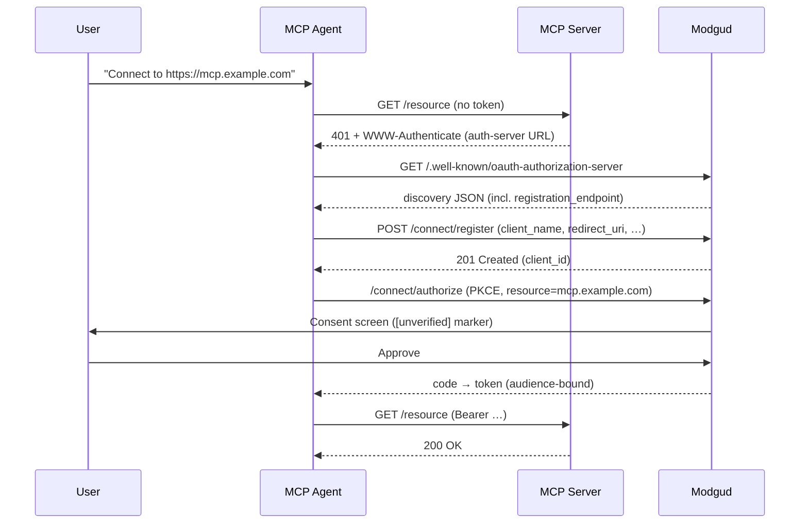

# Dynamic Client Registration

**Dynamic Client Registration** (DCR, [RFC 7591](https://datatracker.ietf.org/doc/html/rfc7591))
is the OAuth feature that lets an application register *itself* as a
client of the authorization server — instead of an administrator
pre-creating the client by hand and emailing credentials around.

This page explains what that means, why it matters again in 2026, and
where Modgud sits on the spectrum of "anyone can register" vs "only
admins can". If you're looking for the **setup checklist** to enable
DCR on your realm, jump to
[Admin → Dynamic Client Registration](/admin/dynamic-client-registration).

::: info Not the same as user self-registration
DCR registers **software** (an OAuth client). User
self-registration registers **people** (accounts). Two unrelated
concepts that happen to share the word "register".
:::

## What gets registered

A normal OAuth client is created the way every other admin object
gets created: a human logs into the IdP, fills out a form, and ends
up with a `client_id`, optional `client_secret`, redirect URIs, and a
grant-type allowlist. That client lives in the IdP's database. Every
new app you want to integrate adds one such row.

DCR replaces *that part* with an HTTP call. An application POSTs a
JSON payload to `/connect/register`:

```http
POST /connect/register HTTP/1.1
Content-Type: application/json

{
  "client_name": "Acme MCP Browser",
  "redirect_uris": ["https://acme.example/cb"],
  "grant_types": ["authorization_code", "refresh_token"],
  "response_types": ["code"],
  "token_endpoint_auth_method": "none"
}
```

…and gets back a `client_id` it can immediately use to start an
Authorization-Code + PKCE flow. No admin in the loop.

The catch — and it's the whole game — is *who* is allowed to send
that POST, and *what* the resulting client is allowed to do.

## Why DCR exists at all

DCR was originally specified for ecosystems where the **count of
clients is unbounded and the IdP operator can't reasonably onboard
each one individually**. Three historical waves drove it:

1. **eHealth interoperability** (mid-2010s) — every clinic's EHR
   software needed to attach to regional patient-record APIs.
   Hand-registering thousands of vendor clients didn't scale.
2. **SaaS-to-SaaS integration onboarding** (late 2010s) — when your
   customers want to plug a Zapier-style automation into your API and
   you don't want to be the bottleneck.
3. **MCP and AI agents** (2024 onwards) — the most recent and
   probably the loudest. The
   [Model Context Protocol](https://modelcontextprotocol.io) spec
   mandates DCR for the "agent attaches to a tool server" handshake,
   because the universe of agents is open-ended and growing weekly.

The third one is what makes DCR interesting again in 2026, and is
the design target for Modgud's implementation.

## The MCP scenario in one diagram

A user pastes an MCP-server URL into Claude Code (or Cursor, or
claude.ai, or any other MCP-aware host). They've never seen this
server before, the server's operator has never heard of this
particular agent. The agent has to negotiate access on the fly:



Without DCR step 6 is a 404 and the user has to call the realm
admin. With DCR enabled, the whole handshake completes in seconds
without anyone touching an admin console.

## The trust problem

Once you let unknown software register itself, three obvious
worries:

1. **Brand impersonation.** An attacker registers a client named
   "Cocoar Mail" hoping users will hit Approve on the consent screen
   thinking it's first-party.
2. **Spray / spam.** A misbehaving agent (or an attacker) registers
   thousands of clients, filling the DB and inflating audit noise.
3. **Privilege creep.** A registered client requests `realm:admin`
   or similarly high-trust scopes and trips up a user into granting
   them.

Different IdPs answer this in different ways. The two main schools:

| School | Stance | Trade-off |
|---|---|---|
| **Initial-Access-Token (RFC 7591 §3.1)** | An admin issues a one-time token; the registering software must present it. | Solves trust by re-centralising it — but defeats the "agent attaches without admin involvement" use case. Common in eHealth + SaaS onboarding. |
| **Anonymous + structural limits** | Registration is open, but *what registered clients can do* is heavily constrained at the server end. | Preserves the spontaneous-onboarding use case. Requires careful constraint design. The MCP-friendly choice. |

Modgud picks the second school and adds belt-and-braces to make it
safe. The
[Admin doc](/admin/dynamic-client-registration#triple-opt-in-design)
walks through the operator-facing knobs; the rest of this page
explains the *primitives* those knobs control.

## How Modgud constrains DCR clients

Five structural rules apply to *every* DCR-registered client,
unconditionally:

1. **Public PKCE only.** `token_endpoint_auth_method` is forced to
   `none`. The IdP never issues a `client_secret` to a DCR client,
   so it physically cannot use confidential flows.
2. **No `client_credentials` grant.** The grant-type allowlist is
   `{authorization_code, refresh_token}`. Anonymous registration
   would otherwise be a free pass to mint machine-to-machine tokens —
   so the validator rejects anything else outright. Service Accounts
   have their own admin-only provisioning path
   ([Service Accounts](/admin/service-accounts)).
3. **No implicit / hybrid flows.** `response_types` is locked to
   `{code}` only. PKCE + Authorization Code is the only path.
4. **Audience-bound tokens.** The agent must pass
   `resource=<api-url>` when requesting authorization, and the
   resulting token is bound to that API only. A code grabbed by an
   attacker can't be replayed against an unrelated resource.
5. **`[unverified]` marker on consent.** Every DCR-registered client
   shows up on the consent screen with the marker plus a callout
   warning the user to verify the name. `AllowRememberConsent` is
   forced off so the prompt fires on every authorize hit until the
   agent itself caches the user's decision.

On top of these immovable rules, the realm admin chooses **three
opt-in toggles** (realm master, per-API, per-scope) — see the
[Admin doc](/admin/dynamic-client-registration#triple-opt-in-design)
for the exact gating logic.

## A newer sibling: CIMD

Modgud also supports **Client ID Metadata Documents** (CIMD), a
newer client-identification mechanism aimed at the same MCP use
case. Instead of registering a client record via `/connect/register`,
a CIMD client publishes a metadata document at an HTTPS URL and uses
that URL *as* its `client_id` — the IdP fetches and validates the
document on demand, and stores nothing. Both claude.ai and ChatGPT
prefer CIMD when a server advertises support for it, falling back to
DCR otherwise. See
[Admin → Client ID Metadata Documents](/admin/client-id-metadata-documents)
for the full mechanics and how it compares to DCR.

## How other IdPs handle DCR

Where Modgud sits on the spectrum, compared to other commonly-used
identity providers as of early 2026:

| IdP | RFC 7591 | Default mode | Notes |
|---|---|---|---|
| **Modgud** | ✅ Full | Anonymous + triple-opt-in | MCP-tuned; `[unverified]` marker on consent; audit + GC on stale clients |
| **Keycloak** | ✅ Full | Configurable: anonymous, initial-access-token, or trusted-host | Most flexible OSS option |
| **Auth0** | ✅ | Initial-access-token by default; "dynamic application registration" is a SaaS feature | Aimed at customer-of-customer onboarding |
| **Okta** | ✅ | API-token required | Same shape as Auth0 — admin-gated |
| **Ory Hydra** | ✅ Full | Multiple access-control modes (public, none, access-token) | OSS, configurable like Keycloak |
| **Authentik** | ✅ | Configurable per provider | OSS |
| **Zitadel** | ⚠️ Partial | Application creation via API, not full RFC 7591 | Works but isn't standards-compliant |
| **IdentityServer (Duende)** | ❌ Not built-in | Custom implementation needed | Community samples exist; no stock support |
| **Azure AD / Entra ID** | ❌ | App registration via Microsoft Graph (admin auth) | Not RFC 7591 |
| **AWS Cognito** | ❌ | App-client creation via Admin API only | Admin-gated, proprietary shape |
| **Google Identity Platform** | ❌ | No public registration endpoint | Console-only |

The pattern: the **OSS / enterprise-IdP** crowd (Keycloak, Hydra,
Authentik, Modgud) supports DCR, while the **cloud-vendor IdPs**
(Azure, AWS, Google) do not. Among the OSS ones, most default to
admin-gated registration via initial-access-token. Modgud's choice
to default to anonymous-with-constraints — rather than admin-gated
— is the MCP-friendly outlier, and the rationale is the use case
above: agent-attaches-to-tool needs to work without an admin in
the loop.

## When you want DCR enabled

Enable it when **at least one of these is true**:

- You're running an MCP server and want AI agents (Claude Desktop,
  Cursor, Continue, claude.ai, …) to attach without per-agent admin
  onboarding.
- You're exposing an OAuth-protected API to a long tail of unknown
  client apps (typical SaaS integration marketplace pattern).
- You want each downstream installation of *your* product to register
  itself against *your* identity provider as part of first-run setup.

Leave it off (the default) if every client of your APIs is something
*you* control or *you* manually onboard. Modgud was built so the
non-DCR path stays straightforward — the admin UI for OAuth Clients
is the single source of truth when DCR isn't enabled.

## Related

- [Admin → Dynamic Client Registration](/admin/dynamic-client-registration)
  — operational setup: enabling the feature, sizing rate-limits,
  managing the registered-client surface.
- [Client ID Metadata Documents](/admin/client-id-metadata-documents)
  — the newer, no-registration-endpoint sibling mechanism, also
  aimed at MCP clients.
- [OAuth & OIDC](/concepts/oauth) — the larger flow context DCR
  plugs into.
- [Service Accounts](/admin/service-accounts) — the admin-only path
  for machine-to-machine identities, deliberately separate from DCR.
- [RFC 7591](https://datatracker.ietf.org/doc/html/rfc7591) — the
  protocol spec.
- [Model Context Protocol — Authorization](https://modelcontextprotocol.io/specification/draft/basic/authorization)
  — the MCP-side spec that mandates DCR for agent attachment.
