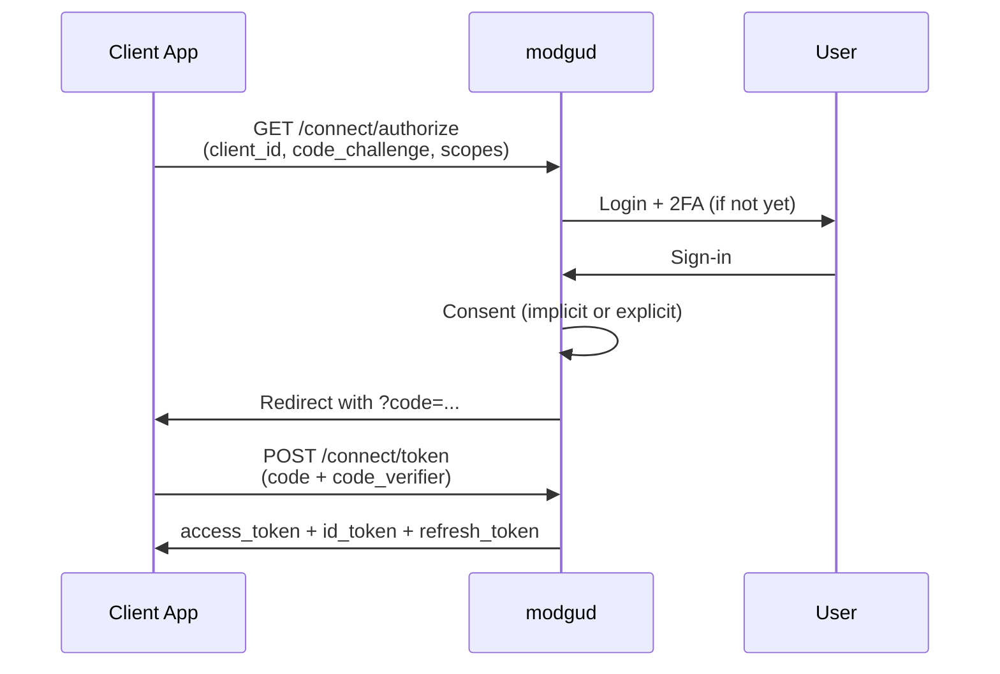

# OAuth 2.0 & OpenID Connect

## Overview

Modgud is a full-fledged OAuth 2.0 authorization server and
OpenID Connect provider. Implemented via **OpenIddict 7** with its
own Marten-based stores (`MartenApplicationStore`, `MartenScopeStore`,
`MartenAuthorizationStore`, `MartenTokenStore`) — no Entity Framework.

Terminology (Client, Scope, API, Grant Type, token types) in the
[Glossary](/concepts/glossary#oauth-oidc-begriffe).

## The three actors

| Actor | Role | Example |
|---|---|---|
| **User** | The person signing in | Someone using your app |
| **Client** | The application requesting access | SPA, mobile app, backend service |
| **API** | The protected service | A billing API, an order API |

Modgud sits in the middle — it authenticates the user, issues
tokens to the client, and the API verifies the tokens.

## Supported flows

### Authorization Code + PKCE (for user apps)

Standard for web apps, SPAs, mobile. PKCE (Proof Key for Code
Exchange) is **enforced** (`RequireProofKeyForCodeExchange`).



### Client Credentials (for services)

Machine-to-machine. The service authenticates directly with client ID +
secret, no user involved:

```http
POST /connect/token
Content-Type: application/x-www-form-urlencoded

grant_type=client_credentials
client_id=my-service
client_secret=...
scope=billing.read
```

### Refresh Token

Enabled for clients that request `offline_access`. Refresh tokens are
reference tokens, stored server-side in `OpenIddictTokenDocument`.

### Device Code (RFC 8628)

For devices with no browser or limited input — CLIs, TVs,
input-constrained appliances. The client polls
`/connect/token` while the user completes the flow on a separate
device. Endpoint shape + verification UI documented in
[Reference → OAuth API](/reference/oauth-api).

### Native cookieless grants (`urn:cocoar:*`)

For native/mobile apps that want a passwordless sign-in without ever
holding a browser cookie, Modgud accepts three custom grant types
directly at `/connect/token`: `urn:cocoar:otp` (email + one-time
code), `urn:cocoar:magic` (magic-link token), and `urn:cocoar:passkey`
(WebAuthn assertion). Each is opt-in per client. See
[Native apps](/integrate/native-apps) for the request/response shape.

## Dynamic Client Registration (DCR)

In addition to admin-created clients, Modgud supports
[**Dynamic Client Registration**](/concepts/dynamic-client-registration)
(RFC 7591) — software registers itself against the IdP without an
administrator pre-provisioning it. This is the protocol path MCP
agents use to attach to MCP servers without per-agent onboarding.

DCR-registered clients are constrained to public PKCE +
Authorization-Code/Refresh-Token only — no `client_credentials`, no
secrets, no implicit/hybrid flows. The feature is **off by default**
on every realm; turning it on is a triple opt-in (realm master +
per-API + per-scope). See the
[concept page](/concepts/dynamic-client-registration) for the design
rationale and the
[admin setup guide](/admin/dynamic-client-registration) for the
operational checklist.

Modgud also supports [**Client ID Metadata Documents**](/admin/client-id-metadata-documents)
(CIMD), a newer, no-registration-endpoint alternative aimed at the
same MCP use case — a client identifies itself with an HTTPS URL
instead of a stored client record.

::: warning No Implicit, no ROPC
Modgud rejects Implicit Flow and Resource Owner Password
Credentials. Both are considered insecure — OAuth 2.1 deprecates them.
:::

## Token validation

How an API validates an access token depends on the configured token
format (settable per client):

| Token type | How the API validates |
|---|---|
| **Reference Token** (default) | Calls modgud's introspection endpoint — gets back user info, scopes, expiry. Can be revoked instantly. |
| **JWT** | Verifies the signature locally with the signing key from the JWKS endpoint. No roundtrip needed, but revocation only works via expiry. |

Which one when? See
[Glossary > Access token format](/concepts/glossary#access-token-format).

## Per-realm isolation

Every realm has its own OAuth configuration:

- Clients from realm A cannot authenticate against realm B
- Tokens from realm A are invalid in realm B (issuer check)
- Each realm has its own discovery endpoint
- The issuer claim in tokens contains the realm domain

Two realms can both have a client with `client_id=my-app` — those are
different clients.

Implementation: `RealmIssuerHandler` (an OpenIddict pipeline hook)
overrides the static issuer per request with `BaseUri`
(= the realm domain).

## Consent flow

Configurable per client:

| Consent Type | Behaviour |
|---|---|
| `implicit` | The user never sees a consent page. Authorization runs through automatically. |
| `explicit` | The user must confirm every scope on the consent page. Previous approvals are remembered. |

For `explicit`:

1. `/connect/authorize` checks for existing permanent authorizations
2. If none → it mints a server-side `ConsentTicket` (bound to the current subject, with the requested scopes and the original authorize query locked in) and redirects to `/consent?ticket=...`
3. `ConsentEndpoints` (`GET /connect/consent?ticket=…` then `POST /connect/consent`) resolves the ticket, shows scope details, and processes the decision — the SPA never sees the raw authorize URL
4. Approved scopes are intersected with the locked-in requested set (no scope expansion possible) and stored as a permanent authorization
5. With `prompt=none` and no existing consent → `consent_required` error

## Scopes & API resources

Default scopes (seeded per realm at provisioning):

| Scope | Purpose |
|---|---|
| `openid` | Required for OIDC, returns the user ID |
| `profile` | First name, last name |
| `email` | Email address |
| `roles` | Role memberships |
| `offline_access` | Enables refresh tokens |

**Custom scopes** can be created per realm by an admin, e.g.
`billing:read`, `repo:write`. They can define `UserClaims` — when a
token includes such a scope, the specified claims are packed into the
token.

**API resources** represent protected APIs. Per API:

- Identifier (`audience` claim)
- List of supported scopes
- `UserClaims` that should land in tokens for this API

## Discovery privacy

`scopes_supported` in `/.well-known/openid-configuration` lists **only the scopes a realm has explicitly published**. Privacy is opt-in, not opt-out: standard OIDC scopes are public, and admin-created scopes also default to `ShowInDiscoveryDocument = true` (visible). The one exception is the implicit-scope-per-API bootstrap path, which seeds its scope with `ShowInDiscoveryDocument = false` so a one-click API setup doesn't leak the resource-server name into public metadata. Background:

- RFC 8414 §3 declares `scopes_supported` as `RECOMMENDED`, not `MUST` — publishing every scope is allowed but not required.
- In multi-tenant SaaS, leaking which APIs a tenant operates is information disclosure with no upside: clients learn the scopes they need from the resource server's integration docs, not from discovery.
- The realm-DB scope validation is the access control. Hiding from discovery is defense-in-depth — an attacker can still guess scope names and probe `/connect/token`.

Admins toggle per scope via the **`Show in discovery document`** flag (see [OAuth Scopes admin](/admin/oauth-scopes#discovery-visibility)). Implementation: `RealmScopesSupportedHandler` (an OpenIddict pipeline hook in `Modgud.Infrastructure/OpenIddict/`) overrides the discovery handler so the realm-DB-backed scope set is filtered on this flag.

## Token lifetimes

Configured in `OpenIddictSettings` (overridable per client):

| Token | Default | Setting key |
|---|---|---|
| Access Token | 60 min | `AccessTokenLifetimeMinutes` |
| Refresh Token | 14 days | `RefreshTokenLifetimeDays` |
| Authorization Code | 5 min | `AuthorizationCodeLifetimeMinutes` |

## Signing

| Mode | Configuration |
|---|---|
| Development | Ephemeral signing/encryption keys (auto-generated, lost on restart) |
| Production | X.509 certificate from file (`SigningCertificatePath`) |

In dev mode every client app has to refresh its token validation after
each modgud restart (JWKS changes). In production the certificate
is persistent — a restart changes nothing.

## Admin UI

The admin area (`/admin/oauth/...`) has list and detail views for:

- **Clients** — application registrations with secrets, redirect URIs,
  grant types, per-client token settings
- **Scopes** — permission definitions (built-in + custom) with
  UserClaim mappings
- **APIs** — protected API resources with scopes and UserClaims

Gating: `oauth-client:read`/`:write`,
`oauth-scope:read`/`:write`,
`oauth-api:read`/`:write` (deletes are gated by `:write`, there is
no separate `:delete` tier). Per-resource admin bypass via
`oauth-client:admin` etc. As with every permission string, the
`modgud` app context is implicit and never part of the string itself
— see [Permissions & gating](/concepts/permissions#permission-format).
