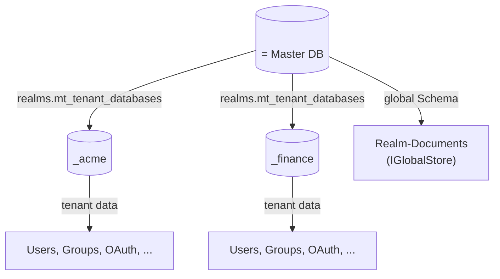

# Realms

## What is a realm?

A realm is a **fully autonomous identity provider**. It is the
fundamental isolation boundary in modgud.

Per realm:

- its own **PostgreSQL database** (`<master-db>_<slug>`)
- its own **users and groups**
- its own **roles and permissions**
- its own **OAuth clients, scopes, APIs**
- its own **OIDC discovery endpoint**
- its own **login providers** (Internal + OIDC/SAML IdPs)
- its own **cookie domain**
- its own **auth rate-limit ceilings** (per-IP request limits on login/register/etc., overridable per realm)

Each realm looks like a standalone modgud installation —
because that is essentially what it is.

::: tip Realm (tenant) vs. Application
The realm is the **hard** boundary above. An **Application** is a **soft
facet** *within* a realm — it can carry its own subdomain, branding and a
per-app override of self-registration / native-grant / DCR / CIMD policy,
but it shares the realm's user pool, signing keys and OIDC issuer (a
request on an App subdomain still mints tokens under the realm's canonical
issuer). Promote an App to its own realm only when you need independent key
rotation, breach containment, or data isolation. See
[Apps & resource access](./apps-and-resource-access#the-apps-second-facet-a-login-experience-adr-0011)
and [Admin → Applications](../admin/applications#application-settings).
:::

## Domain-based routing

Modgud identifies the realm via the **HTTP Host header** —
not via URL paths. Each realm has one or more configured domains.

```
acme.example.com         → Realm "acme"
auth.acme.example.com    → Realm "acme"  (second domain for the same realm)
finance.example.com      → Realm "finance"
auth.localhost           → Realm "local-dev"
```

`RealmMiddleware` (in `Modgud.Api.Middleware`) runs before all
other middlewares and:

1. Reads `request.Host.Host`
2. Looks up a match in `IRealmCache`
3. Sets `HttpContext.Items["TenantId"] = realm.Slug`
4. If no match → `404`

The cache is warmed at boot and invalidated on realm CUD.

::: tip Local development
`*.localhost` resolves to loopback on modern desktop systems. Modgud still
requires the exact hostname in the realm's Domains list; an unknown host fails
closed with 404 instead of guessing a tenant.
:::

## Database-per-tenant via Marten

Modgud uses Marten's `MasterTableTenancy`:



| Database | Contents |
|---|---|
| `<master-db>` (Master) | Schema `realms.mt_tenant_databases` (tenant registry) + schema `global` (Realm documents) |
| `<master-db>_<slug>` | A separate physical DB for every realm, including the first |

::: info Master DB vs. realms
The master DB is deployment-wide infrastructure — tenant registry,
`IGlobalStore`, installation state, global jobs and platform audit. It is
**not** a tenant. Every realm has the same data shape and lives in its own
`<master-db>_<slug>` database. Cross-realm authority follows the transferable
[Control-Plane flag](./control-plane.md), not a special database or slug.
:::

### Tenant resolution in code

`TenantedSessionFactory` (Marten `ISessionFactory`) reads the `TenantId`
from `HttpContext.Items` and opens a tenant-scoped session:

```csharp
public IDocumentSession OpenSession()
    => _store.LightweightSession(ResolveTenantId(forWrite: true));

private string ResolveTenantId(bool forWrite)
{
    var tenant = TenantContext.CurrentOrNull
        ?? httpContextAccessor.HttpContext?.Items["TenantId"] as string;
    return tenant ?? throw new InvalidOperationException("No realm resolved");
}
```

Every `IDocumentSession`/`IQuerySession` injection is realm-scoped and fails
closed without an explicit realm. Deployment-wide code uses `IGlobalStore`;
background realm work enters `TenantContext.Enter(slug)` explicitly.

### GlobalStore for realm documents

The `Realm` document itself cannot live in the tenant store —
otherwise there would be a chicken-and-egg problem. It lives in a
separate Marten store (`IGlobalStore`) that writes to schema `global`
of the master DB.

`RealmCache` loads the realm list from there.

## Realm lifecycle

### 1. First installation

Startup creates the master database, tenant registry and Global Store, but no
realm. A shell-authorized [installation link](../getting-started/first-time-setup)
then drives one browser/API transaction:

1. Create and register `<master-db>_<first-slug>`.
2. Apply the tenant schema and seed standard OAuth scopes, the Internal login
   provider and the `modgud`/`control-plane` apps.
3. Store the first ordinary Realm document in `IGlobalStore` with
   `IsControlPlane = true`.
4. Create its first user and `realm:admin` membership.
5. Activate the realm and mark installation complete.

### 2. Create additional realms

Only users holding `realm:write` in the Control-Plane app context — which
only exists on the Control-Plane realm — can do this. See
[Control Plane](./control-plane.md) for the cross-realm admin model — in
short: realm CRUD lives on a dedicated app slug (`control-plane`) that is
only seeded into the Control-Plane realm's DB, and the routing layer 404s
the endpoint on tenant hosts.

```http
POST /api/admin/realms
{
  "Slug": "acme",
  "DisplayName": "Acme Corp",
  "Domains": ["acme.example.com"]
}
```

Backend:

1. Validates `slug` (regex, no reserved word). New realms are never the
   control plane — the flag defaults to false and there is no create-time
   switch; the role only moves via [transfer](./control-plane.md#transferring-the-control-plane).
2. `CREATE DATABASE <master-db>_acme` (raw SQL).
3. `tenancy.AddDatabaseRecordAsync("acme", connStringForAcme)`.
4. `Storage.ApplyAllConfiguredChangesToDatabaseAsync()`.
5. **`OAuthRealmSeeder`** → 6 default scopes + Internal login provider.
6. **`AppRealmSeeder`** → registers the `modgud` app in the new tenant DB. The `control-plane` app is **not** seeded — it only exists in the Control-Plane realm.
7. Save the `Realm` document in `IGlobalStore`.
8. `RealmCache.Invalidate()`.
9. The realm is complete and active without requiring an administrator.

A Control-Plane admin can later issue a single-use, 24-hour invitation through
`POST /api/admin/realms/{slug}/admin-invites`. Issuing a new link revokes the
previous open one. The recipient sets a password and is auto-signed-in with
`realm:admin`; `RealmAdminBootstrapper` seeds the default roles and adds the
user to the Administrators group.

### 3. Deactivate a realm

```http
PATCH /api/admin/realms/{slug}
{ "isActive": false }
```

`RealmCache` filters on `IsActive = true` — inactive realms are no
longer resolved, all requests to the domain land at `404`. The data
stays in the DB.

::: danger Do not deactivate the Control-Plane realm
The realm currently holding `IsControlPlane` cannot be deactivated. Transfer
the flag to another active realm first.
:::

### 4. Hard-delete a realm

```http
DELETE /api/admin/realms/{slug}?hard=true
```

Without `hard=true`, `DELETE` behaves exactly like the deactivation
above — reversible, data stays in the DB. With `hard=true`, the realm
is removed for good: its tenant database is dropped and the global
`Realm` record is deleted. There is no undo. Hard-delete is refused
for the Control-Plane realm, so a deployment can never delete its own
administration surface.

### 5. Declarative provisioning (import / apply / export)

Beyond the one-field-at-a-time `POST`/`PATCH` above, a realm's entire
configuration — settings, Apps, OAuth APIs/Scopes/Clients, roles,
users, groups — can be described as one **manifest** document and
applied in a single call:

- `POST /api/admin/realms/import` — creates a **brand-new** realm from
  a complete manifest. Fails if the slug already exists; a failed
  import rolls the realm back so it's never left half-provisioned.
- `POST /api/admin/realms/{slug}/apply` — applies a manifest to an
  **existing** realm as an in-place merge/upsert; it never drops the
  database. Add `?prune=true` to make it a full sync that also removes
  entities absent from the manifest — infrastructure essentials
  (the system App, standard scopes, service-account clients) and every
  `realm:admin`-carrying group/user are protected from ever being
  pruned, so an admin can't accidentally lock themselves out.
- `GET /api/admin/realms/{slug}/export` — exports the realm's current
  configuration as a manifest (structure only, never secrets or
  password hashes). Round-trips with `apply`: export, edit, re-apply.
- `GET /api/admin/realms/manifest-schema` — the manifest's JSON Schema,
  generated from the live contract, so a caller can author a valid
  manifest without reading source.

A realm admin (someone holding `realm:admin` inside their own realm,
without any Control-Plane access) gets the same export/apply/prune
workflow scoped to just their own realm, under
`/api/admin/realm-config/*` — they can fully manage their realm's own
configuration and entities, but can't create, delete, or touch any
other realm.

## OIDC endpoints per realm

Since each realm has its own domain, it also has its own OIDC
endpoints:

| Endpoint | Acme |
|---|---|
| Discovery | `https://acme.example.com/.well-known/openid-configuration` |
| Authorize | `https://acme.example.com/connect/authorize` |
| Token | `https://acme.example.com/connect/token` |
| UserInfo | `https://acme.example.com/connect/userinfo` |
| End Session | `https://acme.example.com/connect/logout` |
| Introspect | `https://acme.example.com/connect/introspect` |
| Revoke | `https://acme.example.com/connect/revoke` |

The `RealmIssuerHandler` (an OpenIddict pipeline hook) makes sure
the discovery document emits the correct issuer. Tokens from realm
A are not valid in realm B — the issuer mismatch is enough to reject
them.

## Cross-realm isolation

| Surface | Isolation mechanism |
|---|---|
| User data | Database-per-tenant, physical DB boundary |
| Permissions | Per-tenant Marten sessions, no cross-tenant joins |
| Tokens | Issuer-claim check + per-realm OpenIddict stores |
| Cookies | Cookie domain per realm |
| SignalR | Hub connection is auth-gated and runs in the realm context resolved from the authenticated host |

Query-level cross-realm mixing is prevented by physical separation — each
realm's data lives in its own database, so a query can't reach across the
boundary even by accident. The application-layer surfaces above (permissions,
tokens, cookies, SignalR) are isolated by per-realm scoping enforced in code,
and are covered by tests rather than by the database boundary itself.
