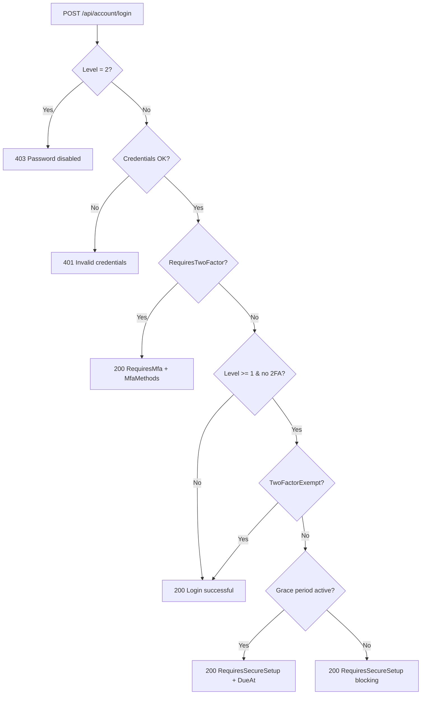

# Login flows

Every login path in detail. Endpoints are mounted under
`/api/account/...` (see `MapAccountEndpoints` in
`Modgud.Api/Program.cs`).

## Login flow overview



After `RequiresMfa` the client must send a second request:

- TOTP: `POST /api/account/mfa/login`
- Email OTP: `POST /api/account/email-otp/login`
- Passkey: `POST /api/account/passkey/login`

After a successful second step the session is fully established — the
`Modgud.Auth` cookie is set, and all following requests run
authenticated.

## Password login

```http
POST /api/account/login
Content-Type: application/json

{
  "username": "admin",
  "password": "ABC12abc!",
  "rememberMe": true
}
```

Possible responses. The backend serializes with `PropertyNamingPolicy = null`, so every field is **PascalCase** on the wire (not camelCase):

| Response | Meaning |
|---|---|
| `200 { "Message": "Login successful" }` | Login complete — cookie set |
| `200 { "RequiresMfa": true, "MfaMethods": ["totp", "email"] }` | Level ≥ 1, user has 2FA — second step needed |
| `200 { "RequiresSecureSetup": true, "GracePeriod": true, "SecureSetupDueAt": "..." }` | User still has to set up 2FA, time runs until `SecureSetupDueAt` |
| `200 { "RequiresSecureSetup": true, "GracePeriod": false }` | Grace period over, blocking |
| `401 { "Message": "Invalid credentials" }` | Username/password wrong, user inactive, or account locked |
| `403 { "Message": "Password login is disabled" }` | Level = 2 (passwordless), password login disabled |

## TOTP login

```http
POST /api/account/mfa/login
Content-Type: application/json

{
  "code": "123456",
  "rememberMe": true
}
```

Reads the `Modgud.2FA` cookie set by `/login`, which holds the
UserId for 5 minutes. Verifies the code via
`UserManager.VerifyTwoFactorTokenAsync`. On success the session is
fully established.

## Email OTP login

```http
POST /api/account/email-otp/login/request
Content-Type: application/json

{ "userName": "alice" }
```

Sends a 6-digit code by email. Rate-limited via
`EmailOtpConfiguration.RateLimitMinutes`. Verify:

```http
POST /api/account/email-otp/login
Content-Type: application/json

{ "userName": "alice", "code": "123456", "rememberMe": true }
```

A maximum of 3 verify attempts per challenge; otherwise a new code
must be requested.

## Passkey login (FIDO2 / WebAuthn)

Two-step ceremony. First fetch options:

```http
POST /api/account/passkey/login-options
Content-Type: application/json

{ "userName": "alice" }
```

The response contains the `AssertionOptions` (challenge, RpId,
allowCredentials). The challenge is also stashed in a short-lived
`Modgud.Passkey.Challenge` cookie so anonymous users (no session yet)
can complete the ceremony. The browser calls
`navigator.credentials.get(...)`, the user touches their passkey. The
assertion response is posted to:

```http
POST /api/account/passkey/login
Content-Type: application/json

{ ... assertion ... }
```

The server verifies the assertion, checks the sign count against
`StoredPasskeyCredential.SignCount` (replay protection) and sets a
persistent cookie (30 days).

## Passwordless via Passkey (without `userName`)

When `POST /api/account/passkey/login-options` is called without
`userName`, the server generates `AssertionOptions` with an empty
`AllowedCredentials` list. The browser uses **discoverable
credentials** (resident keys) — the user picks a stored identity from
the authenticator. The UserId is read from the `UserHandle` of the
assertion.

## Magic Link login

Self-service request:

```http
POST /api/account/magic-link/request
Content-Type: application/json

{ "email": "alice@example.com" }
```

Sends an email with a `?token=...&user=...` link. The click opens:

```http
GET /api/account/magic-link/login?token=...&user=...
```

The backend hashes the token, compares it with
`MagicLinkChallenge.TokenHash`, checks expiry and sets a persistent
cookie. Redirect to the frontend.

::: tip Admin-send instead of self-service
Admins can send a link without any feature toggle via
`POST /api/admin/users/{id}/magic-link`. Used for emergency access
and onboarding.
:::

## OIDC external login

Three endpoints:

```http
GET /api/account/external-login/{idpConfigId}/start?returnUrl=/
```

→ ASP.NET Core `Challenge` with the dynamically registered OIDC
scheme (`DynamicOidcSchemeManager`). Browser lands at the external
IdP.

```http
GET /api/account/external-login/callback
```

→ `ExternalLoginProcessor` runs:

1. Looks up `ExternalIdentityLink` (Issuer + Subject) → existing user
   or JIT create
2. `UserUpdateScriptRunner` runs `IdpConfig.UserUpdateScript` (Jint)
   → maps claims to a `{ firstname, lastname, email, acronym }` patch
3. Email conflict (email belongs to a different user) → hard reject
   (`Idp.EmailConflict`)
4. Login cookie set (persistent, 30 days)

Details on IdP setup and scripting: see
[Login Providers (OIDC)](./login-providers).

## OAuth authorize flow (external apps)

Different topic — an external app starts an OAuth flow against
Modgud via `/connect/authorize`. If the user is not logged in,
they are redirected to the login UI, run through the regular login
flow above, come back to `/connect/authorize` and receive an
authorization code. See [OAuth & OIDC](/concepts/oauth) and
[OpenIddict wiring](/integrate/oauth).

## Logout

```http
POST /api/account/logout
```

Deletes the auth cookie + invalidates the `UserSession` in Marten. In
the frontend the logout composable performs a `window.location`
reload (not just a Vue Router navigation) so that the SignalR
connection tears down cleanly. Otherwise an old subscription would
hang on the previous user.
