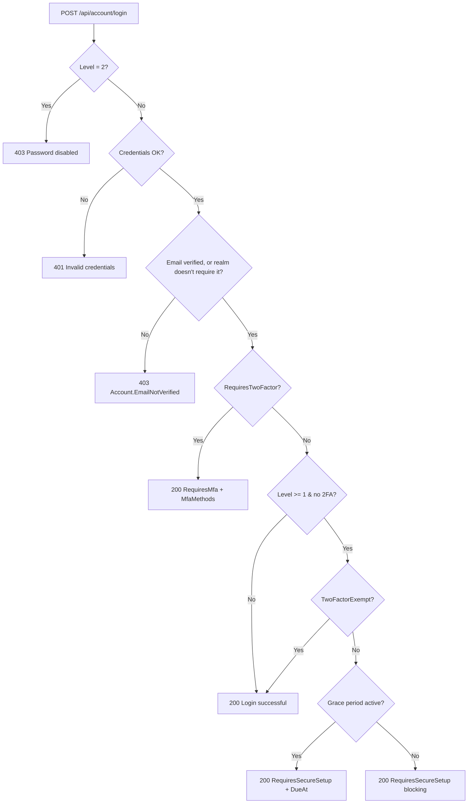

# Login flows

Every login path in detail. Endpoints are mounted under
`/api/account/...` (see `MapAccountEndpoints` in
`Modgud.Api/Program.cs`).

## Login flow overview



After `RequiresMfa` the client must send a second request:

- TOTP: `POST /api/account/mfa/login`
- Email OTP: `POST /api/account/email-otp/login`
- Passkey: `POST /api/account/passkey/login`

After a successful second step the session is fully established — the
`Modgud.Auth` cookie is set, and all following requests run
authenticated.

## Password login

```http
POST /api/account/login
Content-Type: application/json

{
  "username": "admin",
  "password": "ABC12abc!",
  "rememberMe": true
}
```

Possible responses. The backend serializes with `PropertyNamingPolicy = null`, so every field is **PascalCase** on the wire (not camelCase):

| Response | Meaning |
|---|---|
| `200 { "Message": "Login successful" }` | Login complete — cookie set |
| `200 { "RequiresMfa": true, "MfaMethods": ["totp", "email"] }` | Level ≥ 1, user has 2FA — second step needed |
| `200 { "RequiresSecureSetup": true, "GracePeriod": true, "SecureSetupDueAt": "..." }` | User still has to set up 2FA, time runs until `SecureSetupDueAt` |
| `200 { "RequiresSecureSetup": true, "GracePeriod": false }` | Grace period over, blocking |
| `401 { "Message": "Invalid credentials" }` | Username/password wrong, user inactive, or account locked |
| `403 { "Message": "Password login is disabled" }` | Level = 2 (passwordless), password login disabled |
| `403 { "Message": "Please verify your email address before signing in.", "Code": "Account.EmailNotVerified" }` | Realm requires email verification (a self-registration setting) and this account's email isn't confirmed yet |

## TOTP login

```http
POST /api/account/mfa/login
Content-Type: application/json

{
  "code": "123456",
  "rememberMe": true
}
```

Reads the `Modgud.2FA` cookie set by `/login`, which holds the
UserId for 5 minutes. Verifies the code via
`UserManager.VerifyTwoFactorTokenAsync`. On success the session is
fully established.

## Email OTP login

```http
POST /api/account/email-otp/login/request
Content-Type: application/json

{ "userName": "alice" }
```

Sends a 6-digit code by email. Rate-limited via
`EmailOtpConfiguration.RateLimitMinutes`. Verify:

```http
POST /api/account/email-otp/login
Content-Type: application/json

{ "userName": "alice", "code": "123456", "rememberMe": true }
```

A maximum of 3 verify attempts per challenge; otherwise a new code
must be requested.

## Passkey login (FIDO2 / WebAuthn)

Two-step ceremony. First fetch options:

```http
POST /api/account/passkey/login-options
Content-Type: application/json

{ "userName": "alice" }
```

The response contains the `AssertionOptions` (challenge, RpId,
allowCredentials). The challenge is also stashed in a short-lived
`Modgud.Passkey.Challenge` cookie so anonymous users (no session yet)
can complete the ceremony. The browser calls
`navigator.credentials.get(...)`, the user touches their passkey. The
assertion response is posted to:

```http
POST /api/account/passkey/login
Content-Type: application/json

{ ... assertion ... }
```

The server verifies the assertion, checks the sign count against
`StoredPasskeyCredential.SignCount` (replay protection) and sets a
persistent cookie (30 days).

## Passwordless via Passkey (without `userName`)

When `POST /api/account/passkey/login-options` is called without
`userName`, the server generates `AssertionOptions` with an empty
`AllowedCredentials` list. The browser uses **discoverable
credentials** (resident keys) — the user picks a stored identity from
the authenticator. The UserId is read from the `UserHandle` of the
assertion.

## Magic Link login

Self-service request:

```http
POST /api/account/magic-link/request
Content-Type: application/json

{ "email": "alice@example.com", "returnUrl": "/optional/path" }
```

`returnUrl` is optional and only needed when the login was triggered by
an external app's OAuth flow (e.g. the user landed on `/connect/authorize`
and had to sign in first) — it threads that pending continuation through
the e-mail round trip so the user lands back in the OAuth flow after
clicking the link. It must be a same-origin path.

Sends an email with a `?userId=...&token=...` link that opens the
frontend's magic-login page. That page reads the parameters and calls:

```http
POST /api/account/magic-link/login
Content-Type: application/json

{ "userId": "...", "token": "..." }
```

The backend hashes the token, compares it with
`MagicLinkChallenge.TokenHash`, checks expiry and sets a persistent
cookie.

::: tip Admin-send instead of self-service
Admins can send a link without any feature toggle via
`POST /api/admin/users/{id}/magic-link`. Used for emergency access
and onboarding.
:::

## OIDC external login

```http
GET /api/account/external-login/{loginProviderId}/start?returnUrl=/
```

→ ASP.NET Core `Challenge` with the dynamically registered OIDC
scheme (`DynamicOidcSchemeManager`). Browser lands at the external
IdP.

The IdP itself redirects back to a separate, per-provider callback path
(`/signin-oidc/{slug}`, keyed by the provider's own stable slug), where
the OIDC middleware completes the handshake and then forwards the
browser on to:

```http
GET /api/account/external-login/finish
```

→ `ExternalLoginProcessor` runs:

1. Looks up `ExternalIdentityLink` (Issuer + Subject) → existing user
   or JIT create
2. `UserUpdateScriptRunner` runs the provider's `UserUpdateScript` (Jint)
   → maps claims to a `{ firstname, lastname, email, acronym }` patch
3. Email conflict (email belongs to a different user) → hard reject
   (`Idp.EmailConflict`)
4. Login cookie set from the realm's browser-session policy

Details on IdP setup and scripting: see
[Login Providers (OIDC and SAML)](./login-providers).

## SAML external login

```http
GET /saml/{slug}/login?returnUrl=/
```

Modgud acts as the SAML Service Provider. It creates a signed AuthnRequest,
stores a one-time correlation record and redirects the browser to the
external IdP. The IdP returns the response through:

```http
POST /saml/{slug}/acs
```

The ACS validates the response signature, issuer, audience, time conditions
and the one-time `InResponseTo` correlation before passing the claims to the
same `ExternalLoginProcessor` used by OIDC. The processor then resolves or
creates the local user and issues the Modgud application cookie.

Only **SP-initiated** SAML login is supported. IdP-initiated responses are
rejected; SAML Single Logout and Artifact Binding are not available in v1.
See [SAML federation](/admin/saml-federation) for configuration and the
complete support boundary.

## OAuth authorize flow (external apps)

Different topic — an external app starts an OAuth flow against
Modgud via `/connect/authorize`. If the user is not logged in,
they are redirected to the login UI, run through the regular login
flow above, come back to `/connect/authorize` and receive an
authorization code. See [OAuth & OIDC](/concepts/oauth) and
[OpenIddict wiring](/integrate/oauth).

## Logout

```http
POST /api/account/logout
```

Deletes the auth cookie + invalidates the `UserSession` in Marten. In
the frontend the logout composable performs a `window.location`
reload (not just a Vue Router navigation) so that the SignalR
connection tears down cleanly. Otherwise an old subscription would
hang on the previous user.

For a live OIDC provider, the response can include
`ExternalLogoutUrl`, which performs RP-initiated logout at the upstream
OIDC provider when requested. SAML v1 has no Single Logout endpoint:
SAML-originated sessions end locally and return no external logout URL.

## Logout propagation to relying parties

Modgud owns the session of record. A relying party's own session is a cache of a Modgud login, and it ends when the Modgud session ends — whichever way that happens: the user signs out, an RP calls `/connect/logout`, the user ends a session from the sessions list or signs out everywhere, an admin forces a sign-out, the account is deactivated or deleted, or the session simply expires. Every such end is propagated over two transports; use one or both.

### The session identifier

Every token of a user session carries `sid`: the ID token, the access token (JWT or introspection response). For browser flows it is the browser session; for native grants (OTP, passkey, magic link) it is the native client session. Client-credentials tokens have no session and no `sid`. A relying party keeps the `sid` next to its own session so it can match a logout notification to exactly one local session.

### Transport A — back-channel logout (POST)

Register a **Logout URI** on the client (admin UI, *Login & Consent* tab; `BackChannelLogoutUri` in the admin API and the realm manifest). It must be an absolute `https` URI without fragment (`http` only on `localhost`); private and link-local targets are refused at registration and again at send time. When a session that holds tokens of the client ends, Modgud POSTs

```http
POST /oidc/backchannel-logout HTTP/1.1
Content-Type: application/x-www-form-urlencoded
Cache-Control: no-store

logout_token=eyJhbGciOiJSUzI1NiIsImtpZCI6Ii4uLiIsInR5cCI6ImxvZ291dCtqd3QifQ...
```

The logout token follows [OpenID Connect Back-Channel Logout 1.0 §2.4](https://openid.net/specs/openid-connect-backchannel-1_0.html#LogoutToken): `iss` (the same issuer your ID tokens carry), `sub`, `aud` = your `client_id`, `iat`, `exp` (two minutes), `jti`, `events` with the `http://schemas.openid.net/event/backchannel-logout` member, `sid` when one session ended, no `nonce`, header `typ: logout+jwt`, signed RS256 with the realm key (`kid` in the JWKS). Validate it like an ID token (signature, `iss`, `aud`, `iat`/`exp`, `jti` replay), then end the local session named by `sid` — or every session of `sub` when `sid` is absent (the user's access ended as a whole: force sign-out, deactivation, deletion). Answer `200` or `204`; anything else, a timeout or an unreachable host counts as failed. The delivery is retried by the realm's retry job after about 1, 5 and 30 minutes, each time with a fresh token, then given up (the change feed still carries the fact). The RP that called `/connect/logout` is not notified about its own logout. The last delivery outcome per client is shown on the client page, and every attempt is a `security.backchannel_logout_sent` / `security.backchannel_logout_failed` entry in the security log.

Discovery advertises `backchannel_logout_supported` and `backchannel_logout_session_supported`; most OIDC client libraries (ASP.NET Core, Spring, Keycloak adapters, oidc-client) handle the token with their built-in back-channel support.

### Transport B — the Application change feed

A relying party without an inbound route reads the same fact from the [Application change feed](application-change-feed#session-entity-version-1): a `session` entity is upserted when the App's client first receives tokens for a session and deleted — with `Reason` — when the session ends. An offline consumer replays the deletes from its cursor; the snapshot lists the live sessions for reconciliation. A resource server that validates JWTs locally can use the same entity kind to reject tokens of ended sessions before they expire (the shared `Modgud.AspNetCore.ResourceServer` library will ship that denylist).
