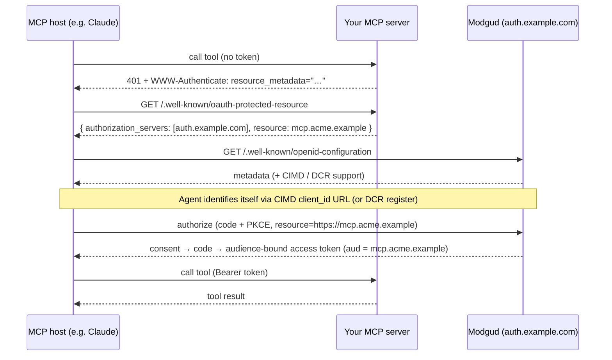

# Secure an MCP server with Modgud (15 minutes)

This is the end-to-end path for the one use case Modgud's [DCR](/admin/dynamic-client-registration) and [CIMD](/admin/client-id-metadata-documents) features exist for: letting AI agents you don't pre-trust — Claude, ChatGPT, Cursor, Continue — attach to a [Model Context Protocol](https://modelcontextprotocol.io) server you host, authenticate their user against your realm, and receive an access token that is bound to *your* MCP server and nothing else.

The general OAuth pages document each mechanism in isolation. This page assembles them into a single walkthrough, in the order you actually do them, and calls out the two things people get wrong: the resource identifier and the opt-in gates.

::: tip What you need first
- A running Modgud realm you administer (this guide uses `https://auth.example.com`).
- An MCP server you host and can change the HTTP responses of (this guide uses `https://mcp.acme.example`).
- One app already created in Modgud to hang the API off — the walkthrough uses an app named `acme`. If you don't have one, follow the [SaaS walkthrough](./saas-walkthrough) up to app creation first.
:::

## How MCP authorization flows

MCP uses ordinary OAuth 2.1 — Authorization Code + PKCE — with two discovery hops bolted on the front so an agent that has never seen your server can find the authorization server on its own. CIMD (preferred) or DCR is what lets the agent obtain a `client_id` without an administrator onboarding it.



The single most important field in this whole flow is `resource=`. It is the MCP server's canonical URL, it becomes the token's `aud`, and in Modgud it must string-match a registered OAuth API's **Audience**. Steps 1 and 2 below exist to make that match happen.

## Step 1 — Register the MCP server as an OAuth API

In Modgud an [OAuth API](/admin/oauth-apis) is the registration of a resource server. Create one for your MCP server.

**OAuth → APIs → Create**, then:

- **Audience (aud)** — set this to the MCP server's **canonical absolute URL**: `https://mcp.acme.example`. This is not cosmetic. RFC 8707 requires the `resource=` indicator to be an absolute URI, and Modgud uses the OAuth API's Audience as *both* the `aud` claim it stamps and the `resource=` value it matches against. An agent sends `resource=https://mcp.acme.example`; that has to equal this field exactly.
- **Application** — link it to your app (`acme`), so per-audience `resource_access` narrowing works.
- **PermissionIds** — the subset of the app's catalog this MCP server gates on. Default is the full catalog; tighten it if the server only needs a slice.

::: warning The Audience is immutable
You can't change **Audience (aud)** after creation — it's the resource identifier every token is bound to. Get the URL right (scheme + host, no trailing path unless your MCP server's canonical URI has one). To change it later you clone the API and re-point clients.
:::

## Step 2 — Define the scope the MCP server gates

A token only carries `aud=https://mcp.acme.example` if the client requested a scope whose **Resources** list contains that URL. The fastest way to create that coupling:

1. Open the OAuth API you just created.
2. Click **Create implicit scope**. This mints an [OAuth Scope](/admin/oauth-scopes) whose `Resources = [https://mcp.acme.example]`, linked to the same app, private in discovery by default.

That one scope is what turns `resource=https://mcp.acme.example` into an authorized, audience-bound token. Without a scope binding that resource, `/connect/authorize` has nothing to grant the resource from and the token request fails with `invalid_target`.

If your MCP server distinguishes capabilities (read-only tools vs. mutating tools), add granular scopes on top — e.g. `mcp:tools.read` / `mcp:tools.write`, each with `Resources = [https://mcp.acme.example]`. Also add the standard `roles` and `permissions` scopes to the mix if the server gates on RBAC claims — see [Integrating a resource server](./resource-server#prerequisite-request-the-right-scopes).

## Step 3 — Serve protected-resource metadata from the MCP server

The two discovery hops in the diagram are your **MCP server's** responsibility, not Modgud's. Modgud is the authorization server; it does not advertise your resource server for you.

On any unauthenticated tool request, the MCP server must return:

```http
HTTP/1.1 401 Unauthorized
WWW-Authenticate: Bearer resource_metadata="https://mcp.acme.example/.well-known/oauth-protected-resource"
```

and host that metadata document ([RFC 9728](https://datatracker.ietf.org/doc/html/rfc9728)):

```json
{
  "resource": "https://mcp.acme.example",
  "authorization_servers": ["https://auth.example.com"],
  "scopes_supported": ["mcp:tools.read", "mcp:tools.write"],
  "bearer_methods_supported": ["header"]
}
```

- `resource` must equal the OAuth API Audience from step 1.
- `authorization_servers` points at your **realm root** — the bare host, no realm path segment. Modgud routes realms by Host header, so the issuer *is* the host root.

::: info Authorization-server discovery
Modgud serves its authorization-server metadata at **both** `https://auth.example.com/.well-known/oauth-authorization-server` (RFC 8414) and `https://auth.example.com/.well-known/openid-configuration` (OpenID Connect discovery) — the identical document at either path — plus its JWKS at `/.well-known/jwks`. An MCP host discovers the realm whether it probes the RFC 8414 alias, the OIDC document, or both.
:::

## Step 4 — Turn on CIMD (preferred), with DCR as the fallback

Now let unknown agents obtain a `client_id`. Both paths are off by default and both share the same opt-in gates, so nothing is exposed until you deliberately flip these.

**Client ID Metadata Documents ([CIMD](/admin/client-id-metadata-documents)) — the MCP-preferred path.** The agent uses its own published metadata URL (e.g. `https://claude.ai/.well-known/oauth-client`) *as* its `client_id`; Modgud fetches and validates it on demand and stores nothing.

1. **Realm Settings → Client ID Metadata Documents** → enable.
2. **OAuth APIs → your MCP-server API** → tick **Allow DCR**.
3. **OAuth Scopes → the scope(s) from step 2** → tick **Allow DCR Clients**.

**Dynamic Client Registration ([DCR](/admin/dynamic-client-registration)) — the fallback** for agents that don't support CIMD. It uses the same three gates (realm toggle → per-API **Allow DCR** → per-scope **Allow DCR Clients**), and additionally exposes `POST /connect/register`. Enable it alongside CIMD so both kinds of agent can attach; claude.ai and ChatGPT try CIMD first and fall back to DCR automatically.

::: warning resource= is mandatory for these clients
A CIMD or DCR client that omits `resource=` is rejected with `invalid_target` — there is no implicit audience for self-identified clients. The MCP host derives `resource=` from your protected-resource metadata's `resource` field (step 3), which is why that field has to match the API Audience exactly.
:::

## Step 5 — Connect from a real MCP host

Add `https://mcp.acme.example` to an MCP host — in claude.ai, "Add custom connector"; in Claude Code, `claude mcp add`. The host runs the whole diagram automatically:

1. Hits your server, gets the 401 + `resource_metadata`.
2. Reads your PRM, learns the realm is the authorization server.
3. Reads Modgud's discovery document, sees CIMD (and/or DCR) is available.
4. Identifies itself (CIMD `client_id` URL, or a DCR `POST /connect/register`).
5. Runs Authorization Code + PKCE with `resource=https://mcp.acme.example`.

The user lands on Modgud's login, then the **consent screen**. Because the client is self-identified, consent is explicit and carries an **`[unverified]`** marker plus the `client_id` **hostname** (e.g. `claude.ai`) shown prominently — the user is meant to confirm the domain, not just the display name. Consent is never remembered for these clients; the agent keeps its refresh token instead of re-authorizing.

## Step 6 — Call a tool, then inspect the token and the audit trail

After consent the agent holds an access token with `aud` narrowed to exactly `https://mcp.acme.example` — RFC 8707 binding means it cannot be replayed against any other resource server on the realm.

**Validate it on the MCP server.** Two options, same as any resource server:

- **JWT + JWKS (local):** validate signature against `https://auth.example.com/.well-known/jwks`, check `iss` equals the realm root and `aud` equals your MCP URL. CIMD clients are issued JWT access tokens, so this is the default MCP path. For an ASP.NET Core MCP server the wiring is identical to [Integrating a resource server](./resource-server) — use `AddModgudResourceServer` with `Audience = "https://mcp.acme.example"`; `OnlyJwt` is the default mode.
- **Introspection (server-side):** if your OAuth client issues reference tokens, `POST /connect/introspect` returns `active` plus the claims. Slower per call, but revocation is instant (see step 7).

Decode the token (or introspect it) and confirm `aud` is your MCP URL alone and the `permissions` array inside `resource_access[acme]` holds what you expect.

**Check the audit trail.** [Auth Log](/admin/auth-log) records the lifecycle. CIMD and DCR events are prefixed `DCR ` in the message and surface under the **operations** chip (rejected registrations under **security-ops**):

- `DCR client registered` — a DCR agent onboarded (CIMD stores no record, so it won't appear here; its first token-issue does).
- `DCR client first used` — first successful token issued for the client. The cleanest "this integration is real" signal.

## Step 7 — Revoke access and watch it take effect

Three levers, fastest blast-radius first:

- **Flip `Allow DCR` off** on the OAuth API (step 4). This is re-checked on *every* token issuance for self-identified clients, so it immediately stops all CIMD/DCR agents from minting new tokens for this MCP server — without touching any individual client.
- **Delete the client.** DCR clients appear in the [OAuth Clients](/admin/oauth-clients) grid (filter chip **DCR only**); delete one like any client. CIMD clients are never stored, so "revoking" one means either flipping the gate above or, if you must target a single domain, adding it to the realm's reserved-names / declining it at the fetch layer.
- **Revoke a live token** via `POST /connect/revoke`.

What "immediate" means depends on token format, and this is the one honest caveat to give your security reviewer:

| Token format | Revocation effect |
|---|---|
| Reference (opaque) | Instant — the next introspection returns `active: false`. |
| JWT (CIMD default) | The parent authorization is killed, so refresh stops immediately, but an already-issued JWT stays valid until it expires. CIMD/DCR access-token lifetime defaults to **15 minutes** precisely to bound this window. |

To prove it: revoke, then have the agent call a tool. A reference-token setup 401s at once; a JWT setup keeps working until the short lifetime lapses, after which the refresh is refused and the agent can't get a new token.

## Where to go next

- [Client ID Metadata Documents](/admin/client-id-metadata-documents) — the full CIMD validation rules, SSRF hardening, and accepted risks.
- [Dynamic Client Registration](/admin/dynamic-client-registration) — the DCR field rules, rate limits, and garbage collection.
- [Integrating a resource server](./resource-server) — the .NET token-validation code the MCP server reuses verbatim.
- [Security model](/concepts/security-model) — where CIMD, DCR, and resource binding sit in the overall posture.
- [OAuth / OIDC endpoints](/reference/oauth-api) — the raw endpoint reference.
