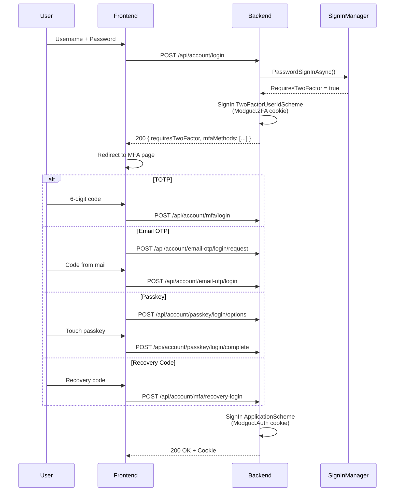

# Two-Factor Authentication

Modgud supports four 2FA methods, all implemented in the
Authentication slice. Any number of methods can be active per user.

| Method | Service | Storage |
|---|---|---|
| TOTP | ASP.NET Core Identity DefaultTokenProviders | `UserSecurityData.AuthenticatorKey` |
| Email OTP | `EmailOtpService` | `EmailOtpChallenge` (ephemeral) |
| Passkey/FIDO2 | `Fido2NetLib` | `StoredPasskeyCredential` |
| Magic Link | `MagicLinkService` | `MagicLinkChallenge` (ephemeral) |

Plus **recovery codes** as a last resort.

## Login flow with 2FA



On the first login step the `Modgud.2FA` cookie is set
(lifetime: 5 min), holding the UserId between step 1 and step 2. Only
a successful second step issues the full `Modgud.Auth` cookie.

## TOTP (authenticator apps)

Standard RFC 6238, compatible with Google Authenticator, Authy,
Microsoft Authenticator, etc.

### Setup

```http
POST /api/account/mfa/setup
```

→ Generates a fresh authenticator key (32 bytes Base32) via
`UserManager.ResetAuthenticatorKeyAsync()`. Returns:

```json
{
  "sharedKey": "ABCD EFGH IJKL MNOP",
  "authenticatorUri": "otpauth://totp/Modgud:alice@example.com?secret=...&issuer=Modgud&digits=6"
}
```

`sharedKey` is formatted in groups of four for manual entry;
`authenticatorUri` is for QR-code generation.

### Activate

```http
POST /api/account/mfa/enable
{ "code": "123456" }
```

→ `UserManager.VerifyTwoFactorTokenAsync()` checks the code; on
success `TwoFactorEnabled = true` is set + 10 recovery codes are
generated.

### Deactivate

```http
POST /api/account/mfa/disable
{ "code": "123456" }
```

→ Verifies a TOTP code once more. Resets the authenticator key.

::: warning Last 2FA at level ≥ 1
When a user removes their last 2FA method while
`AuthenticationMinimumLevel >= 1`, `SecureSetupDueAt = now` is set →
the user is blocked immediately (no new grace window).
:::

## Email OTP

6-digit code by email to the verified email address.

### How it works

1. **Request:** `POST /api/account/email-otp/login/request` generates
   a 6-digit code, hashes it with SHA-256, and stores the hash in an
   `EmailOtpChallenge` document
2. **Send:** code via `IEmailService.SendEmailOtpAsync()`
3. **Verify:** `POST /api/account/email-otp/login` hashes the entered
   code and compares it

### Protection mechanisms

| Protection | Implementation |
|---|---|
| Rate limit | At least 2 min between OTP requests |
| Expiry | 10 min |
| Attempt limit | At most 3 verify attempts per challenge |
| Code never in plain text | Only SHA-256 hash stored |

`EmailOtpChallenge` is 1:1 per UserId — requesting a new code replaces
any existing challenge.

## Passkey / FIDO2 / WebAuthn

Hardware keys (YubiKey) or platform authenticators (TouchID, Windows
Hello). Implemented with
[Fido2NetLib](https://github.com/passwordless-lib/fido2-net-lib).

### Registration ceremony

```http
POST /api/account/passkey/register/options
```

→ `CredentialCreateOptions` with:
- `ResidentKey = Preferred` (for discoverable credentials → passwordless)
- `UserVerification = Preferred`
- `excludeCredentials` = the user's existing credentials

Challenge bytes + options JSON are stored in a
`Modgud.Session` ASP.NET session entry (Marten
`DistributedMemoryCache` as the session store), 5 min idle.

```http
POST /api/account/passkey/register/complete
{ "attestation": {...} }
```

→ `_fido2.MakeNewCredentialAsync()` verifies the attestation against
the stored challenge. On success a `StoredPasskeyCredential` is
created.

### Authentication ceremony

```http
POST /api/account/passkey/login/options
{ "userName": "alice" }   // optional — empty = passwordless mode
```

→ `AssertionOptions` scoped to the user's existing credentials. With
`userName=null`, discoverable credentials are allowed (passwordless).

```http
POST /api/account/passkey/login/complete
{ "assertion": {...} }
```

→ Verifies the assertion via `_fido2.MakeAssertionAsync()`, checks
SignCount against the stored value (replay protection), updates
`LastUsedAt`.

### Passwordless

`POST /api/account/passkey/login/options` without `userName` produces
options with an empty `AllowedCredentials` list → the authenticator
picks a discoverable credential. The UserId is read from the
`UserHandle` of the assertion.

### StoredPasskeyCredential

| Field | Purpose |
|---|---|
| `CredentialId` | Unique id (Base64-encoded) |
| `PublicKey` | COSE-format public key |
| `UserHandle` | UserId in bytes (for discoverable) |
| `SignCount` | Replay-protection counter |
| `DeviceName` | User label (e.g. "YubiKey 5") |
| `Aaguid` | Authenticator model id |
| `Transports` | USB, NFC, BLE, internal |
| `LastUsedAt` | Audit |

### Configuration

Derived in `Program.cs` from `IServerConfiguration.PublicUrl`:

```csharp
builder.Services.AddFido2(options =>
{
    options.ServerDomain = publicUri.Host;
    options.ServerName = "Modgud";
    options.Origins = fido2Origins;
});
```

In dev, `localhost:4300` and `https://localhost` are additionally
allowed.

## Magic Link

Single-use token by email. Two modes:

- **Self-service** (`POST /api/account/magic-link/request`) — only
  when `IMagicLinkConfiguration.Enabled` AND
  `IAuthSettings.MagicLinkSelfService` are both `true`
- **Admin send** (`POST /api/admin/users/{id}/magic-link`) — always
  available, no toggle

Clicking the link:

```http
GET /api/account/magic-link/login?token=...&user=...
```

The backend hashes the token, compares it to
`MagicLinkChallenge.TokenHash`, checks expiry, sets a persistent
cookie (always 30 days), and redirects to the frontend.

## Recovery codes

10 single-use backup codes, generated when 2FA is enabled.

- Generated via `UserManager.GenerateNewTwoFactorRecoveryCodesAsync()`
- Stored in `UserSecurityData.RecoveryCodes` (NOT in the event stream)
- Each code usable only once (`RedeemTwoFactorRecoveryCodeAsync()`)
- Regeneration invalidates all previous codes
- Status query: `GET /api/account/mfa/status` → `recoveryCodesRemaining`

## Security data separation

All 2FA secrets live in `UserSecurityData` or in separate documents —
**never** in the event stream.

| Data | Storage | Reason |
|---|---|---|
| Authenticator key | `UserSecurityData.AuthenticatorKey` | TOTP secret |
| Recovery codes | `UserSecurityData.RecoveryCodes` | Single-use secrets |
| Passkey credentials | `StoredPasskeyCredential` (separate doc) | Public key + counter |
| Password hash | `UserSecurityData.PasswordHash` | Sensitive |

Security domain events store metadata only:

- `UserTwoFactorEnabled(UserId)` — no key
- `UserTwoFactorDisabled(UserId)` — no key
- `UserRecoveryCodesRegenerated(UserId, CodeCount)` — no code
- `PasskeyCredentialRegistered(UserId, CredentialId, DeviceName)` — no PublicKey

This way GDPR stream replays are safe and event streams can't be
abused for credential extraction.

## API endpoints

| Endpoint | Method | Purpose |
|---|---|---|
| `/api/account/mfa/status` | GET | Status (enabled, methods, recovery-codes-remaining) |
| `/api/account/mfa/setup` | POST | Generate authenticator key + QR URI |
| `/api/account/mfa/enable` | POST | Enable 2FA with a code |
| `/api/account/mfa/disable` | POST | Disable 2FA |
| `/api/account/mfa/recovery-codes` | POST | Regenerate recovery codes |
| `/api/account/mfa/login` | POST | Login step 2 with TOTP |
| `/api/account/mfa/recovery-login` | POST | Login with recovery code |
| `/api/account/email-otp/status` | GET | Email-OTP status |
| `/api/account/email-otp/login/request` | POST | Request email OTP |
| `/api/account/email-otp/login` | POST | Login with email OTP |
| `/api/account/passkey/register/options` | POST | Passkey register options |
| `/api/account/passkey/register/complete` | POST | Complete passkey registration |
| `/api/account/passkey/login/options` | POST | Passkey login options |
| `/api/account/passkey/login/complete` | POST | Complete passkey login |
| `/api/account/passkey/credentials` | GET | List own passkeys |
| `/api/account/passkey/credentials/{id}` | DELETE | Delete a passkey |
| `/api/account/magic-link/request` | POST | Request a self-service magic link |
| `/api/account/magic-link/login` | GET | Magic-link login |
