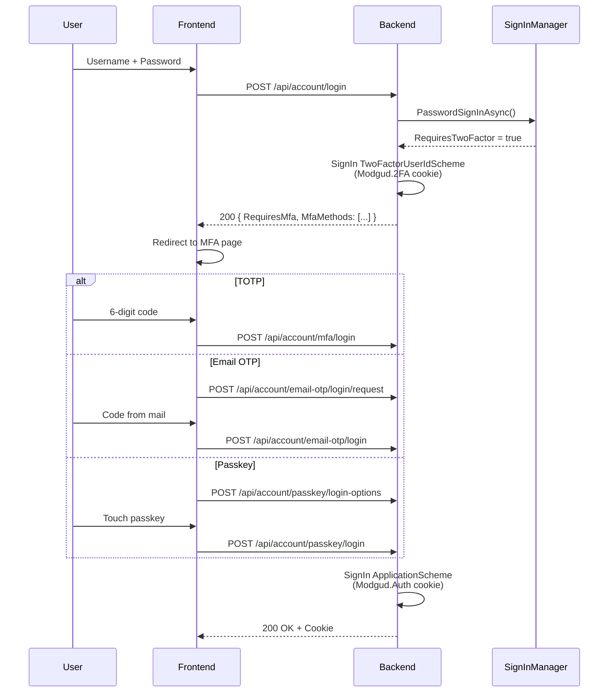

# Two-Factor Authentication

Modgud supports four 2FA methods, all implemented in the
Authentication slice. Any number of methods can be active per user.

| Method | Service | Storage |
|---|---|---|
| TOTP | ASP.NET Core Identity DefaultTokenProviders | `UserSecurityData.AuthenticatorKey` |
| Email OTP | `EmailOtpService` | `EmailOtpChallenge` (ephemeral) |
| Passkey/FIDO2 | `Fido2NetLib` | `StoredPasskeyCredential` |
| Magic Link | `MagicLinkService` | `MagicLinkChallenge` (ephemeral) |

## Login flow with 2FA



On the first login step the `Modgud.2FA` cookie is set
(lifetime: 5 min), holding the UserId between step 1 and step 2. Only
a successful second step issues the full `Modgud.Auth` cookie.

## TOTP (authenticator apps)

Standard RFC 6238, compatible with Google Authenticator, Authy,
Microsoft Authenticator, etc.

### Setup

```http
POST /api/account/mfa/setup
```

→ Generates a fresh authenticator key (32 bytes Base32) via
`UserManager.ResetAuthenticatorKeyAsync()`. Returns:

```json
{
  "SharedKey": "ABCD EFGH IJKL MNOP",
  "AuthenticatorUri": "otpauth://totp/Modgud:alice@example.com?secret=...&issuer=Modgud&digits=6"
}
```

`sharedKey` is formatted in groups of four for manual entry;
`authenticatorUri` is for QR-code generation.

### Activate

```http
POST /api/account/mfa/verify
{ "code": "123456" }
```

→ `UserManager.VerifyTwoFactorTokenAsync()` checks the code; on
success `TwoFactorEnabled = true` is set, the acting session is
re-issued with the fresh security stamp, and outstanding OAuth
reference tokens for the user are revoked so the change takes effect
across every channel immediately.

### Deactivate

```http
POST /api/account/mfa/disable
{ "code": "123456" }
```

→ Verifies a TOTP code once more. Resets the authenticator key.

::: warning Last 2FA at level ≥ 1
When a user removes their last 2FA method while
`AuthenticationMinimumLevel >= 1`, `SecureSetupDueAt = now` is set →
the user is blocked immediately (no new grace window).
:::

## Email OTP

6-digit code by email to the verified email address.

### How it works

1. **Request:** `POST /api/account/email-otp/login/request` generates
   a 6-digit code, hashes it with SHA-256, and stores the hash in an
   `EmailOtpChallenge` document
2. **Send:** code via `IEmailService.SendEmailOtpAsync()`
3. **Verify:** `POST /api/account/email-otp/login` hashes the entered
   code and compares it

### Protection mechanisms

| Protection | Implementation |
|---|---|
| Rate limit | At least 2 min between OTP requests |
| Expiry | 10 min |
| Attempt limit | At most 3 verify attempts per challenge |
| Code never in plain text | Only SHA-256 hash stored |

`EmailOtpChallenge` is 1:1 per UserId — requesting a new code replaces
any existing challenge.

## Passkey / FIDO2 / WebAuthn

Hardware keys (YubiKey) or platform authenticators (TouchID, Windows
Hello). Implemented with
[Fido2NetLib](https://github.com/passwordless-lib/fido2-net-lib).

### Registration ceremony

```http
POST /api/account/passkey/register-options
```

→ `CredentialCreateOptions` with:
- `ResidentKey = Preferred` (for discoverable credentials → passwordless)
- `UserVerification = Preferred`
- `excludeCredentials` = the user's existing credentials

Challenge bytes + options JSON are stored in a server-side
`PasskeyEnrollCeremony` document in the realm database; the response
sets the `Modgud.Passkey.Enroll` cookie carrying only its id (5 min,
single use), so the finishing request may be served by any instance.

```http
POST /api/account/passkey/register
{ "attestation": {...} }
```

→ `_fido2.MakeNewCredentialAsync()` verifies the attestation against
the stored challenge. On success a `StoredPasskeyCredential` is
created.

### Authentication ceremony

```http
POST /api/account/passkey/login-options
{ "userName": "alice" }   // optional — empty = passwordless mode
```

→ `AssertionOptions` scoped to the user's existing credentials. With
`userName=null`, discoverable credentials are allowed (passwordless).

```http
POST /api/account/passkey/login
{ "assertion": {...} }
```

→ Verifies the assertion via `_fido2.MakeAssertionAsync()`, checks
SignCount against the stored value (replay protection), updates
`LastUsedAt`.

### Passwordless

`POST /api/account/passkey/login-options` without `userName` produces
options with an empty `AllowedCredentials` list → the authenticator
picks a discoverable credential. The UserId is read from the
`UserHandle` of the assertion.

### StoredPasskeyCredential

| Field | Purpose |
|---|---|
| `CredentialId` | Unique id (Base64-encoded) |
| `PublicKey` | COSE-format public key |
| `UserHandle` | UserId in bytes (for discoverable) |
| `SignCount` | Replay-protection counter |
| `DeviceName` | User label (e.g. "YubiKey 5") |
| `Aaguid` | Authenticator model id |
| `Transports` | USB, NFC, BLE, internal |
| `LastUsedAt` | Audit |

### Configuration

There is no single, global WebAuthn relying party. Each ceremony
builds its own configuration for the **current realm**: the relying
party ID (`ServerDomain`) is the realm's primary domain, and the
relying party name (`ServerName`) is the realm's display name. This
is what scopes a passkey to the realm it was registered on — the
same credential can't be replayed against a different realm.

An individual OAuth client used for the cookieless native flows (see
below) can additionally override the relying party ID with its own
branded domain; when unset it falls back to the realm's primary
domain. See [per-client WebAuthn RP-ID](../integrate/native-apps#3-passkeys-set-the-per-client-rp-id-and-serve-an-aasa).

In dev, `localhost:4300` and `https://localhost` are additionally
allowed as origins.

## Magic Link

Single-use token by email. Two modes:

- **Self-service** (`POST /api/account/magic-link/request`) — only
  when `IMagicLinkConfiguration.Enabled` AND
  `IAuthSettings.MagicLinkSelfService` are both `true`
- **Admin send** (`POST /api/admin/users/{id}/magic-link`) — always
  available, no toggle

The emailed link points at a frontend route carrying the token and
user id as query parameters; the frontend reads them and calls:

```http
POST /api/account/magic-link/login
{ "userId": "...", "token": "..." }
```

The backend hashes the token, compares it to
`MagicLinkChallenge.TokenHash`, checks expiry, and — if the account
also has TOTP enabled — requires that second factor before signing
in (mailbox possession alone never bypasses TOTP). Otherwise it signs
the user in directly with a persistent cookie (always 30 days). The
response is JSON, not an HTTP redirect.

## Security data separation

All 2FA secrets live in `UserSecurityData` or in separate documents —
**never** in the event stream.

| Data | Storage | Reason |
|---|---|---|
| Authenticator key | `UserSecurityData.AuthenticatorKey` | TOTP secret |
| Passkey credentials | `StoredPasskeyCredential` (separate doc) | Public key + counter |
| Password hash | `UserSecurityData.PasswordHash` | Sensitive |

Enabling/disabling TOTP and registering/removing a passkey update
`UserSecurityData` / `StoredPasskeyCredential` directly as plain
documents — none of that goes through the event stream at all, so
there's no event payload that could leak a secret. This way GDPR
stream replays are safe and event streams can't be abused for
credential extraction.

## API endpoints

| Endpoint | Method | Purpose |
|---|---|---|
| `/api/account/mfa/status` | GET | Status (enabled, has an authenticator key) |
| `/api/account/mfa/setup` | POST | Generate authenticator key + QR URI |
| `/api/account/mfa/verify` | POST | Verify a code and enable 2FA |
| `/api/account/mfa/disable` | POST | Disable 2FA |
| `/api/account/mfa/login` | POST | Login step 2 with TOTP |
| `/api/account/email-otp/status` | GET | Email-OTP status |
| `/api/account/email-otp/login/request` | POST | Request email OTP |
| `/api/account/email-otp/login` | POST | Login with email OTP |
| `/api/account/passkey` | GET | List own passkeys |
| `/api/account/passkey/register-options` | POST | Passkey register options |
| `/api/account/passkey/register` | POST | Complete passkey registration |
| `/api/account/passkey/{id}` | DELETE | Delete a passkey |
| `/api/account/passkey/login-options` | POST | Passkey login options |
| `/api/account/passkey/login` | POST | Complete passkey login |
| `/api/account/magic-link/request` | POST | Request a self-service magic link |
| `/api/account/magic-link/login` | POST | Magic-link login |

## Cookieless equivalents for native apps

Everything above assumes a browser talking to the cookie-based
`/api/account/...` endpoints. A native mobile/desktop app can redeem
the same email-OTP, magic-link, and passkey factors without a cookie
at all, directly at the OAuth token endpoint (`grant_type=urn:cocoar:otp`
/ `:magic` / `:passkey` on `POST /connect/token`), and manage its own
passkeys via a bearer-authenticated `GET`/`DELETE /connect/passkey`.
See [native app integration](../integrate/native-apps).
