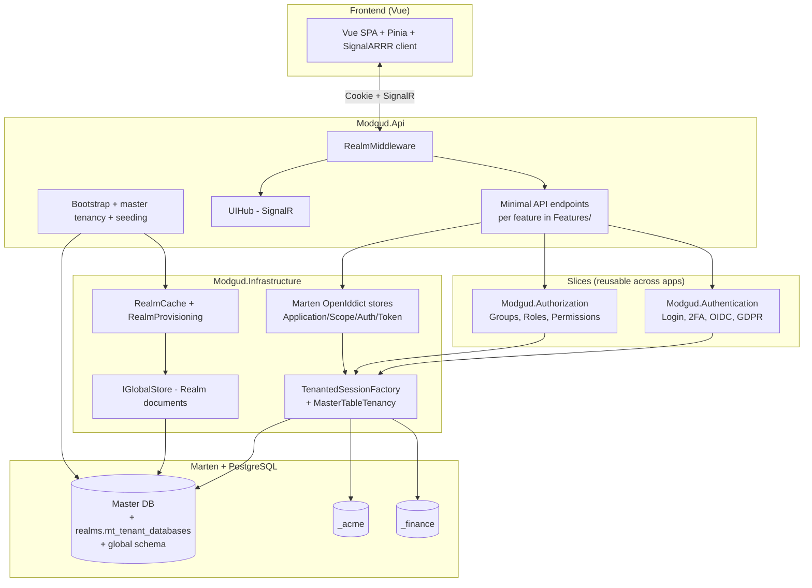

# Backend architecture

Modgud is **not** classically layered (Domain → Application →
Infrastructure). Instead, the core features are organised as vertical
slices, with additional IdP-specific layers on top.

## Project layout

```
src/dotnet/
├── Modgud.Authentication/   ← Slice (Login, 2FA, OIDC, GDPR, Sessions)
├── Modgud.Authorization/    ← Slice (Groups, Roles, Permissions)
├── Modgud.Domain/           ← Realm, OAuth, LoginProvider domain
├── Modgud.Application/      ← DTOs, service interfaces
├── Modgud.Infrastructure/   ← OpenIddict stores, tenancy, realm cache, Wolverine handlers
├── Modgud.Permissions.Abstractions/ ← Shared permission evaluator (realm:admin / <resource>:admin bypass tiers)
├── Modgud.AspNetCore.ResourceServer/ ← Published NuGet package: JWT and introspection integration for resource servers
├── Modgud.Provisioning.TestKit/ ← Published NuGet package: throwaway realms for integration tests
├── Modgud.Api/              ← Minimal API endpoints, middleware, setup, SignalR hub
├── Modgud.Api.Tests/        ← Integration tests (Testcontainers + PostgreSQL)
└── Common/                       ← Shared utilities (PathHelper, Optional<T>, ...)
```

## Component diagram



## Request lifecycle

```
Browser → ASP.NET Core
  ↓ UseRouting
  ↓ UseMiddleware<RealmMiddleware>          ← sets HttpContext.Items["TenantId"]
  ↓ UseSession
  ↓ UseAuthentication                        ← cookie auth
  ↓ UseAuthorization
  ↓ UseMiddleware<TwoFactorEnforcementMW>    ← blocks users without 2FA at level ≥ 1
  ↓ Endpoint routing
  ↓ Endpoint with RequiresPermission(...)    ← per-resource gating
  ↓ Handler
       ↓ IDocumentSession                    ← TenantedSessionFactory reads TenantId
       ↓ Marten query against tenant DB
       ↓ Response
```

`TenantedSessionFactory` is registered as a Marten `ISessionFactory`
(`AddMarten(...).BuildSessionsWith<TenantedSessionFactory>()`), so
every `IDocumentSession`/`IQuerySession` injection is automatically
tenant-scoped.

## Wolverine CQRS

CQRS commands and queries are dispatched via Wolverine's `IMessageBus`:

```csharp
var result = await _messageBus.InvokeAsync<ErrorOr<UserDto>>(
    new CreateUserCommand(...));
```

Handlers are auto-discovered. Modgud runs with
`DurabilityMode.Solo` (in-memory, local) — no external message broker
required. The Marten outbox is still active for event side-effects:
SignalR notifications fire after `SaveChangesAsync` via
`ProjectionSideEffects`.

Codegen mode is environment-aware. Production runs `TypeLoadMode.Dynamic`
— Wolverine/Marten handler classes are generated in memory on first use
and never written to disk, so the container never tries to write into its
read-only application directory. Local dev and tests run
`TypeLoadMode.Auto`, which generates into `Internal/Generated/` on first
boot and reuses it on the next.

## Marten usage

Modgud uses three Marten patterns:

### 1. Document storage

Classic Marten document store for ephemeral or security-sensitive
data — no event sourcing.

| Document | Contents |
|---|---|
| `ApplicationUser` | ASP.NET Identity user |
| `UserSecurityData` | Password hash, TOTP key, recovery codes, passkey credentials |
| `UserSession` | Active login session |
| `EmailOtpChallenge`, `MagicLinkChallenge` | Ephemeral challenges |
| `PasskeyCeremony`, `PasskeyEnrollCeremony` | Ephemeral, single-use passkey login/enrollment ceremony state (native/bearer flow only — the cookie-based web flow keeps its ceremony state in ASP.NET Core session) |
| `OpenIddictAuthorizationDocument`, `OpenIddictTokenDocument` | OAuth tokens + authorizations |

### 2. Inline projections (`*State`)

Synchronous within the `SaveChanges` transaction. Guarantee that the
next read after a write sees the new state. Used for validation and
identity stores.

| Projection | What it holds |
|---|---|
| `OAuthApplicationState` | OpenIddict application state |
| `OAuthScopeState` | OpenIddict scope state |
| `OAuthApiState` | API resource state |
| `LoginProvider` | Internal/external login provider config — applied directly onto the document by `LoginProviderProjection` (no separate aggregate/state split) |

### 3. Event-sourced aggregates

OAuth domain aggregates are fully event-sourced via Marten:

| Aggregate | Events |
|---|---|
| `OAuthApplicationAggregate` | Created, Updated, Deleted, Renamed, ... |
| `OAuthScopeAggregate` | Created, ResourcesChanged, ... |
| `OAuthApiAggregate` | Created, Updated, Scopes-Changed, ... |

Login providers are event-sourced too, but skip the Aggregate+State
split: `LoginProviderProjection` applies the events directly onto the
`LoginProvider` document (see inline projections above).

User events are emitted by the Authentication slice (`UserCreated`,
`UserUpdated`, `UserPasswordChanged`, `UserLoggedIn`, ...). The slice
itself stores identity through the `ApplicationUser` document; the
events are kept separately for audit and for the `PrincipalProjection`
(see Authorization slice).

## OpenIddict stores

Modgud implements all four OpenIddict stores as Marten-backed
stores, in `Modgud.Infrastructure/OpenIddict/`:

| Store | Backing |
|---|---|
| `MartenApplicationStore` | `OAuthApplicationState` inline projection (event-sourced via aggregate) |
| `MartenScopeStore` | `OAuthScopeState` inline projection (event-sourced via aggregate) |
| `MartenAuthorizationStore` | `OpenIddictAuthorizationDocument` (direct storage) |
| `MartenTokenStore` | `OpenIddictTokenDocument` (direct storage) |

Plus two pipeline hooks:

- `RealmIssuerHandler` — overwrites `context.Issuer` with the per-request
  `BaseUri` (= realm domain). This way every realm has its own
  discovery document.
- `AccessTokenTypeHandler` — switches between reference tokens and JWT
  per client.

## Setup bootstrap

`Program.cs` runs an explicit bootstrap path at startup
(before `app.Run()`):

1. **Create the master DB** (raw SQL, because Marten cannot create its own
   target database)
2. **Apply the primary-store schema** so the tenant registry exists
3. **Apply the Global Store schema**, including installation state
4. **Load every existing active realm** and idempotently apply its realm seeders
5. **Warm RealmCache**

On a fresh database this intentionally leaves the registry empty. The
shell-authorized installation API creates the first tenant database, its first
`realm:admin`, and the initial `IsControlPlane` assignment. See
[First-time setup](../getting-started/first-time-setup).

Only after this does Kestrel start listening.

## Recovery CLI

The Authentication slice ships a break-glass CLI. Instead of starting
Kestrel, the image can run in the container with the `recover`
subcommand:

```bash
dotnet Modgud.Api.dll recover list
dotnet Modgud.Api.dll recover reset-2fa <username>
dotnet Modgud.Api.dll recover set-email <username> <email>
dotnet Modgud.Api.dll recover magic-link <username>
dotnet Modgud.Api.dll recover rebuild-projections
dotnet Modgud.Api.dll recover control-plane list
dotnet Modgud.Api.dll recover adopt-tenant <slug> <name> [domain]
```

Helps with lockouts: all 2FA lost, no admin left, projection
corrupted — all solvable via container exec.

## Frontend integration

The Vue frontend lives at `src/frontend-vue/` and is served from the
container as static `wwwroot/` content via `app.UseSpaUI()`. The SignalR
hub is mounted at `/signalr/ui` (`MapHARRRController<UIHub>`).

## Testing

Integration tests (`Modgud.Api.Tests`) use:

- **Testcontainers** — PostgreSQL in Docker, started automatically on
  test runs
- **WebApplicationFactory** — in-process hosting of the API with
  cookie auth
- **Per-test-class DB isolation** — each test class gets its own DB
- **Shared PostgreSQL container** — one container instance for all
  test collections, parallelised
- **In-process test IdP** — external-login tests either construct
  principals directly or exercise a lightweight Kestrel-hosted stand-in
  OIDC server; no third-party mocking library is involved
- **Wolverine/Marten codegen** (`TypeLoadMode.Auto`) — generated on the
  first boot into the test working tree and reused, so repeat runs skip
  Roslyn compilation
