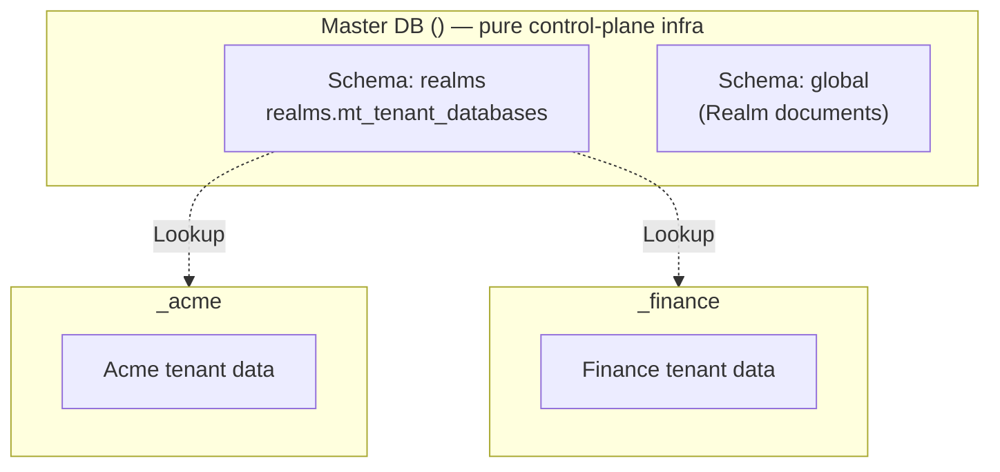

# Multi-tenancy / Realms

Modgud uses a **realm model** for multi-tenancy. Each realm is a
fully autonomous Identity Provider with its own database, users,
roles, OAuth configuration, and login providers.

::: info "Realm" vs. "tenant"
User-facing it's called **realm** everywhere (UI, docs). The code uses
**tenant** in the infrastructure layer (`TenantId`,
`ITenantSessionFactory`, `MasterTableTenancy`), because that's what
Marten/Wolverine call it. `TenantId` = realm slug.
:::

## Domain-based routing

Realms are identified by the **Host header**, not by URL path. Each
realm has one or more configured domains:

| Hostname | Realm |
|---|---|
| `auth.example.com` | Control-Plane realm |
| `acme.example.com` | Acme realm |
| `auth.acme.example.com` | Acme realm (second domain) |
| `auth.localhost` (dev) | Local development realm |

`RealmMiddleware` (`src/dotnet/Modgud.Api/Middleware/RealmMiddleware.cs`)
runs as the very first middleware:

```csharp
public async Task InvokeAsync(HttpContext context)
{
    var path = context.Request.Path.Value;
    if (SkipPaths.Any(p => path.StartsWith(p))) { await _next(context); return; }

    var hostname = context.Request.Host.Host;
    var resolution = await _realmCache.ResolveAsync(hostname);

    if (resolution is null)
    {
        context.Response.StatusCode = 404;
        return;
    }

    var tenantInfo = resolution.Tenant;
    context.Items[TenantConstants.HttpContextTenantIdKey] = tenantInfo.Slug;
    context.Items[TenantConstants.HttpContextTenantInfoKey] = tenantInfo;

    // Set only when the host is an Application's own subdomain (see
    // "Applications and domain routing" below).
    if (resolution.ApplicationId is { } applicationId)
        context.Items[TenantConstants.HttpContextApplicationIdKey] = applicationId;

    // Ambient AsyncLocal so code without an HttpContext (background services,
    // Wolverine handlers) can still see which realm is active; restored when
    // the request scope unwinds.
    using var _ = TenantContext.Enter(tenantInfo.Slug);

    await _next(context);
}
```

Skip paths: `/health`, `/swagger`, `/openapi`, `/_framework` — these
run without realm context. `/signalr` is deliberately **not** skipped:
SignalR connections still need a resolved realm so the auth cookie
(encrypted with that realm's own keys) can be decrypted on
`/signalr/*/negotiate`.

### Single-tenant fallback in dev

If only **one** realm is active AND the host is a localhost variant
(`localhost`, `127.0.0.1`, `::1`, `0.0.0.0`), the cache returns that
realm — even if it doesn't list the localhost domain. This way a
single-realm dev boot works without a hosts-file entry.

### Primary domain

While a realm may route from several domains, exactly one of them is its **PrimaryDomain** — the canonical public host. Any host in `Domains` resolves the realm for *inbound* requests, but the PrimaryDomain is what Modgud uses whenever it has to *emit* a host: magic-link and bootstrap-invite URLs, and the **WebAuthn relying-party ID** that binds passkeys. A realm always has a PrimaryDomain (it defaults to the first domain at creation) and it must be one of `Domains`. Re-point it from the admin UI's domain picker or via the [Recovery CLI](recovery-cli) `realm-set-primary-domain`; because it is the passkey RP ID, changing it invalidates every passkey in the realm.

### Applications and domain routing

A realm can also give one of its [Applications](../admin/applications) its own subdomain (e.g. `billing.acme.example.com`). Resolving that host still lands on the realm — same tenant DB, same user pool, same OIDC issuer — but the middleware additionally pins which Application the request is for, so app-specific branding and login-experience settings apply. This is a routing refinement layered on top of the realm/domain mechanism above, not a second isolation boundary.

## RealmCache

`RealmCache` (`Modgud.Infrastructure/Realms/RealmCache.cs`) holds
a snapshot of the domain → realm mappings in memory:

```csharp
private sealed record CacheSnapshot(
    ConcurrentDictionary<string, TenantInfo> ByDomain,
    ConcurrentDictionary<string, ApplicationDomainMatch> ByApplicationDomain,
    TenantInfo? SingleActiveRealm,
    DateTimeOffset LoadedAt);
```

Loads all active realms from `IGlobalStore` (see below) at startup.
Invalidated on realm CUD (Create/Update/Delete via the admin API), and
also revalidated on a 60-second timer regardless — so a change made on
another node of a multi-node deployment is picked up within that
window even without a cross-node cache invalidation.

## Database-per-tenant via Marten

Modgud uses Marten's `MasterTableTenancy`:



| Database | Contents |
|---|---|
| `<master-db>` (master) | `realms.mt_tenant_databases` (tenant registry) + schema `global` (Realm documents) + Wolverine durability — pure control-plane infra, **not** a tenant |
| `<master-db>_<slug>` | A dedicated physical DB for every realm, including the first |

The master DB holds **no** tenant data. Every realm has the same shape and
lives in its own `<master-db>_<slug>` database. The
[Control-Plane flag](../concepts/control-plane) can move between active realms;
no database or slug is privileged by itself.

## TenantedSessionFactory

A Marten `ISessionFactory` implementation
(`Modgud.Infrastructure/Persistence/Tenancy/TenantedSessionFactory.cs`)
that reads the `TenantId` from `HttpContext.Items`:

```csharp
public IDocumentSession OpenSession()
    => _store.LightweightSession(ResolveTenantId(forWrite: true));

public IQuerySession OpenQuerySession()
    => _store.QuerySession(ResolveTenantId(forWrite: false));

private string ResolveTenantId(bool forWrite)
{
    var explicitTenant = TenantContext.CurrentOrNull
        ?? _httpContextAccessor.HttpContext?
             .Items[TenantConstants.HttpContextTenantIdKey] as string;

    return explicitTenant ?? FallbackTenantId(forWrite);
}
```

An ambient `TenantContext.CurrentOrNull` (set by `RealmMiddleware`, or
explicitly via `TenantContext.Enter(...)` for a deliberate cross-realm
operation) is checked before `HttpContext.Items`, which carries the
same value on the common request path.

Wired up via:

```csharp
builder.Services.AddMarten(...)
    .BuildSessionsWith<TenantedSessionFactory>();
```

This way every `IDocumentSession`/`IQuerySession` injection is realm-scoped.
When neither signal resolves a tenant, reads and writes both fail closed.
Deployment-wide work uses `IGlobalStore`; background realm work explicitly
enters `TenantContext.Enter(slug)`. Moving the Control Plane can therefore
never redirect unrelated data into another realm.

## IGlobalStore

The `Realm` document itself can't live in the tenant store —
chicken-and-egg. It lives in a separate Marten store (`IGlobalStore`)
against schema `global` of the master DB:

```csharp
public sealed record TenantInfo(string Slug, bool IsControlPlane, bool IsActive, string? PrimaryDomain = null);

public class Realm
{
    public Guid Id { get; set; }
    public string Slug { get; set; }            // = TenantId, immutable, reserved if "system"
    public string DisplayName { get; set; }
    public string? Description { get; set; }
    public string[] Domains { get; set; }       // ["acme.example.com", ...]
    public string PrimaryDomain { get; set; }   // must be one of Domains — see "Primary domain" above
    public Dictionary<string, Guid> ApplicationDomains { get; set; } // subdomain -> Application id
    // Stored and transferable. The first installed realm receives the
    // flag; it can later be moved to any active realm.
    public bool IsControlPlane { get; set; }
    public bool IsActive { get; set; }
    public DateTimeOffset CreatedAt { get; set; }
    public DateTimeOffset? UpdatedAt { get; set; }
}
```

`RealmCache` loads the realm list from `IGlobalStore`.

## Bootstrap order

In `Program.cs` (before `app.Run`):

1. **Create the master DB** (raw SQL)
2. **Apply primary and Global Store schemas**
3. **Load and idempotently seed every existing active realm**
4. **Warm RealmCache**
5. **Check the recovery-CLI path** or start Kestrel

A fresh boot stops here with zero realms. The first-installation flow creates
the first tenant database and assigns its realm the Control-Plane flag only
after the first `realm:admin` exists. Existing deployments keep their registered
realms and persisted Control-Plane assignment.

## Realm CRUD

Endpoints under `/api/admin/realms` — gated by `realm:read` /
`realm:write` (catalog entries in the `control-plane` App, which is
only seeded on the Control-Plane realm). Only reachable on the
**Control-Plane realm** (the realm holding the control-plane flag). On any other
host: 404 (the existence of the surface is hidden from tenant realms
— see [Concepts: Control Plane](../concepts/control-plane)).

### Create

`POST` creates a complete realm independently from administrator onboarding.
`InitialAdmin` is optional for API clients that want creation and invitation in
one atomic request; the admin UI uses the separate invitation action.

```http
POST /api/admin/realms
{
  "Slug": "acme",
  "DisplayName": "Acme Corp",
  "Domains": ["acme.example.com"]
}
```

`IsControlPlane` is **not** in the request body — new realms are never the
control plane. The role only moves via
[transfer](../concepts/control-plane#transferring-the-control-plane).

Backend:

1. Validates `slug` (regex, reserved-words check).
2. `CREATE DATABASE <master-db>_acme` (raw SQL).
3. `tenancy.AddDatabaseRecordAsync("acme", connStringForAcme)`.
4. `Storage.ApplyAllConfiguredChangesToDatabaseAsync()`.
5. **`OAuthRealmSeeder`** seeds 6 default scopes + the Internal login
   provider into the new tenant DB.
6. **`AppRealmSeeder`** seeds the `modgud` app. The
   `control-plane` app is **only** seeded when the new realm is itself
   the Control Plane.
7. `Realm` document persisted in `IGlobalStore`.
8. `RealmCache.Invalidate()`.
9. Realm creation completes independently from administrator onboarding.

`POST /api/admin/realms/{slug}/admin-invites` issues a single-use,
24-hour realm-admin invitation. Issuing a new invitation revokes every
previous open admin invitation in that realm.

The recipient consumes the invite at `POST /api/account/bootstrap-admin` on
the realm's host, sets a password and gets auto-signed-in. Atomic with that
consume, `RealmAdminBootstrapper` creates the user, seeds the default roles and
adds the user to the Administrators group with `realm:admin`.

### Update

```http
PATCH /api/admin/realms/{slug}
{
  "displayName": "Acme Corporation",
  "domains": ["acme.example.com", "auth.acme.com"]
}
```

`Slug` is immutable.

### Soft-delete (deactivate)

```http
PATCH /api/admin/realms/{slug}
{ "isActive": false }
```

`RealmCache` filters on `IsActive = true` — all requests to the realm
domain land on `404`. Data is preserved.

::: danger Control-Plane realm
The realm currently holding `IsControlPlane` cannot be deactivated. Transfer
the flag first.
:::

### Hard-delete

```http
DELETE /api/admin/realms/{slug}?hard=true
```

Escalates from the reversible soft-delete above to a destructive
delete that drops the realm's tenant database. Refused for the
Control-Plane realm. Without `?hard=true`, `DELETE` behaves the same
as the soft-delete (`isActive = false`).

### Declarative provisioning (import / apply / export)

Beyond the one-field-at-a-time Create/Update above, the same
`/api/admin/realms` group also accepts a **manifest** — a single JSON
document describing a realm's apps, OAuth clients/scopes/APIs, roles,
users and groups:

- `POST /import` — create a brand-new realm from a manifest.
- `POST /{slug}/apply` (optionally `?prune=true` for a full sync that
  also removes anything absent from the manifest) — apply a manifest
  to an existing realm in place.
- `GET /{slug}/export` — export a realm's current shape as a manifest.
- `GET /manifest-schema` — the manifest's JSON Schema.

See [Declarative Realm Provisioning](../admin/realm-provisioning) for
the full walkthrough.

## Cookies and sessions in a multi-realm setup

Since each realm has its own domain, cookies are automatically
realm-isolated by the browser's cookie-domain rule. A login on
`acme.example.com` sets a cookie for exactly that domain — it isn't
sent on `finance.example.com`. No path acrobatics required.

Sessions (`UserSession` documents) live per realm in the tenant store.
A user logged in to two realms has two separate sessions, in two
separate DBs.
