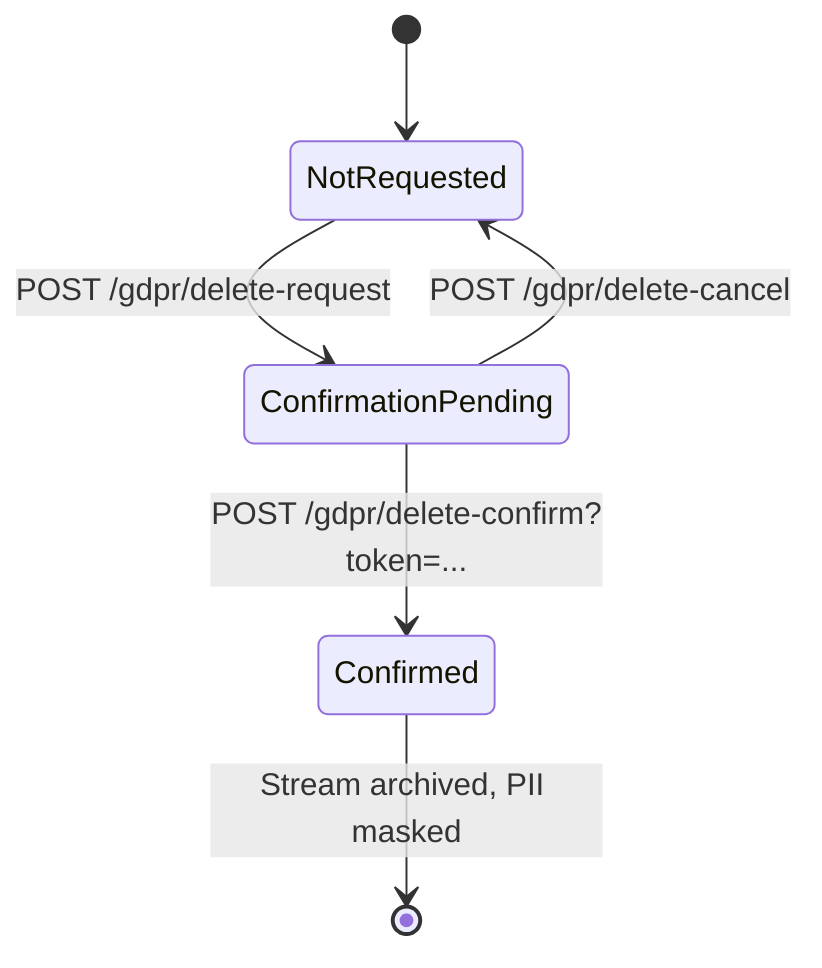

# GDPR & Sessions

## Session tracking with UAParser

Every login creates a `UserSession` Marten document in the tenant store
(NOT event-sourced — sessions are ephemeral state).

| Field | Source |
|---|---|
| `UserId` | Auth system |
| `SessionId` | Random GUID |
| `IpAddress` | `HttpContext.Connection.RemoteIpAddress` (proxy-aware via `ForwardedHeaders`) |
| `Browser`, `BrowserVersion` | UAParser from `User-Agent` |
| `OperatingSystem`, `OsVersion` | UAParser |
| `DeviceType` | UAParser → Desktop / Mobile / Tablet |
| `CreatedAt`, `LastActiveAt`, `ExpiresAt` | UTC timestamps |

`SessionTracker` (HTTP-middleware-like) updates `LastActiveAt` on every
authenticated request — throttled (e.g. only every 60 seconds per
session) so the write traffic doesn't escalate.

`DeviceInfoService` is a pure UAParser wrapper, singleton.
`SessionService` holds an `IDocumentSession`, scoped.

## Session self-service

```http
GET    /api/account/sessions
DELETE /api/account/sessions/{id}
DELETE /api/account/sessions          # Logout everywhere (except current)
```

The frontend shows each session with browser, OS, IP, "active now" or
"x minutes ago". The user can revoke individual sessions or "log out
everywhere except here".

Admin variant:

```http
GET    /api/admin/users/{id}/sessions
DELETE /api/admin/users/{id}/sessions  # Force logout
```

## GDPR self-service

The user can export their data and delete their account — both without
admin involvement.

### Data export (Article 20)

```http
GET /api/account/gdpr/export
```

Returns a ZIP containing:

- `user.json` — all user fields
- `events.json` — all user domain events from the stream (filtered to
  this user)
- `sessions.json` — session history
- `external-logins.json` — linked OIDC identities

No streaming needed — user data is small. If that ever changes, the
endpoint would spawn a background job and deliver the result via a
mailed link.

### Account deletion

Three-step process with a cooling-off period:



1. **Request:**

```http
POST /api/account/gdpr/delete-request
```

→ `UserDeletionState.Status = ConfirmationPending`, a
`ConfirmationToken` (256-bit) is generated, and an email with a link to
`/profile/confirm-deletion?token=...` goes out. The user stays fully
functional and logged in.

2. **Confirm** (user clicks the link in the email):

```http
POST /api/account/gdpr/delete-confirm
{ "token": "..." }
```

→ Backend:

- `ArchiveStream(userId)` — the user event stream is archived (out of
  live queries, audit remains)
- Marten **data masking** runs over the archived events: PII fields
  (`Email`, `FirstName`, `LastName`, `PhoneNumber`, `IpAddress` in
  `UserLoggedIn`/`UserLoginFailed`) are overwritten
- The `ApplicationUser` document is deleted
- `UserSecurityData` (hashes, TOTP key, recovery codes, passkey
  credentials) is deleted
- All `UserSession`s are deleted
- All `ExternalIdentityLink`s are deleted
- The user is logged out

3. **Cancel** (alternatively, before confirm):

```http
POST /api/account/gdpr/delete-cancel
```

→ `UserDeletionState.Status = NotRequested`, token invalidated.

### Status query

```http
GET /api/account/gdpr/delete-status
```

Returns `{ status: "NotRequested" | "ConfirmationPending", requestedAt }`.
The frontend shows the appropriate UI (request button or "cancel +
request a new email").

## Marten data masking

Configured during Marten setup (`UseCocoarAuthAuthentication`):

```csharp
options.Events.AddMaskingRuleForProtectedInformation<UserCreated>(x =>
    new UserCreated(x.UserId, "[DELETED]", "[DELETED]", null, null, null));

options.Events.AddMaskingRuleForProtectedInformation<UserLoggedIn>(x =>
    new UserLoggedIn(x.UserId, "[DELETED-IP]", x.OccurredAt));
```

Masking rules only apply when the stream is **archived** — live events
are not touched. This is intentional: while a user is active, their
events are fresh and correct; once they are deleted, the events are
made unreadable but not removed (audit requirement).

## Stream archival

`ArchiveStream` marks a stream as archived. Marten queries
(`Query<TProjection>()`) no longer surface archived events in
read-models — the person is effectively gone from the system. Only
explicit compliance queries
(`OpenSession().Events.QueryAllRawEvents()`) still see them, with
masked PII fields.

## Admin variant

An admin (with `cocoar-auth:user:admin` permission) can trigger the GDPR flow:

```http
POST   /api/admin/users/{id}/gdpr/delete-request
POST   /api/admin/users/{id}/gdpr/delete-confirm
DELETE /api/admin/users/{id}/gdpr/delete-cancel
```

The confirmation email goes to the user's email; the user has to click
— even if the admin initiated it. This prevents a compromised admin
account from deleting users en masse.

::: tip Soft-delete vs. GDPR erase
Soft-delete (`IsDeleted = true` without PII masking) is for "the user
is no longer active, but we keep everything". GDPR confirm-delete is
final: stream archived + PII masked. Only run the latter on user
request or compliance trigger.
:::
