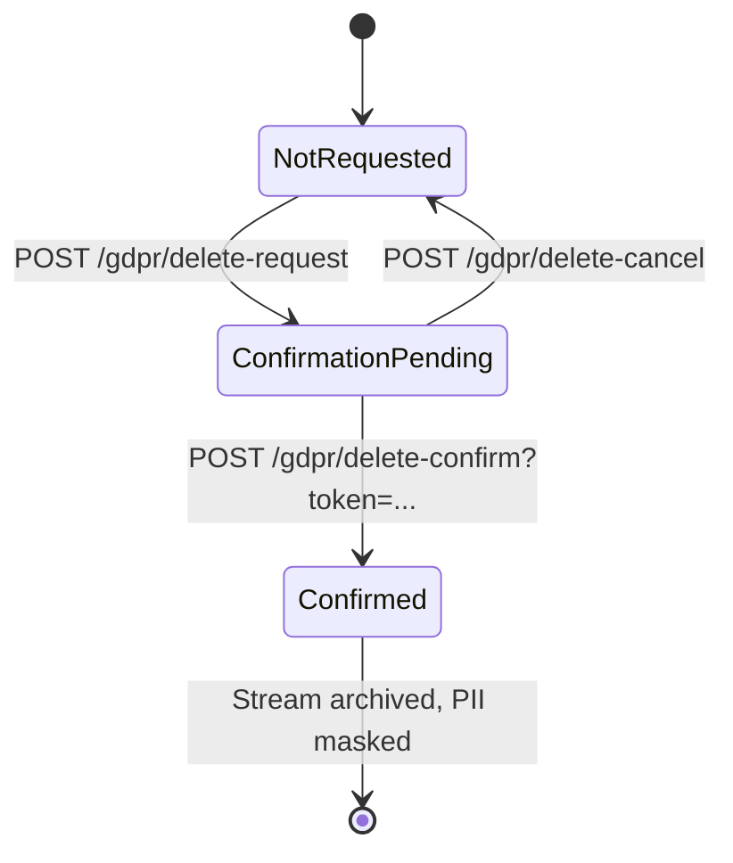

# GDPR & Sessions

## Session-Tracking mit UAParser

Jeder Login erzeugt ein `UserSession`-Marten-Document im Tenant-Store
(NICHT event-sourced — Sessions sind ephemerer Zustand).

| Feld | Quelle |
|---|---|
| `UserId` | Auth-System |
| `SessionId` | Random GUID |
| `IpAddress` | `HttpContext.Connection.RemoteIpAddress` (durch `ForwardedHeaders` proxy-aware) |
| `Browser`, `BrowserVersion` | UAParser aus `User-Agent` |
| `OperatingSystem`, `OsVersion` | UAParser |
| `DeviceType` | UAParser → Desktop / Mobile / Tablet |
| `CreatedAt`, `LastActiveAt`, `ExpiresAt` | UTC-Timestamps |

`SessionTracker` (HTTP-Middleware-ähnlich) updated `LastActiveAt` bei
jedem authentifizierten Request — throttled (z.B. nur alle 60 Sekunden
pro Session) damit der Schreibverkehr nicht eskaliert.

`DeviceInfoService` ist ein reiner UAParser-Wrapper, Singleton.
`SessionService` hält eine `IDocumentSession`, scoped.

## Session-Self-Service

```http
GET    /api/account/sessions
DELETE /api/account/sessions/{id}
DELETE /api/account/sessions          # Logout everywhere (außer current)
```

Das Frontend zeigt jede Session mit Browser, OS, IP, "active now" oder
"x minutes ago". User kann einzelne revoken oder "alle abmelden außer
mir hier".

Admin-Variante:

```http
GET    /api/admin/users/{id}/sessions
DELETE /api/admin/users/{id}/sessions  # Force logout
```

## GDPR-Self-Service

Der User kann seine Daten exportieren und sein Konto löschen — beides
ohne Admin-Touch.

### Daten-Export (Article 20)

```http
GET /api/account/gdpr/export
```

Liefert ein ZIP mit:

- `user.json` — alle User-Felder
- `events.json` — alle User-Domain-Events aus dem Stream (gefiltert auf
  diesen User)
- `sessions.json` — Session-Historie
- `external-logins.json` — verknüpfte OIDC-Identitäten

Kein Streaming nötig — User-Daten sind klein. Wenn das mal anders wird,
würde der Endpoint einen Background-Job spawnen und das Ergebnis per
Mail-Link zustellen.

### Account-Löschung

3-Schritt-Prozess mit Bedenkzeit:



1. **Request:**

```http
POST /api/account/gdpr/delete-request
```

→ `UserDeletionState.Status = ConfirmationPending`,
`ConfirmationToken` (256-bit) wird generiert, Mail mit Link
`/profile/confirm-deletion?token=...` geht raus. User bleibt
voll-funktional eingeloggt.

2. **Confirm** (User klickt Link in der Mail):

```http
POST /api/account/gdpr/delete-confirm
{ "token": "..." }
```

→ Backend:

- `ArchiveStream(userId)` — der User-Event-Stream wird archiviert (aus
  Live-Queries draußen, Audit bleibt)
- Marten **Data-Masking** läuft über die archivierten Events:
  PII-Felder (`Email`, `FirstName`, `LastName`, `PhoneNumber`, `IpAddress`
  in `UserLoggedIn`/`UserLoginFailed`) werden überschrieben
- `ApplicationUser`-Document wird gelöscht
- `UserSecurityData` (Hashes, TOTP-Key, Recovery-Codes,
  Passkey-Credentials) wird gelöscht
- Alle `UserSession`s werden gelöscht
- Alle `ExternalIdentityLink`s werden gelöscht
- User wird ausgeloggt

3. **Cancel** (alternativ vor Confirm):

```http
POST /api/account/gdpr/delete-cancel
```

→ `UserDeletionState.Status = NotRequested`, Token entwertet.

### Status-Abfrage

```http
GET /api/account/gdpr/delete-status
```

Liefert `{ status: "NotRequested" | "ConfirmationPending", requestedAt }`.
Frontend zeigt das passende UI (Request-Button oder
"Cancel + erneut Mail anfordern").

## Marten Data-Masking

Konfiguriert beim Marten-Setup (`UseCocoarAuthAuthentication`):

```csharp
options.Events.AddMaskingRuleForProtectedInformation<UserCreated>(x =>
    new UserCreated(x.UserId, "[DELETED]", "[DELETED]", null, null, null));

options.Events.AddMaskingRuleForProtectedInformation<UserLoggedIn>(x =>
    new UserLoggedIn(x.UserId, "[DELETED-IP]", x.OccurredAt));
```

Masking-Regeln greifen erst beim **Archivieren** des Streams — Live-Events
werden nicht angefasst. Das ist absichtlich: solange ein User aktiv ist,
sind seine Events frisch und korrekt; sobald er gelöscht wird, werden
sie unkenntlich gemacht aber nicht entfernt (Audit-Anforderung).

## Stream-Archivierung

`ArchiveStream` markiert einen Stream als archiviert. Marten-Queries
(`Query<TProjection>()`) zeigen archivierte Events nicht mehr in
Read-Models — die Person ist aus dem System effektiv weg. Nur
explizite Compliance-Queries (`OpenSession().Events.QueryAllRawEvents()`)
sehen sie noch, mit gemaskten PII-Feldern.

## Admin-Variante

Admin kann (mit `user:admin`-Permission) den GDPR-Flow anstoßen:

```http
POST   /api/admin/users/{id}/gdpr/delete-request
POST   /api/admin/users/{id}/gdpr/delete-confirm
DELETE /api/admin/users/{id}/gdpr/delete-cancel
```

Konfirmations-Mail geht an die User-Email, der User muss klicken — auch
wenn der Admin das angestoßen hat. Das verhindert dass ein
kompromittierter Admin-Account User reihenweise löscht.

::: tip Soft-Delete vs. GDPR-Erase
Soft-Delete (`IsDeleted = true` ohne PII-Masking) ist für
"User ist nicht mehr aktiv, aber wir behalten alles" gedacht.
GDPR-Confirm-Delete ist endgültig: Stream archiviert + PII gemasked.
Letzteres erst auf User-Wunsch oder Compliance-Trigger ausführen.
:::
