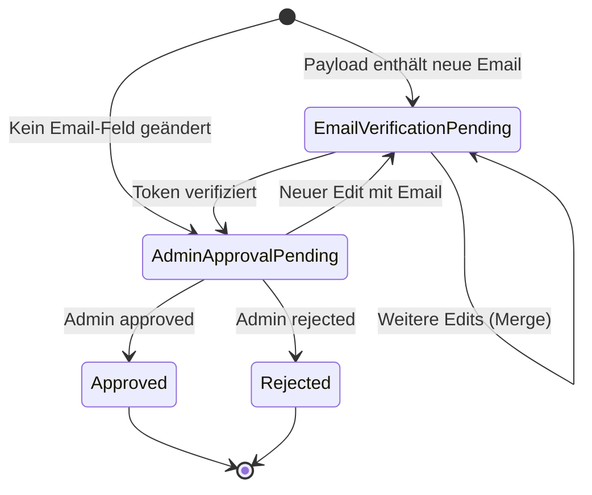

# Konzepte

## BFF-Pattern (Backend-for-Frontend)

Cocoar.Auth nutzt **Cookie-basierte Authentifizierung** ohne JWTs im
Browser. Der Vue-SPA spricht ausschließlich mit dem eigenen Backend, das
ein `HttpOnly`-Session-Cookie hält. Kein Token im LocalStorage, kein
OAuth-Token-Handling im Frontend.

Warum:

- `HttpOnly` + `SameSite=Strict` schützt gegen XSS-Token-Diebstahl
- Sliding Expiration über Cookie-Renewals, kein Refresh-Token-Tanz
- Backend hat volle Kontrolle über Session-Invalidierung (SignOut →
  Cookie weg, fertig)

Das Hauptcookie heißt `Cocoar.Auth.Auth` und ist `HttpOnly`,
`SameSite=Strict`. In Production immer `Secure=Always`, in Dev
`Secure=None`, weil der Vite-Proxy `http://localhost:4300` und das
Backend `http://localhost:9099` ohne TLS spricht.

::: tip OAuth/OIDC Server ist davon getrennt
Der Cookie ist nur für die First-Party-Frontend-Sitzung mit dem
Admin-/User-UI von cocoar.auth. Der OAuth-/OIDC-Server (OpenIddict)
gibt klassische Access- + Refresh-Tokens an externe Apps aus — das
ist eine ganz andere Achse.
:::

## Authentication Level

Konfiguriert in `AppSettings.AuthenticationMinimumLevel`:

| Level | Name | Verhalten |
|---|---|---|
| 0 | None | Kein Enforcement — Password-only erlaubt |
| 1 | SecureLogin (Standard) | Password-only blockiert — User muss 2FA oder Passwordless einrichten |
| 2 | Passwordless | Password-Login komplett deaktiviert — nur Magic Link + Passkey |

Geprüft an zwei Stellen:

1. **Login-Endpoint** — bei Password-Login: Level 2 → sofort 403;
   Level ≥ 1 → prüft ob User 2FA hat, sonst `RequiresSecureSetup`-Response
2. **`TwoFactorEnforcementMiddleware`** — bei jedem API-Request nach
   erfolgreicher Authentifizierung: prüft Grace-Period und blockiert
   abgelaufene User mit `403 { RequiresSecureSetup: true, GracePeriod: false }`

Whitelist der Middleware: `/api/account/me`, `/logout`, `/mfa/*`,
`/email-otp/*`, `/passkey/*`, `/change-password` sind immer erreichbar,
damit der User sich tatsächlich einrichten kann.

## SecureSetup-Modal und Grace-Period

Bei Level ≥ 1 muss jeder User mindestens eine 2FA-Methode aktivieren.
User ohne 2FA bekommen eine Grace-Period:

1. Erster Login nach Level-Aktivierung → `SecureSetupDueAt` wird gesetzt
   (`now + TwoFactorGracePeriodDays` oder per-User-Override)
2. Solange `SecureSetupDueAt > now` → Login gelingt, Response enthält
   `{ RequiresSecureSetup: true, GracePeriod: true, SecureSetupDueAt }` →
   Frontend zeigt non-blocking Modal
3. Nach Ablauf → Middleware blockiert mit
   `403 { RequiresSecureSetup: true, GracePeriod: false }` → Frontend
   zeigt blocking Modal

`TwoFactorExempt`-Flag (per User) bypassed Enforcement komplett. Wer das
letzte 2FA-Verfahren bei Level ≥ 1 entfernt → `SecureSetupDueAt = now`
(sofort blockierend, kein neues Grace-Fenster).

## Cookie- und Session-Modell

```
┌────────────────────────────────────────────────────────┐
│  Cocoar.Auth.Auth          ASP.NET Identity App-Cookie │
│  HttpOnly, SameSite=Strict, Secure (Prod)              │
│  ExpireTimeSpan = 30 Tage, SlidingExpiration = true    │
│                                                        │
│  Session cookie:    RememberMe=false → läuft bei       │
│                     Browser-Schließen ab               │
│  Persistent:        RememberMe=true → 30 Tage          │
│  Passkey/MagicLink: immer persistent, 30 Tage          │
└────────────────────────────────────────────────────────┘

┌────────────────────────────────────────────────────────┐
│  Cocoar.Auth.2FA           2FA-Partial-Cookie          │
│  Gültig 5 Minuten — hält UserId zwischen               │
│  Password-Step und TOTP/Email-OTP-Step                 │
└────────────────────────────────────────────────────────┘

┌────────────────────────────────────────────────────────┐
│  Cocoar.Auth.External      OIDC External Cookie        │
│  SameSite=Lax (Browser hält Cookie über IdP-Redirect)  │
│  Gültig 10 Minuten — Callback → App-Sign-In            │
└────────────────────────────────────────────────────────┘

┌────────────────────────────────────────────────────────┐
│  Cocoar.Auth.Session       ASP.NET Session             │
│  HttpOnly, SameSite=Strict, 5 Min Idle                 │
│  Nur für Passkey-Attestation-Options (Challenge-Store) │
└────────────────────────────────────────────────────────┘
```

Im Multi-Realm-Setup ist die Realm-Boundary die **Domain** (Host-Header),
nicht der URL-Pfad. Cookies sind nicht pfad-scoped — sie leben unter
der Realm-Domain. Cross-Realm-Leakage entsteht nicht, weil jeder Realm
seine eigene Domain hat (siehe [Realms](/concepts/realms)).

## 2FA-Methoden

### TOTP (Time-based One-Time Password)
Standard RFC-6238 6-stellige Codes. Setup via QR-Code-URI
(`otpauth://totp/…`). Kein externer Service nötig — OTP-Berechnung läuft
server-seitig via `AddDefaultTokenProviders()`. Immer verfügbar.

### Email OTP
6-stelliger Code per E-Mail. Benötigt einen konfigurierten
`IEmailService` (Postmark oder SMTP). Challenge-Dokument
(`EmailOtpChallenge`) in Marten — enthält Hash des Codes und Ablaufzeit.
Immer verfügbar (wie TOTP).

### Passkey (FIDO2 / WebAuthn)
Fido2NetLib verwaltet Attestation (Registration) und Assertion (Login).
`StoredPasskeyCredential` in Marten. Passkey-Login setzt immer ein
persistentes Cookie (30 Tage). Session-Storage (Marten
`DistributedMemoryCache`) hält das Attestation-Options-Objekt zwischen
Registration-Start und -Finish. `ServerDomain` + `Origins` werden aus
`PublicUrl` abgeleitet.

### Magic Link
Einmal-Token per E-Mail. `MagicLinkChallenge` in Marten (Hash des Tokens
+ UserId + Ablaufzeit). Zwei Modi:

- **Admin-Send** (`POST /api/admin/users/{id}/magic-link`): immer
  verfügbar, kein Feature-Toggle, Notfallzugang + Onboarding
- **Self-Service** (`POST /api/account/magic-link/request`): nur wenn
  `IMagicLinkConfiguration.Enabled` **und**
  `IAuthSettings.MagicLinkSelfService` beide `true`

Magic-Link-Login setzt immer ein persistentes Cookie (30 Tage).

## AuthLog

```
Serilog.ILogger.LogInformation("Auth: Login successful. User={UserName} IP={IP}", ...)
       │
       ▼
AuthLogSink (ILogEventSink)
  Filter: MessageTemplate.Text.StartsWith("Auth:")
       │
       ▼
Channel<AuthLogDocument> (unbounded)
       │
       ▼
AuthLogPersistenceService (BackgroundService)
  Batch: bis 100 Dokumente, alle 2 Sek. oder bei Channel-Drain
       │
       ▼
Marten (per-Tenant: mt_doc_authlogdocument)
  Cleanup: stündlich, 7-Tage-Retention
```

Der Log landet im Tenant-Store des aktiven Realms — jeder Realm hat
seinen eigenen Audit-Log. Recovery-CLI-Einträge (`Auth: Recovery …`)
werden vom Sink ebenfalls erfasst.

## Profile Self-Service (UserChangeRequest)



**Ein offener Request pro (UserId, Type)** — mehrere Edits mergen in
denselben Request per `MutableJsonMerge.MergeDestructive`. Das Payload
ist opakes JSON; `ProfileUpdateDto` hat `Optional<T>`-Felder. Cleanup
beim Merge: wenn ein Feld identisch zum aktuellen User-Wert ist, wird
es aus dem Payload entfernt (Revert = No-Op).

Admin-Benachrichtigung bei `EmailVerificationPending → AdminApprovalPending`:
`IPrincipalEmailResolver` löst alle Adressen von Gruppen mit
`app:admin`-Rolle auf.
