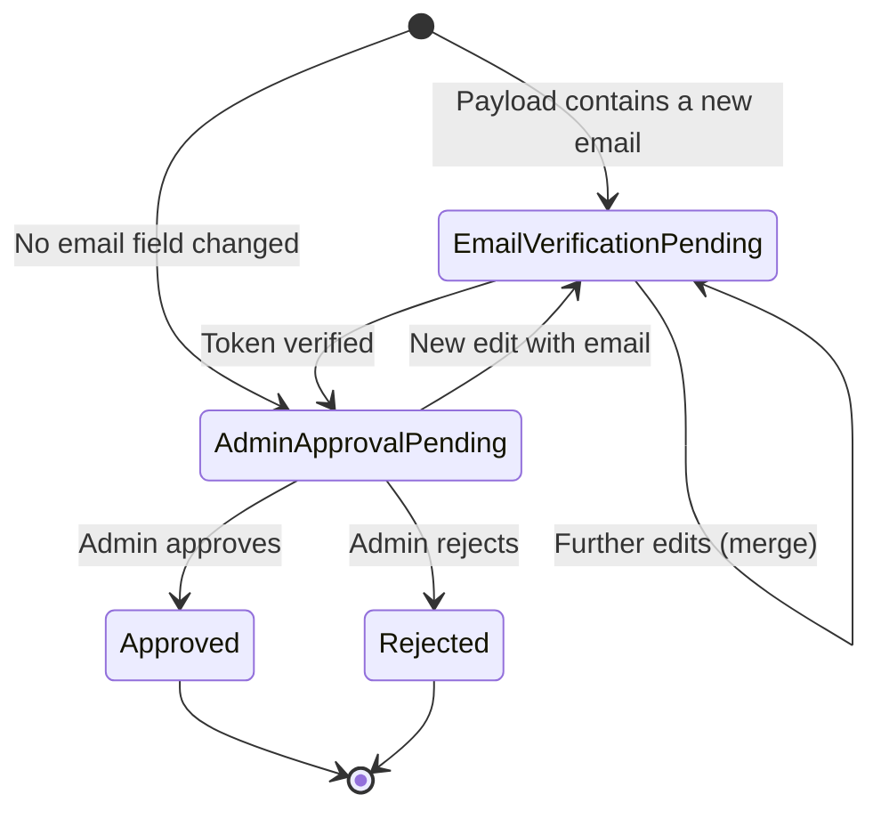

# Concepts

## BFF pattern (Backend-for-Frontend)

Cocoar.Auth uses **cookie-based authentication** without JWTs in the
browser. The Vue SPA talks exclusively to its own backend, which holds
an `HttpOnly` session cookie. No token in localStorage, no OAuth token
handling in the frontend.

Why:

- `HttpOnly` + `SameSite=Strict` protects against XSS token theft
- Sliding expiration via cookie renewals, no refresh-token dance
- The backend has full control over session invalidation (SignOut →
  cookie gone, done)

The main cookie is named `Cocoar.Auth.Auth` and is `HttpOnly`,
`SameSite=Strict`. In production always `Secure=Always`; in dev
`Secure=None`, because the Vite proxy talks to
`http://localhost:4300` and the backend `http://localhost:9099`
without TLS.

::: tip The OAuth/OIDC server is separate
The cookie is only for the first-party frontend session with the
admin/user UI of cocoar.auth. The OAuth/OIDC server (OpenIddict)
issues classical access + refresh tokens to external apps — that's a
completely different axis.
:::

## Authentication level

Configured in `AppSettings.AuthenticationMinimumLevel`:

| Level | Name | Behaviour |
|---|---|---|
| 0 | None | No enforcement — password-only allowed |
| 1 | SecureLogin (default) | Password-only blocked — user must set up 2FA or passwordless |
| 2 | Passwordless | Password login fully disabled — only Magic Link + Passkey |

Checked in two places:

1. **Login endpoint** — on password login: Level 2 → immediate 403;
   Level ≥ 1 → checks whether the user has 2FA, otherwise
   `RequiresSecureSetup` response
2. **`TwoFactorEnforcementMiddleware`** — on every API request after
   successful authentication: checks the grace period and blocks
   expired users with
   `403 { RequiresSecureSetup: true, GracePeriod: false }`

Whitelisted by the middleware: `/api/account/me`, `/logout`, `/mfa/*`,
`/email-otp/*`, `/passkey/*`, `/change-password` are always reachable
so the user can actually set themselves up.

## SecureSetup modal and grace period

At Level ≥ 1 every user must enable at least one 2FA method. Users
without 2FA get a grace period:

1. First login after level activation → `SecureSetupDueAt` is set
   (`now + TwoFactorGracePeriodDays` or per-user override)
2. While `SecureSetupDueAt > now` → login succeeds, the response
   contains
   `{ RequiresSecureSetup: true, GracePeriod: true, SecureSetupDueAt }` →
   the frontend shows a non-blocking modal
3. After expiry → middleware blocks with
   `403 { RequiresSecureSetup: true, GracePeriod: false }` → the
   frontend shows a blocking modal

The `TwoFactorExempt` flag (per user) bypasses enforcement entirely.
If the last 2FA method is removed at Level ≥ 1 →
`SecureSetupDueAt = now` (immediately blocking, no fresh grace
window).

## Cookie and session model

```
┌────────────────────────────────────────────────────────┐
│  Cocoar.Auth.Auth          ASP.NET Identity App-Cookie │
│  HttpOnly, SameSite=Strict, Secure (Prod)              │
│  ExpireTimeSpan = 30 days, SlidingExpiration = true    │
│                                                        │
│  Session cookie:    RememberMe=false → expires when    │
│                     the browser closes                 │
│  Persistent:        RememberMe=true → 30 days          │
│  Passkey/MagicLink: always persistent, 30 days         │
└────────────────────────────────────────────────────────┘

┌────────────────────────────────────────────────────────┐
│  Cocoar.Auth.2FA           2FA partial cookie          │
│  Valid 5 minutes — holds the UserId between            │
│  the password step and the TOTP/Email-OTP step         │
└────────────────────────────────────────────────────────┘

┌────────────────────────────────────────────────────────┐
│  Cocoar.Auth.External      OIDC external cookie        │
│  SameSite=Lax (browser keeps the cookie across the     │
│  IdP redirect)                                         │
│  Valid 10 minutes — Callback → app sign-in             │
└────────────────────────────────────────────────────────┘

┌────────────────────────────────────────────────────────┐
│  Cocoar.Auth.Session       ASP.NET Session             │
│  HttpOnly, SameSite=Strict, 5 min idle                 │
│  Only for passkey attestation options (challenge       │
│  store)                                                │
└────────────────────────────────────────────────────────┘
```

In a multi-realm setup the realm boundary is the **domain** (Host
header), not the URL path. Cookies are not path-scoped — they live
under the realm domain. Cross-realm leakage doesn't happen because
each realm has its own domain (see [Realms](/concepts/realms)).

## 2FA methods

### TOTP (Time-based One-Time Password)
Standard RFC-6238 6-digit codes. Setup via QR-code URI
(`otpauth://totp/…`). No external service needed — OTP calculation
runs server-side via `AddDefaultTokenProviders()`. Always available.

### Email OTP
6-digit code by email. Requires a configured `IEmailService` (Postmark
or SMTP). Challenge document (`EmailOtpChallenge`) in Marten —
contains the code hash and expiry. Always available (like TOTP).

### Passkey (FIDO2 / WebAuthn)
Fido2NetLib handles attestation (registration) and assertion (login).
`StoredPasskeyCredential` in Marten. Passkey login always sets a
persistent cookie (30 days). Session storage (Marten
`DistributedMemoryCache`) holds the attestation options object
between registration start and finish. `ServerDomain` + `Origins` are
derived from `PublicUrl`.

### Magic Link
One-time token by email. `MagicLinkChallenge` in Marten (token hash +
UserId + expiry). Two modes:

- **Admin send** (`POST /api/admin/users/{id}/magic-link`): always
  available, no feature toggle, emergency access + onboarding
- **Self-service** (`POST /api/account/magic-link/request`): only
  when both `IMagicLinkConfiguration.Enabled` **and**
  `IAuthSettings.MagicLinkSelfService` are `true`

Magic Link login always sets a persistent cookie (30 days).

## AuthLog

```
Serilog.ILogger.LogInformation("Auth: Login successful. User={UserName} IP={IP}", ...)
       │
       ▼
AuthLogSink (ILogEventSink)
  Filter: MessageTemplate.Text.StartsWith("Auth:")
       │
       ▼
Channel<AuthLogDocument> (unbounded)
       │
       ▼
AuthLogPersistenceService (BackgroundService)
  Batch: up to 100 documents, every 2 seconds or on channel drain
       │
       ▼
Marten (per tenant: mt_doc_authlogdocument)
  Cleanup: hourly, 7-day retention
```

The log lands in the tenant store of the active realm — every realm
has its own audit log. Recovery-CLI entries (`Auth: Recovery …`) are
captured by the sink as well.

## Profile self-service (UserChangeRequest)



**One open request per `(UserId, Type)`** — multiple edits merge into
the same request via `MutableJsonMerge.MergeDestructive`. The payload
is opaque JSON; `ProfileUpdateDto` has `Optional<T>` fields. Cleanup
on merge: when a field equals the current user value, it is dropped
from the payload (revert = no-op).

Admin notification on
`EmailVerificationPending → AdminApprovalPending`:
`IPrincipalEmailResolver` resolves all addresses of groups that hold
the `realm:admin` role.
