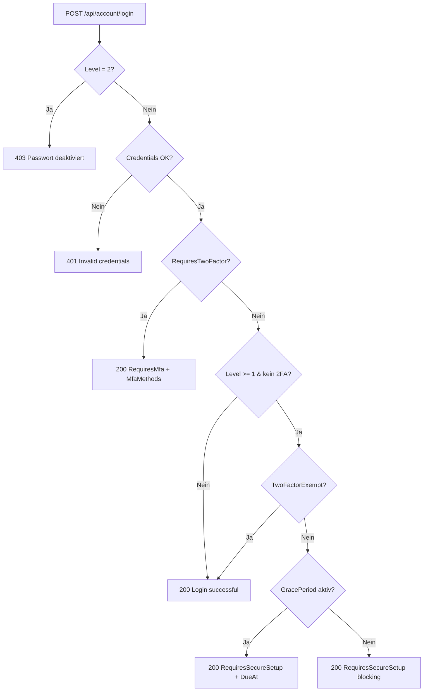

# Login-Flows

Alle Login-Wege im Detail. Endpoints sind unter `/api/account/...`
gemountet (siehe `MapAccountEndpoints` in `Cocoar.Auth.Api/Program.cs`).

## Login-Flow-Übersicht



Nach `RequiresMfa` muss der Client einen zweiten Request senden:

- TOTP: `POST /api/account/mfa/login`
- Email OTP: `POST /api/account/email-otp/login`
- Passkey: `POST /api/account/passkey/login/complete`

Nach erfolgreichem zweiten Schritt ist die Session vollständig — das
`Cocoar.Auth.Auth`-Cookie wird gesetzt, alle folgenden Requests laufen
authentifiziert durch.

## Password-Login

```http
POST /api/account/login
Content-Type: application/json

{
  "username": "admin",
  "password": "ABC12abc!",
  "rememberMe": true
}
```

Mögliche Responses:

| Response | Bedeutung |
|---|---|
| `200 { authenticated: true }` | Login fertig — Cookie gesetzt |
| `200 { requiresTwoFactor: true, mfaMethods: [...] }` | Level ≥ 1, User hat 2FA — zweiter Schritt nötig |
| `200 { requiresSecureSetup: true, gracePeriod: true, secureSetupDueAt }` | User muss noch 2FA einrichten, hat Zeit bis `DueAt` |
| `200 { requiresSecureSetup: true, gracePeriod: false }` | Grace-Period vorbei, blocking |
| `401 Invalid credentials` | Username/Passwort falsch oder User locked |
| `403 Passwordless required` | Level = 2, Password-Login deaktiviert |

## TOTP-Login

```http
POST /api/account/mfa/login
Content-Type: application/json

{
  "code": "123456",
  "rememberMe": true
}
```

Greift auf den `Cocoar.Auth.2FA`-Cookie zu, der von `/login` gesetzt
wird und die UserId für 5 Minuten hält. Verifiziert den Code via
`UserManager.VerifyTwoFactorTokenAsync`. Bei Erfolg wird die Session
voll aufgebaut.

## Email-OTP-Login

```http
POST /api/account/email-otp/login/request
Content-Type: application/json

{ "userName": "alice" }
```

Sendet einen 6-stelligen Code per Mail. Rate-Limited via
`EmailOtpConfiguration.RateLimitMinutes`. Verify:

```http
POST /api/account/email-otp/login
Content-Type: application/json

{ "userName": "alice", "code": "123456", "rememberMe": true }
```

Maximal 3 Verify-Versuche pro Challenge, sonst muss ein neuer Code
angefordert werden.

## Passkey-Login (FIDO2 / WebAuthn)

Zwei-Schritt-Ceremony. Erst Optionen holen:

```http
POST /api/account/passkey/login/options
Content-Type: application/json

{ "userName": "alice" }
```

Antwort enthält die `AssertionOptions` (Challenge, RpId, allowCredentials).
Browser ruft `navigator.credentials.get(...)` auf, der User berührt
seinen Passkey. Antwort an:

```http
POST /api/account/passkey/login/complete
Content-Type: application/json

{ "assertion": { ... } }
```

Server verifiziert die Assertion, prüft den Sign-Count gegen
`StoredPasskeyCredential.SignCount` (Replay-Schutz) und setzt einen
persistenten Cookie (30 Tage).

## Passwordless via Passkey (ohne `userName`)

Wenn `POST /api/account/passkey/login/options` ohne `userName` aufgerufen
wird, generiert der Server `AssertionOptions` mit leerer
`AllowedCredentials`-Liste. Der Browser nutzt **discoverable credentials**
(resident keys) — der User wählt eine gespeicherte Identität aus dem
Authenticator. Die UserId wird aus dem `UserHandle` der Assertion
gelesen.

## Magic-Link-Login

Self-Service-Request:

```http
POST /api/account/magic-link/request
Content-Type: application/json

{ "email": "alice@example.com" }
```

Sendet eine Mail mit einem `?token=...&user=...`-Link. Klick öffnet:

```http
GET /api/account/magic-link/login?token=...&user=...
```

Backend hashed das Token, vergleicht es mit `MagicLinkChallenge.TokenHash`,
prüft Ablauf und setzt einen persistenten Cookie. Redirect auf das
Frontend.

::: tip Admin-Send statt Self-Service
Admin kann ohne Feature-Toggle einen Link verschicken via
`POST /api/admin/users/{id}/magic-link`. Wird für Notfallzugang
und Onboarding genutzt.
:::

## OIDC External Login

Drei Endpoints:

```http
GET /api/account/external-login/{idpConfigId}/start?returnUrl=/
```

→ ASP.NET Core `Challenge` mit dem dynamisch registrierten
OIDC-Scheme (`DynamicOidcSchemeManager`). Browser landet beim externen
IdP.

```http
GET /api/account/external-login/callback
```

→ `ExternalLoginProcessor` läuft:

1. Sucht `ExternalIdentityLink` (Issuer + Subject) → existierender User
   oder JIT-Create
2. `UserUpdateScriptRunner` führt `IdpConfig.UserUpdateScript` (Jint) aus
   → mappt Claims auf `{ firstname, lastname, email, acronym }`-Patch
3. Email-Konflikt (Email gehört anderem User) → Hard Reject
   (`Idp.EmailConflict`)
4. Login-Cookie gesetzt (persistent, 30 Tage)

Details zu IdP-Setup und Scripting siehe
[Identity-Provider (OIDC)](./identity-providers).

## OAuth-Authorize-Flow (externe Apps)

Ist ein anderes Thema — eine externe App startet via
`/connect/authorize` einen OAuth-Flow gegen cocoar.auth. Wenn der User
nicht eingeloggt ist, wird er auf das Login-UI redirected, durchläuft
den klassischen Login-Flow oben, kommt zurück zu `/connect/authorize`
und bekommt einen Authorization-Code. Siehe
[OAuth & OIDC](/concepts/oauth) und
[OpenIddict-Wiring](/guide/oauth).

## Logout

```http
POST /api/account/logout
```

Löscht das Auth-Cookie + invalidiert die `UserSession` in Marten. Im
Frontend macht das Logout-Composable einen `window.location`-Reload
(nicht nur eine Vue-Router-Navigation), damit der SignalR-Connection
sauber abreißt. Sonst hängt eine alte Subscription am alten User.
