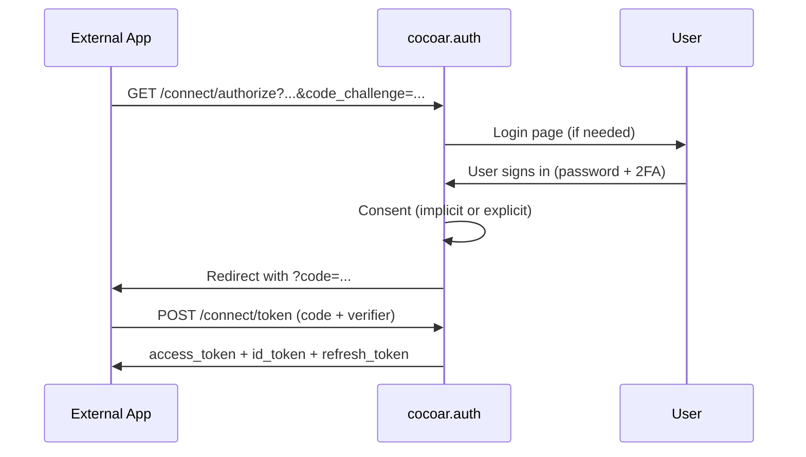

# Authentication

cocoar.auth has two orthogonal authentication axes:

1. **First-party login** — the user signs in to cocoar.auth itself
   (admin UI, profile, setup). Cookie-based, no token in the browser.
2. **OAuth/OIDC server** — external apps let users sign in via
   cocoar.auth. Authorization Code + PKCE, classic.

Both share the same login methods under the hood.

## First-party login

Implemented in the **Authentication slice**
(`Cocoar.Auth.Authentication`). Endpoints mounted under `/api/account/...`.

### Login methods

| Method | When | Cookie lifetime |
|---|---|---|
| **Password** | Default, allowed at AuthLevel 0/1 | Session or 30 days (RememberMe) |
| **TOTP** | Second factor after password | Inherits from the password step |
| **Email OTP** | Second factor — or as an alternative login | Inherits from the password step |
| **Passkey (FIDO2)** | Second factor — or as a sole login (passwordless) | Always 30 days (persistent) |
| **Magic Link** | Email with single-use token; can also be sent by an admin | Always 30 days |
| **OIDC External** | Federated login via Entra ID, Google, ... | 30 days |

See [Login flows](/authentication-slice/login-flows) for details.

### Authentication level

Configured globally via `IAuthSettings.AuthenticationMinimumLevel`:

| Level | Effect |
|---|---|
| 0 = None | Password-only allowed — no enforcement |
| 1 = SecureLogin (default) | User must have 2FA or a passwordless method |
| 2 = Passwordless | Password login disabled — only Magic Link + Passkey |

At level >= 1 the `TwoFactorEnforcementMiddleware` runs and blocks
authenticated requests from users without 2FA (with a grace period).

### Cookies

| Cookie | Purpose | SameSite | Lifetime |
|---|---|---|---|
| `Cocoar.Auth.Auth` | Main session (HttpOnly) | Lax | Session or 30 days |
| `Cocoar.Auth.2FA` | UserId between password step and 2FA step | Strict | 5 min |
| `Cocoar.Auth.External` | OIDC callback holder | Lax | 10 min |
| `Cocoar.Auth.Session` | Only for passkey attestation options | Strict | 5 min idle |

`SameSite=Lax` on the main session cookie is required so that OIDC
redirect-back navigations carry the cookie (top-level GET → cookie sent).
Cross-site POSTs are still blocked by `SameSite=Lax`, plus the
`CsrfDefenseMiddleware` rejects state-changing requests whose
`Sec-Fetch-Site` indicates cross-origin.

In production all cookies are `Secure`. In dev `Secure=None` so the
Vite dev server (`http://localhost:4300`) can write them.

## OAuth 2.0 / OIDC server

cocoar.auth is at the same time a full-fledged OpenID Connect provider
for external apps. Implemented via **OpenIddict 7** with its own
Marten-based stores (no Entity Framework).

### Flows

Supported: **Authorization Code + PKCE**, **Client Credentials**,
**Refresh Token**.

Not supported: Implicit Flow, ROPC.

See [OAuth & OIDC](/concepts/oauth) and
[OAuth implementation](/guide/oauth) for details.

### Per-realm isolation

Each realm is its own OIDC provider with its own discovery document at
`https://<realm-domain>/.well-known/openid-configuration`. Tokens from
realm A do not work in realm B — the issuer check blocks them.

This is implemented by the `RealmIssuerHandler` (an OpenIddict pipeline
hook): at boot there is a static issuer; the handler overrides it per
request with `BaseUri` (the current realm domain).

## Multi-factor authentication

Three independent 2FA methods, freely combinable:

| Method | How it works |
|---|---|
| **TOTP** | Authenticator app (Google Authenticator, Authy) — RFC 6238 |
| **Email OTP** | One-time code by email to the verified address |
| **WebAuthn/Passkey** | Hardware keys (YubiKey) or platform authenticators (TouchID, Windows Hello) |

Plus **recovery codes** as a last-resort backup.

## External login (OIDC IdPs)

Users can sign in via external OIDC providers (Entra ID, Google,
Auth0, ...). Configurable per realm.

1. Admin creates a `LoginProvider` of `Type = Oidc`: authority, client ID,
   client secret, `UserUpdateScript`
2. Login page automatically shows buttons for enabled OIDC providers
3. Click → OIDC Authorization Code + PKCE → IdP login
4. On callback: `ExternalLoginProcessor` runs
   - Looks up `ExternalIdentityLink` (issuer + subject) → existing user
     or JIT-create
   - `UserUpdateScript` (Jint) maps claims to user fields
5. If the user has 2FA enabled, the normal 2FA flow runs afterwards
6. Login cookie is set (always 30 days)

See [Login providers (OIDC)](/authentication-slice/login-providers)
for details.

## Account lifecycle

| How does a user enter the system? | Mechanism |
|---|---|
| Self-registration | Registration form (when enabled for the realm) |
| External login | OIDC IdP → JIT-create on first login |
| Admin-created | Admin creates the user via the UI |
| Setup | First-time setup — the first user becomes system admin |

Lifecycle states:

- **Active** — normal state
- **Locked** — by account lockout (5 failed logins → 1 min)
- **Soft-deleted** — `IsDeleted = true`, all data preserved,
  reactivatable
- **GDPR-erased** — stream archived, PII masked, irreversible
  (Article 17)

See [GDPR & sessions](/authentication-slice/gdpr-sessions).
