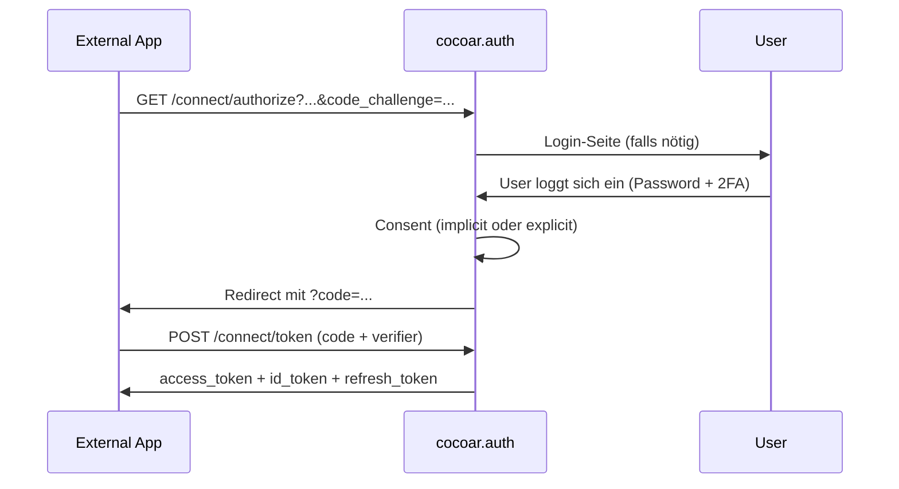

# Authentifizierung

cocoar.auth hat zwei orthogonale Authentifizierungs-Achsen:

1. **First-Party-Login** — User logged sich in cocoar.auth selbst ein
   (Admin-UI, Profil, Setup). Cookie-basiert, kein Token im Browser.
2. **OAuth/OIDC-Server** — externe Apps lassen User sich via cocoar.auth
   einloggen. Authorization Code + PKCE, klassisch.

Beide nutzen unter der Haube dieselben Login-Methoden.

## First-Party-Login

Implementiert im **Authentication-Slice**
(`Cocoar.Auth.Authentication`). Endpoint-Mounts unter `/api/account/...`.

### Login-Wege

| Methode | Wann | Cookie-Lifetime |
|---|---|---|
| **Password** | Standard, mit AuthLevel 0/1 erlaubt | Session oder 30 Tage (RememberMe) |
| **TOTP** | Zweiter Faktor nach Password | Erbt vom Password-Schritt |
| **Email OTP** | Zweiter Faktor — oder als alternativer Login | Erbt vom Password-Schritt |
| **Passkey (FIDO2)** | Zweiter Faktor — oder als alleiniger Login (Passwordless) | Immer 30 Tage (persistent) |
| **Magic Link** | E-Mail mit Single-Use-Token; auch admin-versendbar | Immer 30 Tage |
| **OIDC External** | Federated Login über Entra ID, Google, ... | 30 Tage |

Details siehe [Login-Flows](/authentication-slice/login-flows).

### Authentication-Level

Konfiguriert global via `IAuthSettings.AuthenticationMinimumLevel`:

| Level | Effekt |
|---|---|
| 0 = None | Password-only erlaubt — kein Enforcement |
| 1 = SecureLogin (Standard) | User muss 2FA oder Passwordless-Methode haben |
| 2 = Passwordless | Password-Login deaktiviert — nur Magic Link + Passkey |

Bei Level ≥ 1 läuft die `TwoFactorEnforcementMiddleware` und blockiert
authentifizierte Requests von Usern ohne 2FA (mit Grace-Period).

### Cookies

| Cookie | Wofür | Lifetime |
|---|---|---|
| `Cocoar.Auth.Auth` | Hauptsitzung (HttpOnly, SameSite=Strict) | Session oder 30 Tage |
| `Cocoar.Auth.2FA` | UserId zwischen Password-Step und 2FA-Step | 5 Min |
| `Cocoar.Auth.External` | OIDC-Callback-Holder (SameSite=Lax!) | 10 Min |
| `Cocoar.Auth.Session` | Nur für Passkey-Attestation-Options | 5 Min Idle |

In Production sind alle Cookies `Secure`. In Dev `Secure=None` damit
der Vite-Dev-Server (`http://localhost:4300`) sie schreiben darf.

## OAuth 2.0 / OIDC Server

cocoar.auth ist gleichzeitig ein vollwertiger OpenID-Connect-Provider
für externe Apps. Implementiert via **OpenIddict 7** mit eigenen
Marten-basierten Stores (kein Entity Framework).

### Flows

Unterstützt: **Authorization Code + PKCE**, **Client Credentials**,
**Refresh Token**.

Nicht unterstützt: Implicit Flow, ROPC.

Details siehe [OAuth & OIDC](/concepts/oauth) und
[OAuth-Implementierung](/guide/oauth).

### Per-Realm-Isolation

Jeder Realm ist sein eigener OIDC-Provider mit eigenem Discovery-Dokument
unter `https://<realm-domain>/.well-known/openid-configuration`. Tokens
aus Realm A funktionieren in Realm B nicht — Issuer-Check blockiert.

Das wird vom `RealmIssuerHandler` (OpenIddict-Pipeline-Hook)
umgesetzt: zur Boot-Zeit gibt es einen statischen Issuer; der Handler
überschreibt ihn pro Request mit `BaseUri` (= aktuelle Realm-Domain).

## Multi-Faktor-Authentifizierung

Drei unabhängige 2FA-Methoden, beliebig kombinierbar:

| Methode | Wie es funktioniert |
|---|---|
| **TOTP** | Authenticator-App (Google Authenticator, Authy) — RFC 6238 |
| **Email OTP** | One-Time-Code per E-Mail an verifizierte Adresse |
| **WebAuthn/Passkey** | Hardware-Keys (YubiKey) oder Platform-Authenticators (TouchID, Windows Hello) |

Plus **Recovery-Codes** als Last-Resort-Backup.

## External Login (OIDC IdPs)

User können sich über externe OIDC-Provider einloggen (Entra ID, Google,
Auth0, …). Pro Realm konfigurierbar.

1. Admin legt eine `IdpConfig` an: Authority, Client-ID, Client-Secret,
   `UserUpdateScript`
2. Login-Page zeigt automatisch Buttons für aktive IdpConfigs
3. Klick → OIDC Authorization Code + PKCE → IdP-Login
4. Auf Callback: `ExternalLoginProcessor` läuft
   - Sucht `ExternalIdentityLink` (Issuer + Subject) → existierender User
     oder JIT-Create
   - `UserUpdateScript` (Jint) mappt Claims auf User-Felder
5. Wenn User 2FA aktiv hat, läuft normaler 2FA-Flow danach
6. Login-Cookie wird gesetzt (immer 30 Tage)

Details siehe
[Identity-Provider (OIDC)](/authentication-slice/identity-providers).

## Account-Lifecycle

| Wie kommt ein User ins System? | Mechanismus |
|---|---|
| Self-Registration | Registrierungs-Form (wenn für Realm enabled) |
| External Login | OIDC-IdP → JIT-Create beim ersten Login |
| Admin-created | Admin legt User per UI an |
| Setup | First-Time-Setup — der erste User wird System-Admin |

Lifecycle-States:

- **Active** — normaler Zustand
- **Locked** — durch Account-Lockout (5 Failed Logins → 1 Min)
- **Soft-Deleted** — `IsDeleted = true`, alle Daten bleiben erhalten,
  reaktivierbar
- **GDPR-Erased** — Stream archived, PII gemasked, irreversibel
  (Article 17)

Siehe [GDPR & Sessions](/authentication-slice/gdpr-sessions).
