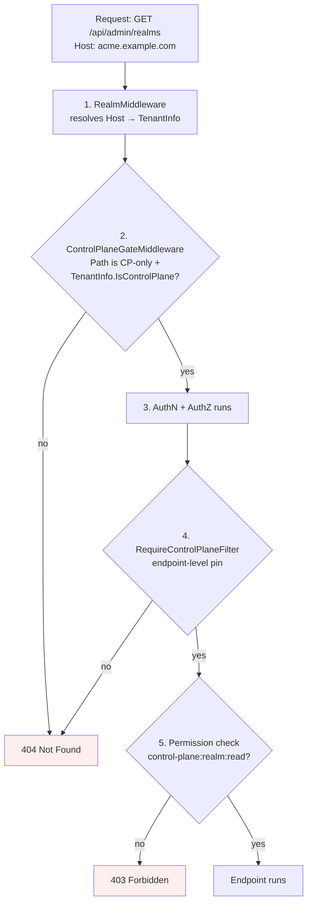

# Control Plane / Data Plane

cocoar.auth separates **cross-realm administration** (realm CRUD, the
first-run setup wizard) from **tenant self-service** (everything else)
on three independent layers. A request that hits a Control-Plane endpoint
from a tenant host has to defeat all three to succeed — and they're
deliberately decoupled so a regression in one doesn't open the others.

## Why bother

Every realm in cocoar.auth is a fully autonomous IdP — its own DB, users,
OAuth clients, login providers (see [Realms](./realms.md)). But two
operations are inherently cross-realm:

- **Realm CRUD** — `POST /api/admin/realms` provisions a *new* tenant DB.
- **First-run setup wizard** — `POST /api/setup/create-admin` creates the
  very first global admin in a fresh deployment.

Neither belongs on a tenant. A tenant should not even be able to
*discover* that a global admin surface exists at this hostname.

## Model

Exactly **one** realm per deployment is flagged
`Realm.IsControlPlane = true`. The system realm is the default Control
Plane (seeded with `IsControlPlane=true` at first boot). You can move
the flag to a different realm later, but you cannot remove it without
designating a successor — `RealmProvisioningService` validates that the
last Control-Plane flag stays put.

::: tip Naming
The permission namespace is `control-plane:*`, deliberately decoupled
from the product slug `cocoar-auth`. If the IdP product is ever
rebranded, cross-realm permissions don't need a migration.
:::

## Three-layer defence



### Layer 1 — Routing gate

`ControlPlaneGateMiddleware` (in `Cocoar.Auth.Api/Middleware`) runs
**before** authentication. For paths under `/api/admin/realms` and
`/api/setup`, it inspects the resolved `TenantInfo` and 404s the
request when `IsControlPlane=false` (or when no tenant resolved at all
— fail-closed).

**404, not 403**: the existence of the endpoint must be invisible to
tenants. A portscan of `tenant-a.example.com` looks identical to a
server that never had those endpoints.

### Layer 2 — Endpoint filter

`RequireControlPlaneFilter` (in `Cocoar.Auth.Infrastructure/Realms`) is
attached to the route group of every Control-Plane-only endpoint —
currently `/api/admin/realms/*` and `/api/setup/*`. It performs the
same `IsControlPlane` check the routing gate does.

This is **belt and suspenders**: a future routing-table change can't
quietly leak the surface, and a future endpoint added without the
routing prefix doesn't slip past the gate. Either layer alone closes
the gap; both together mean a single mistake doesn't open it.

### Layer 3 — Permission namespace

The permissions `control-plane:realm:read` and `control-plane:realm:write`
live on a separate `App` slug. `AppRealmSeeder` only registers the
`control-plane` app **into the Control-Plane realm's tenant DB**:

```csharp
// AppRealmSeeder.SeedAsync — called once per realm DB, on creation
await SeedAppIfMissingAsync(session, slug: AppSlugs.CocoarAuth, ...);
if (isControlPlane)
{
    await SeedAppIfMissingAsync(session, slug: AppSlugs.ControlPlane, ...);
}
```

A tenant realm doesn't have the app registered. A `Group` or `Role` in
a tenant DB can't grant `control-plane:realm:write` because the
`PermissionService` validates against the tenant's own resource
registry — and that registry doesn't list the `control-plane` app.

## Boot validation

In Production, `ControlPlaneSettings.Hostnames[]` (ENV
`ControlPlane__Hostnames=auth.example.com,admin.example.com`) must be
set; on host-start every entry is verified to resolve to a realm with
`IsControlPlane=true`. A typo aborts the boot — better than quietly
exposing realm CRUD on a tenant host.

Development and Testing skip the check and trust the system realm's
own `Domains` list, so a fresh checkout boots without ENV setup.

## What a tenant sees

The SPA reads `IsControlPlane: bool` from the anonymous
`/api/app-info` endpoint:

| Host                     | Sidebar shows "Realms" | `/api/admin/realms` |
|---|---|---|
| auth.example.com (CP)    | ✅ if user has `control-plane:realm:read` | 200 OK |
| acme.example.com (tenant)| Never                   | 404 Not Found |

## Layer-by-layer test pinning

| Layer | Tests | Where |
|---|---|---|
| Routing gate | `ControlPlaneGateMiddlewareTests` (5 cases) | `Cocoar.Auth.Tests.Unit/Api/Middleware/` |
| Endpoint filter | `RealmsEndpointsTests.RequireControlPlaneFilterTests` (4 cases) | `Cocoar.Auth.Tests.Unit/Api/Features/Admin/` |
| End-to-end | `ControlPlaneSeparationTests` (4 cases — tenant 404, CP 200, setup 404, app-info IsControlPlane) | `Cocoar.Auth.Api.Tests/Security/` |
| Realm-cache resolution | `RealmCacheLookupTests` | `Cocoar.Auth.Tests.Unit/Realms/` |

A regression in any one layer is caught by the layer's tests; a
regression in middleware ordering or wiring is caught by the
end-to-end suite.
