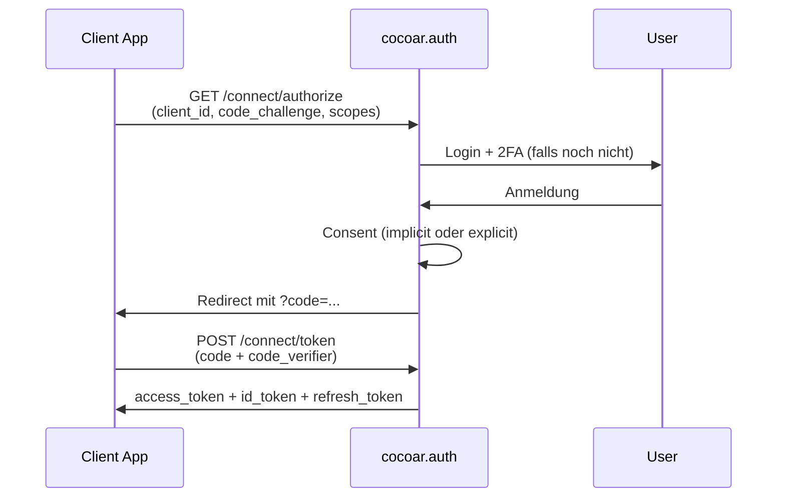

# OAuth 2.0 & OpenID Connect

## Überblick

cocoar.auth ist ein vollwertiger OAuth 2.0 Authorization Server und
OpenID Connect Provider. Implementiert via **OpenIddict 7** mit eigenen
Marten-basierten Stores (`MartenApplicationStore`, `MartenScopeStore`,
`MartenAuthorizationStore`, `MartenTokenStore`) — kein Entity Framework.

Begriffe (Client, Scope, API, Grant Type, Token-Typen) im
[Glossar](/concepts/glossary#oauth-oidc-begriffe).

## Die drei Akteure

| Akteur | Rolle | Beispiel |
|---|---|---|
| **User** | Die Person die sich einloggt | Jemand der Deine App benutzt |
| **Client** | Die Application die Zugriff requested | SPA, Mobile-App, Backend-Service |
| **API** | Der protected Service | Eine Billing-API, Order-API |

cocoar.auth steht in der Mitte — authentifiziert den User, gibt Tokens
an den Client aus, die API verifiziert die Tokens.

## Unterstützte Flows

### Authorization Code + PKCE (für User-Apps)

Standard für Web-Apps, SPAs, Mobile. PKCE (Proof Key for Code
Exchange) ist **erzwungen** (`RequireProofKeyForCodeExchange`).



### Client Credentials (für Services)

Machine-to-Machine. Service authentifiziert sich direkt mit Client-ID +
Secret, kein User involved:

```http
POST /connect/token
Content-Type: application/x-www-form-urlencoded

grant_type=client_credentials
client_id=my-service
client_secret=...
scope=billing.read
```

### Refresh Token

Aktiviert bei Clients die `offline_access` requesten. Refresh-Tokens
sind Reference-Tokens, server-seitig in
`OpenIddictTokenDocument` gespeichert.

::: warning Kein Implicit, kein ROPC
cocoar.auth lehnt Implicit Flow und Resource Owner Password
Credentials ab. Beide gelten als unsicher — OAuth 2.1 deprecated sie.
:::

## Token-Validation

Wie eine API einen Access-Token validiert hängt vom konfigurierten
Token-Format ab (per Client einstellbar):

| Token-Typ | Wie die API validiert |
|---|---|
| **Reference Token** (default) | Ruft den Introspection-Endpoint von cocoar.auth auf — bekommt User-Info, Scopes, Expiry zurück. Kann sofort revoked werden. |
| **JWT** | Verifiziert die Signatur lokal mit dem Signing-Key aus dem JWKS-Endpoint. Kein Roundtrip nötig, aber Revocation funktioniert nur über Expiry. |

Welches wann? Siehe
[Glossar > Access-Token-Format](/concepts/glossary#access-token-format).

## Per-Realm-Isolation

Jeder Realm hat seine eigene OAuth-Konfiguration:

- Clients aus Realm A können nicht gegen Realm B authentifizieren
- Tokens aus Realm A sind in Realm B ungültig (Issuer-Check)
- Jeder Realm hat seinen eigenen Discovery-Endpoint
- Issuer-Claim in Tokens enthält die Realm-Domain

Zwei Realms können beide einen Client mit `client_id=my-app` haben —
das sind verschiedene Clients.

Implementierung: `RealmIssuerHandler` (OpenIddict-Pipeline-Hook)
überschreibt den statischen Issuer pro Request mit `BaseUri`
(=Realm-Domain).

## Consent-Flow

Pro Client konfigurierbar:

| Consent Type | Verhalten |
|---|---|
| `implicit` | User sieht nie eine Consent-Seite. Authorization läuft automatisch durch. |
| `explicit` | User muss jeden Scope auf der Consent-Page bestätigen. Vorherige Zustimmungen werden gemerkt. |

Bei `explicit`:

1. `AuthorizationController` checkt nach existierenden permanenten
   Authorizations
2. Wenn keine → Redirect auf `/consent?returnUrl=...`
3. `ConsentController` zeigt Scope-Details + verarbeitet die Entscheidung
4. Approved Scopes werden als permanente Authorization gespeichert
5. Bei `prompt=none` ohne existierende Consent → `consent_required` Error

## Scopes & API-Resources

Default-Scopes (per Realm beim Provisioning geseedet):

| Scope | Zweck |
|---|---|
| `openid` | Required für OIDC, gibt User-ID zurück |
| `profile` | Vorname, Nachname |
| `email` | E-Mail-Adresse |
| `roles` | Rollen-Mitgliedschaften |
| `offline_access` | Aktiviert Refresh-Tokens |

**Custom Scopes** kann der Admin pro Realm anlegen, z.B.
`billing:read`, `repo:write`. Sie können `UserClaims` definieren — wenn
ein Token diesen Scope enthält, werden die spezifizierten Claims in
den Token gepackt.

**API-Resources** repräsentieren geschützte APIs. Pro API:

- Identifier (`audience`-Claim)
- Liste der unterstützten Scopes
- `UserClaims` die für diese API in Tokens landen sollen

## Token-Lifetimes

Konfiguriert in `OpenIddictSettings` (per-Client overridable):

| Token | Default | Setting-Key |
|---|---|---|
| Access Token | 60 Min | `AccessTokenLifetimeMinutes` |
| Refresh Token | 14 Tage | `RefreshTokenLifetimeDays` |
| Authorization Code | 5 Min | `AuthorizationCodeLifetimeMinutes` |

## Signing

| Mode | Konfiguration |
|---|---|
| Development | Ephemeral Signing/Encryption-Keys (auto-generiert, gehen beim Restart verloren) |
| Production | X.509-Zertifikat aus Datei (`SigningCertificatePath`) |

Im Dev-Mode kann jede Client-App nach jedem Restart von cocoar.auth ihre
Token-Validation neu auflegen (JWKS ändert sich). In Prod ist das
Zertifikat persistent — Restart ändert nichts.

## Admin-UI

Im Admin-Bereich (`/admin/oauth/...`) gibt es Listen + Detail-Views für:

- **Clients** — Application-Registrationen mit Secrets, Redirect-URIs,
  Grant-Types, per-Client Token-Settings
- **Scopes** — Permission-Definitionen (built-in + custom) mit
  UserClaim-Mappings
- **APIs** — Geschützte API-Resources mit Scopes und UserClaims

Gating: `oauth-client:read/write/delete`, `oauth-scope:read/write/delete`,
`oauth-api:read/write/delete`. Per-Resource-Admin-Bypass via
`oauth-client:admin` etc.
