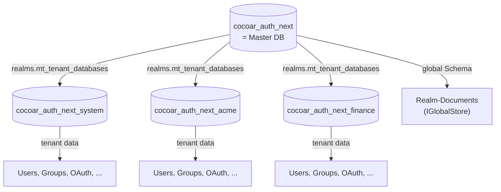

# Realms

## Was ist ein Realm?

Ein Realm ist ein **vollständig autonomer Identity Provider**. Es ist
die fundamentale Isolations-Boundary in cocoar.auth.

Pro Realm:

- eine eigene **PostgreSQL-Datenbank** (`cocoar_auth_next_<slug>`)
- eigene **User und Gruppen**
- eigene **Rollen und Permissions**
- eigene **OAuth-Clients, Scopes, APIs**
- eigene **OIDC-Discovery-Endpoint**
- eigene **Login-Provider** (Internal + OIDC-IdPs)
- eigene **Cookie-Domain**

Jeder Realm sieht aus wie eine eigenständige cocoar.auth-Installation —
weil er es im wesentlichen auch ist.

## Domain-basiertes Routing

cocoar.auth identifiziert den Realm über das **HTTP Host-Header** —
nicht über URL-Pfade. Jeder Realm hat eine oder mehrere konfigurierte
Domains.

```
acme.example.com         → Realm "acme"
auth.acme.example.com    → Realm "acme"  (zweite Domain für selben Realm)
finance.example.com      → Realm "finance"
system.example.com       → System-Realm
localhost                → System-Realm  (Single-Tenant-Fallback in Dev)
```

`RealmMiddleware` (in `Cocoar.Auth.Api.Middleware`) läuft vor allen
anderen Middlewares und:

1. Liest `request.Host.Host`
2. Schaut im `IRealmCache` nach einem Match
3. Setzt `HttpContext.Items["TenantId"] = realm.Slug`
4. Wenn kein Match → `404`

Der Cache wird beim Boot warmgeladen und bei Realm-CUD invalidiert.

::: tip Single-Tenant-Fallback in Dev
Wenn nur ein Realm aktiv ist UND der Host ist eine Localhost-Variante
(`localhost`, `127.0.0.1`, `::1`, `0.0.0.0`), gibt der Cache diesen
einen Realm zurück — auch wenn er die Localhost-Domain nicht in seiner
Liste hat. Damit funktioniert ein Single-Realm-Dev-Boot ohne
hosts-File-Eintrag.
:::

## Database-per-Tenant via Marten

cocoar.auth nutzt Martens `MasterTableTenancy`:



| Datenbank | Inhalt |
|---|---|
| `cocoar_auth_next` (Master) | Schema `realms.mt_tenant_databases` (Tenant-Registry) + Schema `global` (Realm-Documents) |
| `cocoar_auth_next_system` | System-Realm-Daten (User, Gruppen, ...) — physisch dieselbe DB wie die Master |
| `cocoar_auth_next_<slug>` | Eine eigene physische DB pro weiterem Realm |

::: info System-Realm und Master-DB
Der System-Realm zeigt absichtlich auf die Master-DB. So braucht eine
Single-Realm-Installation nur eine einzige DB. Mehr-Realm-Installationen
fügen eigene Tenant-DBs für die anderen Realms hinzu, ohne dass der
System-Realm sich von dort wegbewegen muss.
:::

### Tenant-Auflösung im Code

`TenantedSessionFactory` (Marten `ISessionFactory`) liest die `TenantId`
aus `HttpContext.Items` und öffnet eine tenant-scoped Session:

```csharp
public IDocumentSession OpenSession()
    => _store.LightweightSession(ResolveTenantId());

private string ResolveTenantId()
    => _httpContextAccessor.HttpContext?.Items[TenantConstants.HttpContextTenantIdKey] as string
       ?? TenantConstants.SystemTenantId;
```

Jede `IDocumentSession`/`IQuerySession`-Injection ist also automatisch
realm-scoped. Background-Services (ohne HttpContext) fallen auf den
System-Tenant zurück.

### GlobalStore für Realm-Documents

Das `Realm`-Dokument selbst kann nicht im Tenant-Store leben — sonst
gäbe es ein Henne-Ei-Problem. Es lebt in einem separaten Marten-Store
(`IGlobalStore`) der gegen Schema `global` der Master-DB schreibt.

`RealmCache` lädt die Realm-Liste daraus.

## Realm-Lifecycle

### 1. First-Time Bootstrap

Beim ersten Start:

1. **Master-DB erstellen** (raw SQL, weil Marten nicht
   `CREATE DATABASE` auf einer aktiven Connection kann)
2. **Marten-Schema applyen** → `realms.mt_tenant_databases` entsteht
3. **System-Tenant registrieren** → `tenancy.AddDatabaseRecordAsync("system", masterCs)`
4. **Marten-Schema nochmal applyen** → per-Tenant-Tabellen für System
5. **System-Realm-Document seeden** (in `IGlobalStore`)
6. **Default-OAuth-Scopes + Internal-LoginProvider seeden**
7. **RealmCache warmladen**
8. **Endpoint `/setup`** wartet auf den ersten Admin-Account

### 2. Weitere Realms anlegen

Nur User mit `realm:write` im System-Realm (oder einem anderen Realm
mit `CanManageTenants = true`) können das.

```http
POST /api/admin/realms
{
  "slug": "acme",
  "displayName": "Acme Corp",
  "domains": ["acme.example.com"],
  "canManageTenants": false
}
```

Backend:

1. Validiert `slug` (Regex, kein Reserved-Word)
2. `CREATE DATABASE cocoar_auth_next_acme` (raw SQL)
3. `tenancy.AddDatabaseRecordAsync("acme", connStringForAcme)`
4. `Storage.ApplyAllConfiguredChangesToDatabaseAsync()`
5. **OAuthRealmSeeder** → 5 Default-Scopes + Internal-Login-Provider
6. **AuthorizationSeeder** → 3 Default-Rollen (System Admin, User
   Manager, Viewer)
7. `Realm`-Document in `IGlobalStore` speichern
8. `RealmCache.Invalidate()` → nächster Request lädt frisch

Der neue Realm braucht initialen Setup wie der System-Realm:
`/setup`-Page erscheint beim ersten Aufruf der Realm-Domain, der
allererste User wird zum System-Admin (mit `app:admin`).

### 3. Realm deaktivieren

```http
PATCH /api/admin/realms/{slug}
{ "isActive": false }
```

`RealmCache` filtert auf `IsActive = true` — inaktive Realms werden
nicht mehr aufgelöst, alle Requests an die Domain landen bei `404`.
Daten bleiben in der DB.

::: danger System-Realm nicht deaktivieren
Der System-Realm darf nicht deaktiviert werden — sonst hast Du keinen
Eingang mehr ins System.
:::

### 4. Realm hard-löschen

::: warning In Arbeit
Aktuell ist nur Soft-Delete (Deaktivierung) implementiert. Hard-Delete
müsste die Tenant-DB sauber droppen, Wolverines durability-Agent
herunterfahren, Sessions invalidieren — komplex. Roadmap-Item.
:::

## OIDC-Endpoints pro Realm

Da jeder Realm seine eigene Domain hat, hat er auch seine eigenen
OIDC-Endpoints:

| Endpoint | Acme |
|---|---|
| Discovery | `https://acme.example.com/.well-known/openid-configuration` |
| Authorize | `https://acme.example.com/connect/authorize` |
| Token | `https://acme.example.com/connect/token` |
| UserInfo | `https://acme.example.com/connect/userinfo` |
| End Session | `https://acme.example.com/connect/logout` |
| Introspect | `https://acme.example.com/connect/introspect` |
| Revoke | `https://acme.example.com/connect/revoke` |

Der `RealmIssuerHandler` (OpenIddict-Pipeline-Hook) sorgt dafür, dass
das Discovery-Dokument den richtigen Issuer ausgibt. Tokens aus Realm
A sind in Realm B nicht gültig — der Issuer-Mismatch reicht zur
Ablehnung.

## Cross-Realm-Garantien

| Garantie | Mechanismus |
|---|---|
| Keine User-Daten leaken | Database-per-Tenant, physische DB-Boundary |
| Keine Permission-Leaks | Per-Tenant Marten-Sessions, keine Cross-Tenant-Joins |
| Keine Token-Leaks | Issuer-Claim-Check + per-Realm OpenIddict-Stores |
| Keine Cookie-Leaks | Cookie-Domain pro Realm |
| Keine SignalR-Leaks | Hub-Connection ist auth-gated, läuft im Realm-Context |
