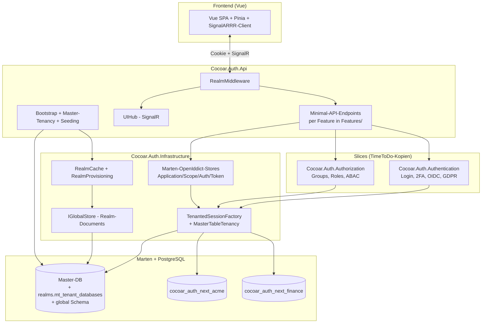

# Backend-Aufbau

cocoar.auth ist **nicht** klassisch geschichtet (Domain → Application →
Infrastructure). Stattdessen sind die Kernfunktionen in Vertical-Slices
organisiert, mit zusätzlichen IdP-spezifischen Layern darüber.

## Projekt-Layout

```
src/dotnet/
├── Cocoar.Auth.Authentication/   ← Slice (Login, 2FA, OIDC, GDPR, Sessions)
├── Cocoar.Auth.Authorization/    ← Slice (Groups, Roles, Permissions, ABAC)
├── Cocoar.Auth.Domain/           ← Realm, OAuth, LoginProvider Domain
├── Cocoar.Auth.Application/      ← DTOs, Service-Interfaces
├── Cocoar.Auth.Infrastructure/   ← OpenIddict-Stores, Tenancy, Realm-Cache, Wolverine-Handler
├── Cocoar.Auth.Api/              ← Minimal-API-Endpoints, Middleware, Setup, SignalR-Hub
├── Cocoar.Auth.Api.Tests/        ← Integration-Tests (Testcontainers + PostgreSQL)
└── Common/                       ← Geteilte Utilities (PathHelper, Optional<T>, ...)
```

## Komponenten-Diagramm



## Request-Lifecycle

```
Browser → ASP.NET Core
  ↓ UseRouting
  ↓ UseMiddleware<RealmMiddleware>          ← setzt HttpContext.Items["TenantId"]
  ↓ UseSession
  ↓ UseAuthentication                        ← Cookie-Auth
  ↓ UseAuthorization
  ↓ UseMiddleware<TwoFactorEnforcementMW>    ← blockiert User ohne 2FA bei Level ≥ 1
  ↓ Endpoint-Routing
  ↓ Endpoint mit RequiresPermission(...)     ← per-resource gating
  ↓ Handler
       ↓ IDocumentSession                    ← TenantedSessionFactory liest TenantId
       ↓ Marten Query gegen Tenant-DB
       ↓ Antwort
```

`TenantedSessionFactory` ist als Marten `ISessionFactory` registriert
(`AddMarten(...).BuildSessionsWith<TenantedSessionFactory>()`), so
dass jede `IDocumentSession`/`IQuerySession`-Injection automatisch
tenant-scoped ist.

## Wolverine-CQRS

CQRS-Commands und Queries werden via Wolverines `IMessageBus`
dispatched:

```csharp
var result = await _messageBus.InvokeAsync<ErrorOr<UserDto>>(
    new CreateUserCommand(...));
```

Handler werden auto-discovered. Cocoar.Auth läuft mit
`DurabilityMode.Solo` (in-memory, lokal) — kein externer Message-Broker
nötig. Die Marten-Outbox ist trotzdem aktiv für event-side-effects:
SignalR-Notifications werden nach `SaveChangesAsync` gefeuert über
`ProjectionSideEffects`.

Der Codegen läuft mit `TypeLoadMode.Auto` — beim Build werden
Wolverine-/Marten-Generierte Klassen vorgeneriert um Kaltstartzeit
und Roslyn-Compilation zur Laufzeit zu sparen.

## Marten-Verwendung

cocoar.auth nutzt drei Marten-Patterns:

### 1. Document-Storage

Klassischer Marten-Document-Store für ephemerere oder
sicherheitssensitive Daten — keine Event-Sourcing.

| Document | Inhalt |
|---|---|
| `ApplicationUser` | ASP.NET Identity-User |
| `UserSecurityData` | Password-Hash, TOTP-Key, Recovery-Codes, Passkey-Credentials |
| `UserSession` | Active Login-Session |
| `EmailOtpChallenge`, `MagicLinkChallenge`, `WebAuthnChallenge` | ephemerere Challenges |
| `IdpConfig` | OIDC-IdP-Konfiguration |
| `OpenIddictAuthorizationDocument`, `OpenIddictTokenDocument` | OAuth-Tokens + Authorizations |

### 2. Inline-Projections (`*State`)

Synchron innerhalb der `SaveChanges`-Transaktion. Garantieren dass der
nächste Read nach einem Write den neuen Stand sieht. Genutzt für
Validation und Identity-Stores.

| Projection | Was sie hält |
|---|---|
| `OAuthApplicationState` | OpenIddict-Application-State |
| `OAuthScopeState` | OpenIddict-Scope-State |
| `OAuthApiState` | API-Resource-State |
| `LoginProviderState` | Internal/External-Login-Provider-State |

### 3. Event-Sourced Aggregates

OAuth-Domain-Aggregate sind voll-event-sourced via Marten:

| Aggregate | Events |
|---|---|
| `OAuthApplicationAggregate` | Created, Updated, Deleted, Renamed, ... |
| `OAuthScopeAggregate` | Created, ResourcesChanged, ... |
| `OAuthApiAggregate` | Created, Updated, Scopes-Changed, ... |
| `LoginProviderAggregate` | Created, Updated, Disabled, ... |

User-Events werden vom Authentication-Slice gefeuert (`UserCreated`,
`UserUpdated`, `UserPasswordChanged`, `UserLoggedIn`, ...). Der Slice
selbst speichert Identity über `ApplicationUser`-Document; die Events
sind separat für Audit und für die `PrincipalProjection` (siehe
Authorization-Slice).

## OpenIddict-Stores

cocoar.auth implementiert alle vier OpenIddict-Stores als
Marten-backed Stores, im Ordner
`Cocoar.Auth.Infrastructure/OpenIddict/`:

| Store | Backing |
|---|---|
| `MartenApplicationStore` | `OAuthApplicationState`-Inline-Projection (event-sourced via Aggregate) |
| `MartenScopeStore` | `OAuthScopeState`-Inline-Projection (event-sourced via Aggregate) |
| `MartenAuthorizationStore` | `OpenIddictAuthorizationDocument` (direct storage) |
| `MartenTokenStore` | `OpenIddictTokenDocument` (direct storage) |

Plus zwei Pipeline-Hooks:

- `RealmIssuerHandler` — überschreibt `context.Issuer` mit `BaseUri`
  pro Request (= Realm-Domain). So hat jeder Realm sein eigenes
  Discovery-Dokument.
- `AccessTokenTypeHandler` — schaltet pro Client zwischen
  Reference-Tokens und JWT um.

## Setup-Bootstrap

In `Program.cs` läuft beim Start ein expliziter Bootstrap-Pfad
(VOR `app.Run()`):

1. **Master-DB anlegen** (raw SQL, weil Marten das nicht kann während
   Connection auf einer fehlenden DB hängt)
2. **Marten-Schema applyen** (`Storage.ApplyAllConfiguredChangesToDatabaseAsync`)
   → `realms.mt_tenant_databases` entsteht
3. **System-Tenant registrieren** (`tenancy.AddDatabaseRecordAsync("system", masterCs)`)
4. **Marten-Schema nochmal applyen** → per-Tenant-Tabellen für System
5. **System-Realm-Document seeden** (`EnsureSystemRealmExistsAsync`)
6. **Default-OAuth-Scopes + Internal-Login-Provider seeden**
   (`OAuthRealmSeeder.SeedAsync`)
7. **RealmCache warmladen**

Erst danach beginnt Kestrel zuzuhören.

## Recovery-CLI

Der Authentication-Slice liefert eine Break-Glass-CLI. Statt Kestrel zu
starten kann das Image im Container mit `recover`-Subcommand laufen:

```bash
dotnet Cocoar.Auth.Api.dll recover list
dotnet Cocoar.Auth.Api.dll recover reset-2fa <username>
dotnet Cocoar.Auth.Api.dll recover set-email <username> <email>
dotnet Cocoar.Auth.Api.dll recover magic-link <username>
dotnet Cocoar.Auth.Api.dll recover rebuild-projections
```

Hilft beim Lockout: alle 2FA verloren, kein Admin mehr da, Projection
korrupt — alles per Container-Exec lösbar.

## Frontend-Schnittstelle

Der Vue-Frontend liegt unter `src/frontend-vue/` und wird im Container
über `app.UseSpaUI()` als statisches `wwwroot/` ausgeliefert. SignalR-Hub
unter `/signalr/ui` (`MapHARRRController<UIHub>`).

Mehr siehe [Vue-Frontend](/guide/frontend).

## Testing

Integration-Tests (`Cocoar.Auth.Api.Tests`) nutzen:

- **Testcontainers** — PostgreSQL in Docker, automatisch beim
  Test-Run gestartet
- **WebApplicationFactory** — In-Process Hosting der API mit
  Cookie-Auth
- **Per-Test-Class-DB-Isolation** — jede Test-Class hat ihre eigene DB
- **Shared PostgreSQL container** — eine Container-Instanz für alle
  Test-Collections, parallelisiert
- **WireMock** — Fake OIDC-Server für External-Login-Tests
- **Pre-generated Wolverine-/Marten-Code** (`TypeLoadMode.Auto`) —
  eliminiert Roslyn-Compilation zur Laufzeit
