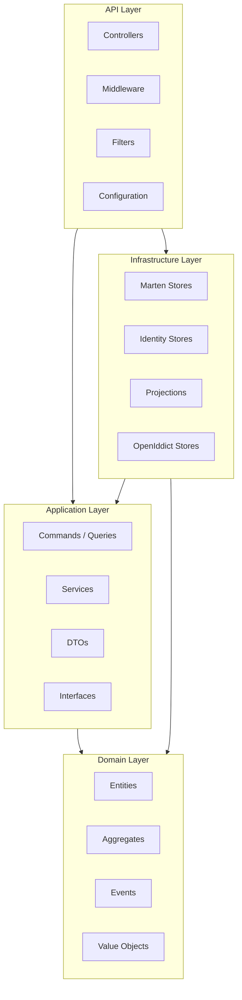

# Clean Architecture

Cocoar.Auth follows a 4-layer Clean Architecture where dependencies point inward. The Domain layer has no dependencies on other layers, and the API layer depends on everything.



## Projects

| Project | Layer | Purpose |
|---------|-------|---------|
| `Cocoar.Auth.Domain` | Domain | Entities, Aggregates, 60+ Domain Events, Value Objects |
| `Cocoar.Auth.Application` | Application | CQRS Commands/Queries via Wolverine, Services, DTOs, Interfaces |
| `Cocoar.Auth.Infrastructure` | Infrastructure | Marten stores, Identity implementation, Projections, Repositories |
| `Cocoar.Auth.Api` | API | REST Controllers, Middleware, Filters, Configuration |
| `Cocoar.Auth.Tests` | Testing | 271 integration tests with Testcontainers |

## Domain Layer

The innermost layer. No dependencies on frameworks or infrastructure.

### Entities

| Entity | Purpose |
|--------|---------|
| `ApplicationUser` | ASP.NET Core Identity user with custom fields (FirstName, LastName, IsActive, ExpiresAt, Roles, Claims) |
| `ApplicationRole` | Identity role with description and email fields |
| `UserSecurityData` | Security-sensitive data stored separately from event stream (password hash, authenticator key, recovery codes, WebAuthn credentials) |
| `Realm` | Tenant metadata (slug, display name, active status) |
| `UserSession` | Ephemeral active session tracking (IP, browser, device info) |
| `WebAuthnCredential` | FIDO2 credential (public key, sign count, device name) |
| `WebAuthnChallenge` | Ephemeral WebAuthn ceremony state |
| `EmailOtpChallenge` | Ephemeral email OTP verification state |
| `ExternalLoginState` | Ephemeral OIDC external login flow state |
| `OpenIddictAuthorizationDocument` | OAuth authorization/consent records |
| `OpenIddictTokenDocument` | OAuth reference tokens and refresh tokens |
| `OAuthApplicationSecurityData` | OAuth client secrets (stored separately from event stream) |

### Aggregates

Event-sourced aggregates that define the domain rules:

| Aggregate | Events | Purpose |
|-----------|--------|---------|
| `UserAggregate` | 30+ events | User lifecycle: creation, profile changes, security events, login tracking, GDPR |
| `RoleAggregate` | 8 events | Role management: creation, name/description/claim changes, deletion |
| `OAuthApplicationAggregate` | 12 events | OAuth client lifecycle: creation, settings changes, deletion |
| `OAuthScopeAggregate` | 13 events | Scope management with user claims and discovery settings |
| `OAuthApiAggregate` | 8 events | API resource lifecycle with scopes and user claims |
| `LoginProviderAggregate` | 6 events | External login provider configuration |

### Domain Events

Over 60 domain events organized by category:

**Profile Events** (carry data for audit):
`UserCreated`, `UserNameChanged`, `UserEmailChanged`, `UserPhoneNumberChanged`, `UserProfileNameChanged`, `UserExpirationChanged`, `UserActivated`, `UserDeactivated`, `UserDeleted`

**Security Events** (metadata only, no sensitive data):
`UserPasswordChanged`, `UserTwoFactorEnabled`, `UserTwoFactorDisabled`, `UserRecoveryCodesRegenerated`, `UserSessionsInvalidated`

**Auth Events** (for monitoring/audit):
`UserLoggedIn`, `UserLoginFailed`, `UserLockedOut`, `UserUnlocked`

**GDPR Events**:
`UserDeletionRequested`, `UserDeletionCancelled`, `UserDataMasked`, `UserDataExported`, `UserRestored`

**WebAuthn Events**:
`WebAuthnCredentialRegistered`, `WebAuthnCredentialDeleted`, `WebAuthnCredentialUsed`

**External Login Events**:
`UserExternalLoginLinked`, `UserExternalLoginRemoved`

**OAuth/Role/Scope/API/LoginProvider Events**: Full CRUD event sets for each aggregate.

## Application Layer

Orchestrates use cases. Depends only on the Domain layer (and defines interfaces that Infrastructure implements).

### CQRS with Wolverine

Commands and queries are dispatched via Wolverine's `IMessageBus`. Handlers are static methods discovered automatically by convention:

```csharp
// Command dispatch (controller)
var result = await _messageBus.InvokeAsync<ErrorOr<UserDto>>(
    new CreateUserCommand(...));

// Handler (auto-discovered)
public static async Task<ErrorOr<UserDto>> HandleAsync(
    CreateUserCommand command,
    IDocumentSession session,
    CancellationToken ct)
{
    // ...
}
```

Wolverine runs with in-memory, local queues (`DurabilityMode.Solo`) -- no external message transport needed.

### Services

| Service | Responsibility |
|---------|---------------|
| `AuthService` | Login, registration, password management, email confirmation |
| `UserService` | User profile CRUD, admin operations |
| `TwoFactorService` | TOTP setup/enable/disable, recovery codes |
| `SessionService` | Session creation, listing, revocation |
| `OAuthAdminService` | OAuth client/scope/API CRUD via admin UI |
| `GdprService` | Data export, deletion request/confirm/cancel |

### ErrorOr Pattern

All service operations return `ErrorOr<T>` for functional error handling. Controllers use `FromErrorOr()` to map errors to HTTP responses:

```csharp
var result = await _authService.LoginAsync(dto, ipAddress, userAgent, ct);
return FromErrorOr(result);
```

### Mapperly

Source-generated DTO mapping using [Mapperly](https://mapperly.riok.app/). Zero reflection, compile-time safe. Mappers are generated as partial classes.

## Infrastructure Layer

Implements interfaces defined in the Application layer. Contains all framework and database dependencies.

### Identity Implementation

The `EventSourcedUserStore` implements 14 ASP.NET Core Identity interfaces:

- `IUserStore`, `IUserPasswordStore`, `IUserEmailStore`, `IUserPhoneNumberStore`
- `IUserSecurityStampStore`, `IUserLockoutStore`, `IUserTwoFactorStore`
- `IUserClaimStore`, `IUserLoginStore`, `IUserAuthenticationTokenStore`
- `IUserRoleStore`, `IQueryableUserStore`
- `IUserAuthenticatorKeyStore`, `IUserTwoFactorRecoveryCodeStore`

It appends domain events for auditable changes while storing security-sensitive data in the `UserSecurityData` document (not event-sourced).

The `EventSourcedRoleStore` implements `IRoleStore`, `IRoleClaimStore`, and `IQueryableRoleStore`.

### OpenIddict Stores

Custom Marten implementations for all four OpenIddict store interfaces:

| Store | Entity | Strategy |
|-------|--------|----------|
| `MartenApplicationStore` | `OAuthApplicationState` | Event-sourced (hybrid: secrets in separate document) |
| `MartenAuthorizationStore` | `OpenIddictAuthorizationDocument` | Direct document storage |
| `MartenScopeStore` | `OAuthScopeState` | Event-sourced |
| `MartenTokenStore` | `OpenIddictTokenDocument` | Direct document storage |

### RealmCache

An in-memory `ConcurrentDictionary` of active realm slugs, loaded from the system database. The `RealmMiddleware` uses it for fast validation on every request. Invalidated when realms are created, updated, or deleted.

### AspNetCoreAuthenticationService

Wraps `SignInManager<ApplicationUser>` to expose authentication operations through an interface (`IAuthenticationService`). Includes `StoreTwoFactorUserAsync()` for the 2FA + external login flow.

## API Layer

The outermost layer. Handles HTTP concerns.

### Controllers

| Controller | Base Path | Purpose |
|-----------|-----------|---------|
| `AuthController` | `/api/auth` | Public authentication (login, register, 2FA, sessions, GDPR) |
| `AuthorizationController` | `/connect` | OpenID Connect endpoints (authorize, token, userinfo, logout) |
| `ConsentController` | `/api/consent` | OAuth consent flow |
| `SetupController` | `/api/setup` | First-time admin account creation |
| `UsersAdminController` | `/api/admin/users` | User CRUD (admin) |
| `RolesAdminController` | `/api/admin/roles` | Role CRUD (admin) |
| `OAuthAdminController` | `/api/admin/oauth` | OAuth client/scope/API management (admin) |
| `LoginProvidersAdminController` | `/api/admin/login-providers` | External login provider management (admin) |
| `RealmsAdminController` | `/api/admin/realms` | Realm management (system admin only) |

### Middleware

- **RealmMiddleware**: Runs before routing. Extracts realm slug from URL path, validates it against `RealmCache`, sets `PathBase` and `TenantId` on the `HttpContext`.

### Filters

- **SystemRealmOnlyAttribute**: Restricts endpoints (like realm management) to requests within the system realm.

### Rate Limiting

Fixed-window rate limiting with two policies:
- `auth-strict`: 10 requests/minute for authentication endpoints
- `general`: 60 requests/minute for other endpoints

## Key Design Decisions

### Event Sourcing for Audit Trail

All user, role, and OAuth entity mutations are captured as domain events. This provides a complete audit trail without a separate audit log. The event stream answers "what happened and when" for any entity.

### Security Data Separation

Security-sensitive data (password hashes, TOTP keys, client secrets) is deliberately stored in plain Marten documents, NOT in event streams. This prevents sensitive data from being replayed, projected, or exposed through event queries.

### Manual OIDC Flow for External Login

External login providers (Google, GitHub, etc.) are configured per-realm as `LoginProvider` documents rather than using ASP.NET Core's dynamic authentication scheme registration. The `ExternalLoginService` handles the OIDC protocol flow manually (discovery, authorization redirect, token exchange, userinfo) using the `OidcProtocolService`. This avoids the complexity of registering and managing authentication schemes at runtime across multiple tenants.

## Testing

### Integration Tests

271 integration tests across 32 test classes using:

- **Testcontainers**: PostgreSQL in Docker, started automatically per test run
- **WebApplicationFactory**: In-process API hosting with cookie-based authentication
- **SharedPostgresFixture**: Shared PostgreSQL container across all tests in the collection
- **WireMock**: Fake OIDC server (`FakeOidcServer`) for external login flow tests

Test classes cover all features: authentication, 2FA, sessions, GDPR, OAuth flows, consent, reference tokens, token claims, admin CRUD, realm management, realm isolation, and more.

### Playwright E2E Tests

25 end-to-end tests across 5 spec files using Playwright:

| Spec File | Tests |
|-----------|-------|
| `login.spec.ts` | Login flow, error handling |
| `navigation.spec.ts` | Sidebar navigation, routing |
| `profile.spec.ts` | Profile viewing and editing |
| `auth-flows.spec.ts` | OAuth authorization flows |
| `admin-login-providers.spec.ts` | Login provider management UI |

### Projection Naming Convention

| Suffix | Type | Purpose |
|--------|------|---------|
| `*State` | Inline Projection | Validation, Identity (synchronous) |
| `*ReadModel` | Async Projection | API responses (eventually consistent) |
| `*Data` | Value Object | Embedded data in projections |
