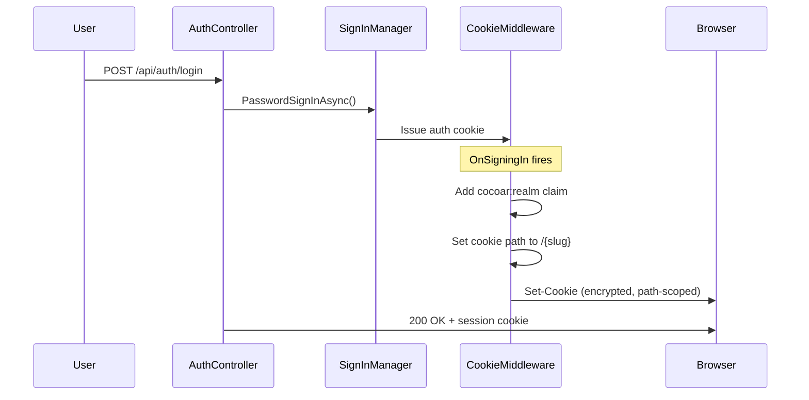

# Cookie-Based Authentication

Cocoar.Auth uses cookie-based authentication with ASP.NET Core Identity. No JWTs are stored in the browser -- all session state is server-side.

## How It Works

ASP.NET Core Identity issues an encrypted authentication cookie on login. The cookie contains the user's `ClaimsPrincipal` (user ID, roles, security stamp) encrypted with Data Protection. On each request, the cookie middleware decrypts the cookie and populates `HttpContext.User`.

Cocoar.Auth configures this through the `CookieAuthenticationOptions` for the `IdentityConstants.ApplicationScheme`:

```csharp
builder.Services.AddOptions<CookieAuthenticationOptions>(IdentityConstants.ApplicationScheme)
    .Configure<AuthSettings>((options, authSettings) =>
    {
        options.Cookie.HttpOnly = authSettings.Cookie.HttpOnly;
        options.Cookie.SecurePolicy = /* from config */;
        options.Cookie.SameSite = /* from config */;
        options.ExpireTimeSpan = TimeSpan.FromDays(authSettings.SessionExpirationDays);
        options.SlidingExpiration = authSettings.SlidingExpiration;
        // ...
    });
```

## Cookie Configuration

| Property | Value | Purpose |
|----------|-------|---------|
| HttpOnly | `true` | Not accessible via JavaScript -- mitigates XSS |
| Secure | Configurable (`Always` / `SameAsRequest` / `None`) | Controls HTTPS-only transmission |
| SameSite | `Lax` | CSRF protection while allowing top-level navigation |
| Path | `/{slug}` (per realm) | Prevents cross-realm session leakage |
| ExpireTimeSpan | 14 days (configurable) | Cookie lifetime |
| SlidingExpiration | `true` | Refreshes expiry on active use |

## Cookie Lifecycle

### Sign-In



During sign-in, the `OnSigningIn` event handler runs:

1. Reads the realm slug from `HttpContext.Items["RealmSlug"]`
2. Adds a `cocoar:realm` claim to the principal for auditing
3. Sets the cookie path based on the realm:
   - **System realm** gets path `/` -- this allows system admin cookies to reach all realm paths
   - **Other realms** get path `/{slug}` -- cookie is only sent for that realm's requests

```csharp
options.Events.OnSigningIn = context =>
{
    var realmSlug = context.HttpContext.Items["RealmSlug"] as string ?? "system";
    var identity = (ClaimsIdentity)context.Principal!.Identity!;
    identity.AddClaim(new Claim("cocoar:realm", realmSlug));

    if (realmSlug == "system")
        context.CookieOptions.Path = "/";     // reaches all realms
    else
        context.CookieOptions.Path = $"/{realmSlug}";

    return originalOnSigningIn?.Invoke(context) ?? Task.CompletedTask;
};
```

### Sign-Out and the Path Fix

When the browser receives a `Set-Cookie` with `Max-Age=0` to delete the auth cookie, the cookie path in the deletion response **must match** the path used when the cookie was set. Otherwise the browser silently ignores the deletion and the user remains logged in.

The `OnSigningOut` handler ensures the path matches:

```csharp
options.Events.OnSigningOut = context =>
{
    var realmSlug = context.HttpContext.Items["RealmSlug"] as string ?? "system";
    context.CookieOptions.Path = realmSlug == "system" ? "/" : $"/{realmSlug}";
    return originalOnSigningOut?.Invoke(context) ?? Task.CompletedTask;
};
```

### API Response Handling

For API calls, the cookie middleware is configured to return status codes instead of redirects:

- **Unauthenticated**: Returns `401` instead of redirecting to a login page
- **Forbidden**: Returns `403` instead of redirecting to an access-denied page
- **OAuth flows**: The `/connect/authorize` endpoint is an exception -- it allows redirects so the frontend can handle the login flow

## Multi-Realm Cookie Coexistence

Because cookies are scoped by path, multiple realm sessions can coexist in the same browser:

```
Cookie: .AspNetCore.Identity.Application  Path: /system  (system admin)
Cookie: .AspNetCore.Identity.Application  Path: /acme    (acme realm user)
Cookie: .AspNetCore.Identity.Application  Path: /corp    (corp realm user)
```

- A request to `/acme/api/...` only receives the `/acme`-scoped cookie
- A request to `/system/api/...` receives both the `/system` cookie AND the `/` cookie (system admin)
- The system realm cookie (path `/`) is intentionally broad so system admins can access any realm's API endpoints

::: warning
The system admin cookie having path `/` means it is sent on every request to every realm. This is by design -- system admins need cross-realm access. Realm-specific cookies with path `/{slug}` provide the isolation.
:::

## Session Tracking

Separate from the auth cookie, Cocoar.Auth maintains a `UserSession` document in Marten for each active login. This provides session management features (view active sessions, revoke sessions) that the cookie alone cannot support.

### The Session Cookie

The `AuthController` manages a second cookie named `cocoar.session_id` that correlates the browser with a `UserSession` document:

```csharp
private const string SessionCookieName = "cocoar.session_id";

private async Task CreateSessionCookieAsync(Guid userId, CancellationToken ct)
{
    var ip = GetClientIpAddress();
    var ua = Request.Headers.UserAgent.ToString();
    var result = await _sessionService.CreateSessionAsync(userId, ip, ua, ct);
    if (!result.IsError)
    {
        Response.Cookies.Append(SessionCookieName, result.Value.Id.ToString(), new CookieOptions
        {
            HttpOnly = true,
            Secure = Request.IsHttps,
            SameSite = SameSiteMode.Lax,
            IsEssential = true
        });
    }
}
```

### UserSession Document

Each login creates a `UserSession` Marten document (NOT event-sourced, since sessions are ephemeral state):

| Field | Source | Purpose |
|-------|--------|---------|
| `UserId` | Auth system | Links session to user |
| `SessionId` | Random GUID | Correlates with the `cocoar.session_id` cookie |
| `IpAddress` | `HttpContext.Connection.RemoteIpAddress` | Audit / display |
| `Browser` | UAParser | e.g., "Chrome" |
| `BrowserVersion` | UAParser | e.g., "120.0" |
| `OperatingSystem` | UAParser | e.g., "Windows" |
| `OsVersion` | UAParser | e.g., "10" |
| `DeviceType` | UAParser | Desktop / Mobile / Tablet |
| `CreatedAt` | UTC timestamp | When the session was created |
| `LastActiveAt` | UTC timestamp | Updated on activity |
| `ExpiresAt` | UTC timestamp | Based on `SessionExpirationDays` config |

The User-Agent string is parsed by the UAParser library to extract browser, OS, and device information for display in the session management UI.

### Session Management

Users can view and manage their sessions through the API:

- `GET /api/auth/sessions` -- List all active sessions for the current user
- `DELETE /api/auth/sessions/{id}` -- Revoke a specific session
- `DELETE /api/auth/sessions` -- Revoke all sessions (logout everywhere)

Admins can also manage user sessions:

- `GET /api/admin/users/{id}/sessions` -- List a user's sessions
- `DELETE /api/admin/users/{id}/sessions` -- Force logout a user

## Security Summary

| Concern | Mitigation |
|---------|-----------|
| XSS token theft | `HttpOnly` -- JavaScript cannot read the cookie |
| Man-in-the-middle | `Secure` flag -- cookie only sent over HTTPS |
| CSRF | `SameSite=Lax` -- cookie not sent on cross-origin POST |
| Cross-realm leakage | Path scoping -- each realm's cookie isolated by URL path |
| Session persistence | Encrypted cookie + server-side `UserSession` document |
| Forced logout | Delete `UserSession` document; security stamp invalidation |
