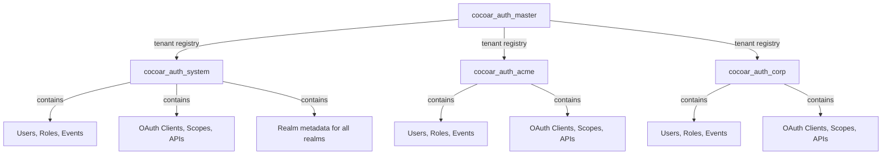

# Database & Migrations

Cocoar.Auth uses [Marten](https://martendb.io/) as both a document database and event store over PostgreSQL. Marten manages its own schema automatically -- there are no manual migrations.

## Multi-Tenant Architecture

Cocoar.Auth uses Marten's `MasterTableTenancy` for database-per-tenant multi-tenancy:



| Database | Purpose |
|----------|---------|
| `cocoar_auth_master` | Marten's `MasterTableTenancy` registry. Maps tenant slugs to connection strings in `realms.mt_tenant_databases`. |
| `cocoar_auth_system` | System realm data. Also stores `Realm` documents for all realms (tenant metadata). |
| `cocoar_auth_{slug}` | Per-realm databases. Each realm gets its own database with the full Marten schema. |

### How Tenant Resolution Works

1. `RealmMiddleware` extracts the realm slug from the URL path (`/{slug}/...`)
2. Sets `HttpContext.Items["TenantId"] = slug`
3. The scoped `IDocumentSession` and `IQuerySession` are registered to read the tenant ID:

```csharp
services.AddScoped<IDocumentSession>(sp =>
{
    var store = sp.GetRequiredService<IDocumentStore>();
    var tenantId = accessor.HttpContext?.Items["TenantId"] as string ?? "system";
    return store.LightweightSession(tenantId);
});
```

Marten's `MasterTableTenancy` looks up the tenant ID in the master registry table and returns a session connected to the correct database. If no `HttpContext` is available (e.g., during startup seeding), it falls back to the system tenant.

The `ITenantSessionFactory` provides the same resolution for services that need to open sessions explicitly (e.g., OpenIddict stores).

## Schema Management

Marten manages its own schema with `AutoCreate.CreateOrUpdate`. On startup:

```csharp
await store.Storage.ApplyAllConfiguredChangesToDatabaseAsync();
```

This creates or updates all tables, indexes, functions, and projections. No manual migrations needed.

## Event Sourcing

### Aggregates

Four aggregate types use event sourcing:

| Aggregate | Stream ID | Events |
|-----------|-----------|--------|
| `UserAggregate` | User ID (GUID) | `UserCreated`, `UserNameChanged`, `UserEmailChanged`, `UserPasswordChanged`, `UserLoggedIn`, `UserLoginFailed`, etc. |
| `RoleAggregate` | Role ID (GUID) | `RoleCreated`, `RoleNameChanged`, `RoleDescriptionChanged`, `RoleDeleted`, etc. |
| `OAuthApplicationAggregate` | Application ID (GUID) | `OAuthApplicationCreated`, `OAuthApplicationDisplayNameChanged`, `OAuthApplicationPermissionsChanged`, etc. |
| `OAuthScopeAggregate` | Scope ID (GUID) | `OAuthScopeCreated`, `OAuthScopeDisplayNameChanged`, `OAuthScopeResourcesChanged`, etc. |

Additional aggregates: `OAuthApiAggregate` (API resources) and `LoginProviderAggregate` (external identity providers).

### Event Storage

Events are stored in Marten's `mt_events` table with stream metadata in `mt_streams`. The events table stores the event type, data (JSON), timestamp, and stream ID. Over 60 event types are registered.

## Projections

### Inline Projections (Synchronous)

Inline projections run within the same transaction as the event append. They provide immediate consistency and are used for validation and Identity store lookups.

| Projection | Document | Purpose |
|-----------|----------|---------|
| `UserStateProjection` | `UserState` | Identity validation, uniqueness checks, authentication |
| `RoleStateProjection` | `RoleState` | Role lookups, claim resolution |
| `OAuthApplicationStateProjection` | `OAuthApplicationState` | OpenIddict client store operations |
| `OAuthScopeStateProjection` | `OAuthScopeState` | OpenIddict scope store operations |
| `OAuthApiStateProjection` | `OAuthApiState` | API resource management, introspection validation |
| `LoginProviderStateProjection` | `LoginProviderState` | External login provider configuration |

### Async Projections (Eventually Consistent)

Async projections run in a background daemon and are used for API response models. In production, they use `ProjectionLifecycle.Async` with Marten's async daemon (`DaemonMode.HotCold`). In development and tests, they run inline for simplicity.

| Projection | Document | Purpose |
|-----------|----------|---------|
| `UserDetailsProjection` | `UserDetailsReadModel` | Rich read model for admin API responses, includes denormalized role info |

### Naming Convention

| Suffix | Type | Purpose |
|--------|------|---------|
| `*State` | Inline Projection | Validation, Identity stores (synchronous) |
| `*ReadModel` | Async Projection | API responses (eventually consistent) |
| `*Data` | Value Object | Embedded data in projections |

## Document Storage (Non-Event-Sourced)

Some entities are stored as plain Marten documents because they are either ephemeral, security-sensitive, or not worth event-sourcing:

### Identity Documents

| Document | Purpose | Indexes |
|----------|---------|---------|
| `ApplicationUser` | ASP.NET Core Identity user document | `NormalizedUserName` (unique), `NormalizedEmail` |
| `ApplicationRole` | ASP.NET Core Identity role document | `NormalizedName` (unique) |

### Security Documents

| Document | Purpose | Notes |
|----------|---------|-------|
| `UserSecurityData` | Password hashes, TOTP keys, recovery codes, WebAuthn credentials | Same ID as the UserAggregate for correlation. Deliberately NOT event-sourced to keep sensitive data out of the event history. |
| `OAuthApplicationSecurityData` | OAuth client secrets, JSON Web Key Sets | Same ID as the OAuthApplicationAggregate. Same rationale. |
| `OAuthApiSecurityData` | API resource secrets | Same pattern. |

### Ephemeral Documents

| Document | Purpose | Lifetime |
|----------|---------|----------|
| `UserSession` | Active login session tracking (IP, browser, device) | Until logout or expiry |
| `EmailOtpChallenge` | Email OTP verification state (hashed code, attempts) | 10 minutes |
| `WebAuthnChallenge` | WebAuthn ceremony state (challenge bytes, options JSON) | 5 minutes |
| `ExternalLoginState` | OIDC external login flow state (nonce, PKCE, return URL) | Until callback completes |

### OpenIddict Documents

| Document | Purpose | Indexes |
|----------|---------|---------|
| `OpenIddictAuthorizationDocument` | Consent records and authorization grants | `ApplicationId`, `Subject` |
| `OpenIddictTokenDocument` | Reference tokens and refresh tokens | `ApplicationId`, `AuthorizationId`, `Subject`, `ReferenceId` |

## GDPR Compliance

### Data Masking

Marten's built-in GDPR support masks PII in archived event streams using `AddMaskingRuleForProtectedInformation`. When a user is permanently deleted, their events remain for audit purposes but PII fields are replaced:

```csharp
options.Events.AddMaskingRuleForProtectedInformation<UserCreated>(x =>
    new UserCreated(x.UserId, "[DELETED]", "[DELETED]", null, null, null,
        x.IsActive, x.LockoutEnabled, x.Roles));
```

Masking rules are configured for: `UserCreated`, `UserNameChanged`, `UserEmailChanged`, `UserPhoneNumberChanged`, `UserProfileNameChanged`, `UserLoggedIn`, `UserLoginFailed`.

### Stream Archiving

`ArchiveStream` excludes deleted user data from normal queries while preserving the event history for compliance audits.

## Serialization

Marten is configured with `System.Text.Json`:

```csharp
options.UseSystemTextJsonForSerialization(configure: o =>
{
    o.PropertyNamingPolicy = null;     // Exact property names (no camelCase)
    o.DefaultIgnoreCondition = JsonIgnoreCondition.WhenWritingNull;
    o.Converters.Add(new JsonStringEnumConverter());
});
```

Enums are stored as strings for readability in the database.

## Tenant Database Provisioning

When a new realm is created via `POST /system/api/admin/realms`:

1. **Validate slug**: Must match `^[a-z][a-z0-9-]{1,61}[a-z0-9]$` and not be a reserved word (`system`, `health`, `swagger`, `api`, `connect`, `realms`, `admin`, `static`, `assets`)
2. **Create PostgreSQL database**: Raw SQL `CREATE DATABASE "cocoar_auth_{slug}"`
3. **Register in Marten**: `tenancy.AddDatabaseRecordAsync(slug, connectionString)` adds the tenant to `realms.mt_tenant_databases`
4. **Apply Marten schema**: `ApplyAllConfiguredChangesToDatabaseAsync()` creates all tables, indexes, and functions
5. **Seed default data**: OpenIddict scopes (`openid`, `email`, `profile`, `roles`, `offline_access`) and the built-in "Internal" login provider
6. **Store metadata**: `Realm` document saved in the system tenant database
7. **Invalidate cache**: `RealmCache.Invalidate()` forces the next request to reload active realms

## Key Tables

| Table | Purpose |
|-------|---------|
| `mt_events` | Event store (all domain events, JSON data) |
| `mt_streams` | Event stream metadata (aggregate ID, version, type) |
| `mt_doc_applicationuser` | Identity user documents |
| `mt_doc_applicationrole` | Identity role documents |
| `mt_doc_usersecuritydata` | Password hashes, authenticator keys, WebAuthn credentials |
| `mt_doc_userstate` | Inline projection for Identity validation |
| `mt_doc_rolestate` | Inline projection for role lookups |
| `mt_doc_userdetailsreadmodel` | Async projection for API responses |
| `mt_doc_oauthapplicationstate` | Inline projection for OpenIddict clients |
| `mt_doc_oauthscopestate` | Inline projection for OpenIddict scopes |
| `mt_doc_oauthapistate` | Inline projection for API resources |
| `mt_doc_loginproviderstate` | Inline projection for external login providers |
| `mt_doc_usersession` | Active session records |
| `mt_doc_openiddictauthorizationdocument` | OAuth authorization/consent records |
| `mt_doc_openiddicttokendocument` | Reference tokens and refresh tokens |
| `realms.mt_tenant_databases` | Master tenancy registry (in master DB only) |
