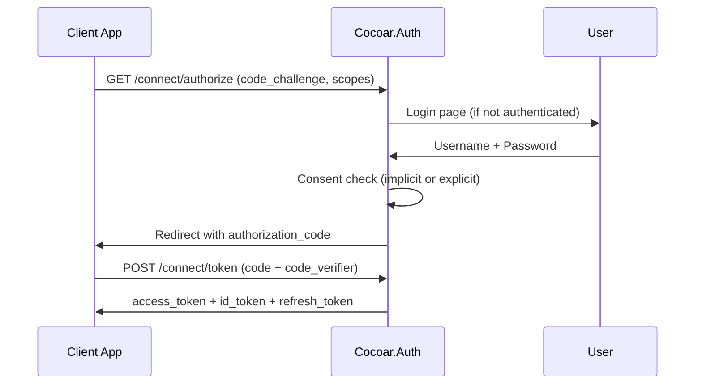

# OAuth / OpenID Connect

Cocoar.Auth is a full OAuth 2.0 + OpenID Connect server powered by [OpenIddict 7](https://documentation.openiddict.com/). All OpenIddict stores are backed by custom Marten implementations -- no Entity Framework Core dependency.

## Supported Flows

### Authorization Code + PKCE

The recommended flow for SPAs and native apps. PKCE (Proof Key for Code Exchange) is mandatory -- Cocoar.Auth enforces this via `RequireProofKeyForCodeExchange()`.



### Client Credentials

Machine-to-machine authentication. The client authenticates with its client ID and secret to receive an access token without user involvement.

```csharp
POST /connect/token
  grant_type=client_credentials
  client_id=my-service
  client_secret=***
  scope=api.read
```

Client credentials tokens can include custom roles and claims configured in the application's Properties (`cocoar:roles`, `cocoar:client_claims`).

### Refresh Token

Enabled for flows that request the `offline_access` scope. Refresh tokens are stored server-side as reference tokens.

## Access Token Types

Each client application can be configured with its own access token type. This is a per-client setting, not a global one.

### Reference Tokens (Default)

Reference tokens are opaque strings. The actual token payload is stored server-side in the `OpenIddictTokenDocument` Marten document. Resource servers validate tokens by calling the introspection endpoint.

- Immediate revocation -- delete the server-side record and the token is instantly invalid
- No claims exposed in the token itself
- Requires the resource server to call the introspection endpoint on each request

### JWT Tokens

Self-contained JSON Web Tokens that carry all claims. The resource server validates the signature locally without contacting Cocoar.Auth.

- No introspection round-trip needed
- Cannot be revoked before expiry (rely on short lifetimes)
- Claims are visible to anyone who decodes the token

### How AccessTokenTypeHandler Works

The `AccessTokenTypeHandler` is an OpenIddict server event handler that runs during the `ProcessSignIn` pipeline, just before the access token is generated. It checks the client's `AccessTokenType` setting from the `OAuthApplicationState` projection:

```csharp
public async ValueTask HandleAsync(ProcessSignInContext context)
{
    var app = await _querySession.Query<OAuthApplicationState>()
        .FirstOrDefaultAsync(a => a.ClientId == clientId && !a.IsDeleted);

    if (app?.AccessTokenType == AccessTokenType.Jwt)
    {
        // Disable reference token storage for this request.
        // OpenIddict generates a self-contained JWT instead.
        context.Options.UseReferenceAccessTokens = false;
    }
}
```

By default, `UseReferenceAccessTokens()` is enabled globally. The handler selectively disables it per-request for JWT clients.

## Consent Flow

The consent type is configured per client application:

| Consent Type | Behavior |
|-------------|----------|
| `implicit` | User is never shown a consent screen. Authorization proceeds automatically. |
| `explicit` | User must approve each scope on a consent page. Prior authorizations are remembered. |

For explicit consent:

1. The `AuthorizationController` checks for existing permanent authorizations
2. If none found, redirects to the consent page (`/consent?returnUrl=...`)
3. The `ConsentController` shows scope details and processes the user's decision
4. Approved scopes are stored as a permanent authorization for future requests
5. If `prompt=none` is requested but consent is required, returns `consent_required` error

## Per-Realm OIDC Isolation

Each realm is a fully independent OIDC provider. The realm slug is always the first path segment:

| Endpoint | URL Pattern |
|----------|-------------|
| Discovery | `/{slug}/.well-known/openid-configuration` |
| Authorize | `/{slug}/connect/authorize` |
| Token | `/{slug}/connect/token` |
| UserInfo | `/{slug}/connect/userinfo` |
| End Session | `/{slug}/connect/logout` |
| Introspect | `/{slug}/connect/introspect` |
| Revoke | `/{slug}/connect/revoke` |

For example, the system realm uses `/system/connect/token` and the Acme realm uses `/acme/connect/token`.

### RealmIssuerHandler

OpenIddict normally uses a single static issuer URI configured at startup. Cocoar.Auth overrides this with the `RealmIssuerHandler`, which runs after `AttachIssuer` in the discovery document pipeline:

```csharp
public ValueTask HandleAsync(HandleConfigurationRequestContext context)
{
    if (context.BaseUri is not null)
    {
        context.Issuer = context.BaseUri; // includes PathBase (e.g., /acme)
    }
    return default;
}
```

This ensures each realm's discovery document reports its own issuer URL (e.g., `https://auth.example.com/acme`), and tokens from one realm cannot be used in another.

## Token Introspection and Revocation

### Introspection

Resource servers validate reference tokens by calling the introspection endpoint:

```http
POST /{slug}/connect/introspect
Authorization: Basic <client_id:client_secret>
Content-Type: application/x-www-form-urlencoded

token=<reference_token>
```

The introspection response includes all claims from the stored token payload. The client must authenticate with its own credentials and must be listed as a resource for the token's scopes.

### Revocation

Clients can revoke their own tokens:

```http
POST /{slug}/connect/revoke
Content-Type: application/x-www-form-urlencoded

token=<token>
token_type_hint=access_token
```

For reference tokens, revocation deletes the server-side `OpenIddictTokenDocument`. The token becomes immediately invalid.

## Custom Marten Stores

OpenIddict requires four stores. Cocoar.Auth implements all of them with Marten, using a hybrid approach:

| Store | Entity | Storage Strategy |
|-------|--------|-----------------|
| `MartenApplicationStore` | `OAuthApplicationState` | Event-sourced via `OAuthApplicationAggregate`. Security data (`ClientSecret`, `JsonWebKeySet`) stored separately in `OAuthApplicationSecurityData` document. |
| `MartenAuthorizationStore` | `OpenIddictAuthorizationDocument` | Direct document storage. Authorizations are consent records -- not worth event-sourcing. |
| `MartenScopeStore` | `OAuthScopeState` | Event-sourced via `OAuthScopeAggregate`. Inline projection for immediate consistency. |
| `MartenTokenStore` | `OpenIddictTokenDocument` | Direct document storage. Tokens are ephemeral and security-sensitive. |

All stores use the `ITenantSessionFactory` to resolve the correct tenant database based on the current realm.

### Application Security Data Separation

Like `UserSecurityData`, OAuth application secrets are stored in a separate document (`OAuthApplicationSecurityData`) rather than in the event stream. This prevents client secrets from appearing in the event history:

```csharp
// During CreateAsync:
var securityData = OAuthApplicationSecurityData.Create(application.Id);
securityData.ClientSecret = application.PendingClientSecret;
session.Store(securityData);
```

## API Resources with Scopes and User Claims

API resources represent protected APIs that clients can request access to. Each API resource can declare:

- **Scopes**: Which scopes grant access to this API
- **UserClaims**: Which user claim types should be included in tokens when this API's scopes are requested

When a client requests a set of scopes, the `AuthorizationController` collects the allowed claim types from both scope definitions and their associated API resources, then includes matching user claims in the token.

## Admin Management

System and realm admins can manage OAuth entities through the admin API:

- **Clients**: Application registrations with secrets, redirect URIs, grant types, per-client token settings
- **Scopes**: Permission definitions (openid, email, profile, roles, custom) with user claim mappings
- **APIs**: Protected API resources with their own scopes and user claim requirements

## Token Lifetimes

Configured globally via `OpenIddictSettings` (can be overridden per-client via application settings):

| Token | Default Lifetime | Setting Key |
|-------|-----------------|-------------|
| Access Token | 60 minutes | `AccessTokenLifetimeMinutes` |
| Refresh Token | 14 days | `RefreshTokenLifetimeDays` |
| Authorization Code | 5 minutes | `AuthorizationCodeLifetimeMinutes` |

## Signing Credentials

| Mode | Configuration |
|------|---------------|
| Development | Ephemeral signing/encryption keys (auto-generated, lost on restart) |
| Production | X.509 certificate loaded from file path (`SigningCertificatePath`) |
