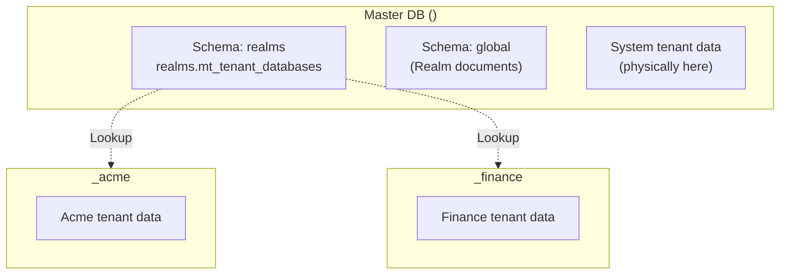

# Multi-tenancy / Realms

cocoar.auth uses a **realm model** for multi-tenancy. Each realm is a
fully autonomous Identity Provider with its own database, users,
roles, OAuth configuration, and login providers.

::: info "Realm" vs. "tenant"
User-facing it's called **realm** everywhere (UI, docs). The code uses
**tenant** in the infrastructure layer (`TenantId`,
`ITenantSessionFactory`, `MasterTableTenancy`), because that's what
Marten/Wolverine call it. `TenantId` = realm slug.
:::

## Domain-based routing

Realms are identified by the **Host header**, not by URL path. Each
realm has one or more configured domains:

| Hostname | Realm |
|---|---|
| `system.example.com` | System realm |
| `acme.example.com` | Acme realm |
| `auth.acme.example.com` | Acme realm (second domain) |
| `localhost` (dev, single-realm) | System realm (single-tenant fallback) |

`RealmMiddleware` (`src/dotnet/Cocoar.Auth.Api/Middleware/RealmMiddleware.cs`)
runs as the very first middleware:

```csharp
public async Task InvokeAsync(HttpContext context)
{
    var path = context.Request.Path.Value;
    if (SkipPaths.Any(p => path.StartsWith(p))) { await _next(context); return; }

    var hostname = context.Request.Host.Host;
    var tenantInfo = await _realmCache.ResolveDomainAsync(hostname);

    if (tenantInfo is null)
    {
        context.Response.StatusCode = 404;
        return;
    }

    context.Items[TenantConstants.HttpContextTenantIdKey] = tenantInfo.Slug;
    context.Items[TenantConstants.HttpContextTenantInfoKey] = tenantInfo;

    await _next(context);
}
```

Skip paths: `/health`, `/swagger`, `/openapi`, `/_framework`,
`/signalr` — these run without realm context.

### Single-tenant fallback in dev

If only **one** realm is active AND the host is a localhost variant
(`localhost`, `127.0.0.1`, `::1`, `0.0.0.0`), the cache returns that
realm — even if it doesn't list the localhost domain. This way a
single-realm dev boot works without a hosts-file entry.

## RealmCache

`RealmCache` (`Cocoar.Auth.Infrastructure/Realms/RealmCache.cs`) holds
a snapshot of the domain → realm mappings in memory:

```csharp
private sealed record CacheSnapshot(
    ConcurrentDictionary<string, TenantInfo> ByDomain,
    TenantInfo? SingleActiveRealm);
```

Loads all active realms from `IGlobalStore` (see below) at startup.
Invalidated on realm CUD (Create/Update/Delete via the admin API).

## Database-per-tenant via Marten

cocoar.auth uses Marten's `MasterTableTenancy`:



| Database | Contents |
|---|---|
| `<master-db>` (master) | `realms.mt_tenant_databases` (tenant registry) + schema `global` (Realm documents) + system tenant data |
| `<master-db>_<slug>` | A dedicated physical DB per additional realm |

The **system tenant intentionally points at the master DB**. This way
a single-realm installation only needs one DB. Multi-realm setups add
more tenant DBs without migrating the system tenant.

## TenantedSessionFactory

A Marten `ISessionFactory` implementation
(`Cocoar.Auth.Infrastructure/Persistence/Tenancy/TenantedSessionFactory.cs`)
that reads the `TenantId` from `HttpContext.Items`:

```csharp
public IDocumentSession OpenSession()
    => _store.LightweightSession(ResolveTenantId());

public IQuerySession OpenQuerySession()
    => _store.QuerySession(ResolveTenantId());

private string ResolveTenantId()
    => _httpContextAccessor.HttpContext?
         .Items[TenantConstants.HttpContextTenantIdKey] as string
       ?? TenantConstants.SystemTenantId;
```

Wired up via:

```csharp
builder.Services.AddMarten(...)
    .BuildSessionsWith<TenantedSessionFactory>();
```

This way every `IDocumentSession`/`IQuerySession` injection is
automatically realm-scoped. Background services without an
`HttpContext` fall back to the system tenant.

## IGlobalStore

The `Realm` document itself can't live in the tenant store —
chicken-and-egg. It lives in a separate Marten store (`IGlobalStore`)
against schema `global` of the master DB:

```csharp
public sealed record TenantInfo(string Slug, bool IsControlPlane, bool IsActive);

public class Realm
{
    public Guid Id { get; set; }
    public string Slug { get; set; }            // = TenantId, immutable
    public string DisplayName { get; set; }
    public string? Description { get; set; }
    public string[] Domains { get; set; }       // ["acme.example.com", ...]
    public bool IsControlPlane { get; set; }    // exactly one per deployment
    public bool IsActive { get; set; }
    public DateTimeOffset CreatedAt { get; set; }
    public DateTimeOffset? UpdatedAt { get; set; }
}
```

`RealmCache` loads the realm list from `IGlobalStore`.

## Bootstrap order

In `Program.cs` (before `app.Run`):

1. **Create master DB** (raw SQL)
2. **Apply Marten storage** → `realms.mt_tenant_databases` is created
3. **Register the system tenant in the tenancy table**
   (`tenancy.AddDatabaseRecordAsync("system", masterCs)`)
4. **Apply Marten storage again** → the system tenant gets per-tenant
   tables
5. **Seed system realm document** (`EnsureSystemRealmExistsAsync`)
6. **OAuthRealmSeeder** seeds 5 default scopes
   (`openid`, `email`, `profile`, `roles`, `offline_access`) +
   internal LoginProvider into the system tenant
7. **Warm up RealmCache**
8. **Check the recovery-CLI path** or start Kestrel

## Realm CRUD

Endpoints under `/api/admin/realms` — gated by
`control-plane:realm:read` / `control-plane:realm:write` and only
reachable on the **Control-Plane realm** (the realm flagged
`IsControlPlane = true`). On any other host: 404 (the existence of
the surface is hidden from tenant realms — see [Concepts: Control
Plane](../concepts/control-plane)).

### Create

`POST` requires an `InitialAdmin` payload — a realm with no admin path
would be unreachable.

```http
POST /api/admin/realms
{
  "Slug": "acme",
  "DisplayName": "Acme Corp",
  "Domains": ["acme.example.com"],
  "IsControlPlane": false,
  "InitialAdmin": {
    "UserName": "max",
    "Email": "max@acme.com"
  }
}
```

Backend:

1. Validates `slug` (regex, reserved-words check) and the
   exactly-one-Control-Plane invariant.
2. `CREATE DATABASE <master-db>_acme` (raw SQL).
3. `tenancy.AddDatabaseRecordAsync("acme", connStringForAcme)`.
4. `Storage.ApplyAllConfiguredChangesToDatabaseAsync()`.
5. **`OAuthRealmSeeder`** seeds 5 default scopes + the Internal login
   provider into the new tenant DB.
6. **`AppRealmSeeder`** seeds the `cocoar-auth` app. The
   `control-plane` app is **only** seeded when the new realm is itself
   the Control Plane.
7. `Realm` document persisted in `IGlobalStore`.
8. `RealmCache.Invalidate()`.
9. **Bootstrap-invite** issued atomically: a `PendingAdminInvite` is
   written into the new tenant DB, the magic-link email is sent, and
   the URL is returned in the response (`InitialAdminInvite.MagicLinkUrl`).

The recipient consumes the invite at `POST /api/account/bootstrap-admin`
on the new realm's host (anonymous, rate-limited under `bootstrap`),
sets a password, gets auto-signed-in. Atomic with that consume,
`RealmAdminBootstrapper` creates the user, seeds the three default
`PermissionRole`s (System Admin / User Manager / Viewer) and adds the
user to the `Administratoren` group with `realm:admin`.

### Update

```http
PATCH /api/admin/realms/{slug}
{
  "displayName": "Acme Corporation",
  "domains": ["acme.example.com", "auth.acme.com"]
}
```

`Slug` is immutable.

### Soft-delete (deactivate)

```http
PATCH /api/admin/realms/{slug}
{ "isActive": false }
```

`RealmCache` filters on `IsActive = true` — all requests to the realm
domain land on `404`. Data is preserved.

::: danger System realm
The system realm cannot be deactivated — the endpoint blocks that.
:::

### Hard-delete

::: warning In progress
Not currently implemented. Would need to drop the tenant DB cleanly,
shut down the Wolverine durability agent for the tenant, invalidate
sessions — see roadmap.
:::

## Cookies and sessions in a multi-realm setup

Since each realm has its own domain, cookies are automatically
realm-isolated by the browser's cookie-domain rule. A login on
`acme.example.com` sets a cookie for exactly that domain — it isn't
sent on `finance.example.com`. No path acrobatics required.

Sessions (`UserSession` documents) live per realm in the tenant store.
A user logged in to two realms has two separate sessions, in two
separate DBs.
