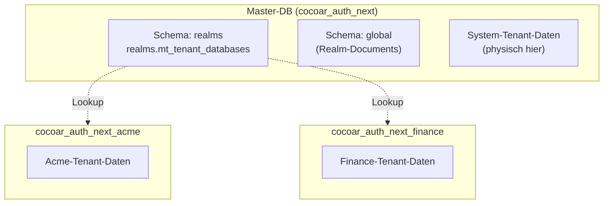

# Multi-Tenancy / Realms

cocoar.auth nutzt einen **Realm-Modell** für Multi-Tenancy. Jeder Realm
ist ein vollständig autonomer Identity Provider mit eigener Datenbank,
eigenen Usern, Rollen, OAuth-Configs und Login-Providern.

::: info "Realm" vs. "Tenant"
User-facing heißt es überall **Realm** (UI, Doku). Der Code nutzt
**Tenant** im Infrastructure-Layer (`TenantId`,
`ITenantSessionFactory`, `MasterTableTenancy`), weil Marten/Wolverine
das so nennen. `TenantId` = Realm-Slug.
:::

## Domain-basiertes Routing

Realms werden über das **Host-Header** identifiziert, nicht über
URL-Pfade. Jeder Realm hat eine oder mehrere konfigurierte Domains:

| Hostname | Realm |
|---|---|
| `system.example.com` | System-Realm |
| `acme.example.com` | Acme-Realm |
| `auth.acme.example.com` | Acme-Realm (zweite Domain) |
| `localhost` (dev, Single-Realm) | System-Realm (Single-Tenant-Fallback) |

`RealmMiddleware` (`src/dotnet/Cocoar.Auth.Api/Middleware/RealmMiddleware.cs`)
läuft als allererste Middleware:

```csharp
public async Task InvokeAsync(HttpContext context)
{
    var path = context.Request.Path.Value;
    if (SkipPaths.Any(p => path.StartsWith(p))) { await _next(context); return; }

    var hostname = context.Request.Host.Host;
    var tenantInfo = await _realmCache.ResolveDomainAsync(hostname);

    if (tenantInfo is null)
    {
        context.Response.StatusCode = 404;
        return;
    }

    context.Items[TenantConstants.HttpContextTenantIdKey] = tenantInfo.Slug;
    context.Items[TenantConstants.HttpContextTenantInfoKey] = tenantInfo;

    await _next(context);
}
```

Skip-Pfade: `/health`, `/swagger`, `/openapi`, `/_framework`,
`/signalr` — die laufen ohne Realm-Kontext.

### Single-Tenant-Fallback in Dev

Wenn nur **ein** Realm aktiv ist UND der Host eine Localhost-Variante
ist (`localhost`, `127.0.0.1`, `::1`, `0.0.0.0`), gibt der Cache
diesen Realm zurück — auch wenn er die Localhost-Domain nicht in seiner
Liste hat. Damit funktioniert ein Single-Realm-Dev-Boot ohne
hosts-File-Eintrag.

## RealmCache

`RealmCache` (`Cocoar.Auth.Infrastructure/Realms/RealmCache.cs`) hält
einen Snapshot der Domain → Realm-Mappings im Memory:

```csharp
private sealed record CacheSnapshot(
    ConcurrentDictionary<string, TenantInfo> ByDomain,
    TenantInfo? SingleActiveRealm);
```

Lädt beim Start aus dem `IGlobalStore` (siehe unten) alle aktiven
Realms. Wird invalidiert bei Realm-CUD (Create/Update/Delete via
Admin-API).

## Database-per-Tenant via Marten

cocoar.auth nutzt Martens `MasterTableTenancy`:



| Datenbank | Inhalt |
|---|---|
| `cocoar_auth_next` (Master) | `realms.mt_tenant_databases` (Tenant-Registry) + Schema `global` (Realm-Documents) + System-Tenant-Daten |
| `cocoar_auth_next_<slug>` | Eigene physische DB pro weiterem Realm |

Der **System-Tenant zeigt absichtlich auf die Master-DB**. So braucht
eine Single-Realm-Installation nur eine einzige DB. Mehr-Realm-Setups
fügen weitere Tenant-DBs hinzu, ohne dass der System-Tenant
wegmigriert.

## TenantedSessionFactory

Marten `ISessionFactory`-Implementierung
(`Cocoar.Auth.Infrastructure/Persistence/Tenancy/TenantedSessionFactory.cs`),
die die `TenantId` aus `HttpContext.Items` liest:

```csharp
public IDocumentSession OpenSession()
    => _store.LightweightSession(ResolveTenantId());

public IQuerySession OpenQuerySession()
    => _store.QuerySession(ResolveTenantId());

private string ResolveTenantId()
    => _httpContextAccessor.HttpContext?
         .Items[TenantConstants.HttpContextTenantIdKey] as string
       ?? TenantConstants.SystemTenantId;
```

Wired über:

```csharp
builder.Services.AddMarten(...)
    .BuildSessionsWith<TenantedSessionFactory>();
```

Damit ist jede `IDocumentSession`/`IQuerySession`-Injection automatisch
realm-scoped. Background-Services ohne `HttpContext` fallen auf den
System-Tenant zurück.

## IGlobalStore

Das `Realm`-Document selbst kann nicht im Tenant-Store leben — Henne-Ei.
Es lebt in einem separaten Marten-Store (`IGlobalStore`) gegen Schema
`global` der Master-DB:

```csharp
public sealed record TenantInfo(string Slug, bool CanManageTenants, bool IsActive);

public class Realm
{
    public Guid Id { get; set; }
    public string Slug { get; set; }            // = TenantId, immutable
    public string DisplayName { get; set; }
    public string? Description { get; set; }
    public string[] Domains { get; set; }       // ["acme.example.com", ...]
    public bool CanManageTenants { get; set; }  // darf andere Realms managen
    public bool IsActive { get; set; }
    public DateTimeOffset CreatedAt { get; set; }
    public DateTimeOffset? UpdatedAt { get; set; }
}
```

`RealmCache` lädt die Realm-Liste aus `IGlobalStore`.

## Bootstrap-Reihenfolge

In `Program.cs` (vor `app.Run`):

1. **Master-DB anlegen** (raw SQL)
2. **Marten-Storage applyen** → `realms.mt_tenant_databases` entsteht
3. **System-Tenant in der Tenancy-Tabelle eintragen**
   (`tenancy.AddDatabaseRecordAsync("system", masterCs)`)
4. **Marten-Storage nochmal applyen** → System-Tenant bekommt
   per-Tenant-Tabellen
5. **System-Realm-Document seeden** (`EnsureSystemRealmExistsAsync`)
6. **OAuthRealmSeeder** seedet 5 Default-Scopes
   (`openid`, `email`, `profile`, `roles`, `offline_access`) +
   Internal-LoginProvider in den System-Tenant
7. **RealmCache warmladen**
8. **Recovery-CLI-Pfad checken** oder Kestrel starten

## Realm-CRUD

Endpoints unter `/api/admin/realms` — gegated durch
`realm:read`/`realm:write` UND nur in Realms mit
`CanManageTenants = true` (sonst 404).

### Create

```http
POST /api/admin/realms
{
  "slug": "acme",
  "displayName": "Acme Corp",
  "domains": ["acme.example.com"],
  "canManageTenants": false
}
```

Backend:

1. Validiert `slug` (Regex, Reserved-Words check)
2. `CREATE DATABASE cocoar_auth_next_acme` (raw SQL)
3. `tenancy.AddDatabaseRecordAsync("acme", connStringForAcme)`
4. `Storage.ApplyAllConfiguredChangesToDatabaseAsync()`
5. **OAuthRealmSeeder** seedet die neue Tenant-DB
6. **AuthorizationSeeder** legt 3 Default-Rollen an (System Admin, User
   Manager, Viewer)
7. `Realm`-Document in `IGlobalStore`
8. `RealmCache.Invalidate()`

Der Realm ist sofort aufrufbar. Beim ersten Aufruf der Realm-Domain
landet der Browser auf `/setup` — der erste Visitor wird System-Admin.

### Update

```http
PATCH /api/admin/realms/{slug}
{
  "displayName": "Acme Corporation",
  "domains": ["acme.example.com", "auth.acme.com"]
}
```

`Slug` ist immutable.

### Soft-Delete (Deactivate)

```http
PATCH /api/admin/realms/{slug}
{ "isActive": false }
```

`RealmCache` filtert auf `IsActive = true` — alle Requests an die
Realm-Domain landen bei `404`. Daten bleiben erhalten.

::: danger System-Realm
Der System-Realm darf nicht deaktiviert werden — der Endpoint blockt
das.
:::

### Hard-Delete

::: warning In Arbeit
Aktuell nicht implementiert. Müsste die Tenant-DB sauber droppen,
Wolverine durability-Agent für den Tenant runterfahren, Sessions
invalidieren — siehe Roadmap.
:::

## Cookies und Sessions im Multi-Realm-Setup

Da jeder Realm seine eigene Domain hat, sind Cookies automatisch
realm-isoliert über die Browser-Cookie-Domain-Regel. Login in
`acme.example.com` setzt einen Cookie für genau diese Domain — er wird
bei `finance.example.com` nicht mitgeschickt. Keine Pfad-Akrobatik
nötig.

Sessions (`UserSession`-Documents) leben pro Realm im Tenant-Store.
Ein User der in zwei Realms eingeloggt ist hat zwei separate Sessions,
in zwei separaten DBs.
