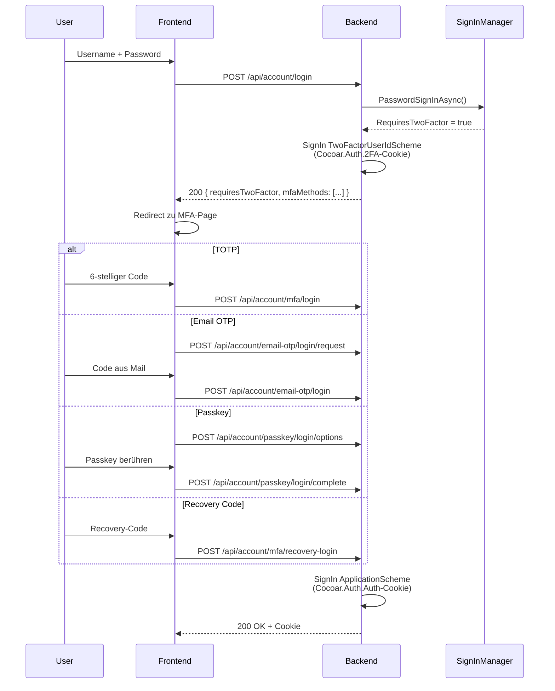

# Two-Factor Authentication

cocoar.auth unterstützt vier 2FA-Methoden, alle implementiert im
Authentication-Slice. Pro User können beliebig viele Methoden aktiv
sein.

| Methode | Service | Storage |
|---|---|---|
| TOTP | ASP.NET Core Identity DefaultTokenProviders | `UserSecurityData.AuthenticatorKey` |
| Email OTP | `EmailOtpService` | `EmailOtpChallenge` (ephemeral) |
| Passkey/FIDO2 | `Fido2NetLib` | `StoredPasskeyCredential` |
| Magic Link | `MagicLinkService` | `MagicLinkChallenge` (ephemeral) |

Plus **Recovery-Codes** als Last-Resort.

## Login-Flow mit 2FA



Beim ersten Login-Schritt wird das `Cocoar.Auth.2FA`-Cookie gesetzt
(Lifetime: 5 Min), das die UserId zwischen Schritt 1 und 2 hält. Erst
der erfolgreiche zweite Schritt setzt den vollen
`Cocoar.Auth.Auth`-Cookie.

## TOTP (Authenticator-Apps)

Standard RFC-6238, kompatibel mit Google Authenticator, Authy,
Microsoft Authenticator etc.

### Setup

```http
POST /api/account/mfa/setup
```

→ Generiert einen neuen Authenticator-Key (32 Byte Base32) via
`UserManager.ResetAuthenticatorKeyAsync()`. Returnt:

```json
{
  "sharedKey": "ABCD EFGH IJKL MNOP",
  "authenticatorUri": "otpauth://totp/CocoarAuth:alice@example.com?secret=...&issuer=CocoarAuth&digits=6"
}
```

`sharedKey` ist 4er-Gruppen-formatiert für manuelle Eingabe;
`authenticatorUri` für QR-Code-Generierung.

### Aktivieren

```http
POST /api/account/mfa/enable
{ "code": "123456" }
```

→ `UserManager.VerifyTwoFactorTokenAsync()` prüft den Code; bei Erfolg
wird `TwoFactorEnabled = true` gesetzt + 10 Recovery-Codes generiert.

### Deaktivieren

```http
POST /api/account/mfa/disable
{ "code": "123456" }
```

→ Verifiziert nochmal einen TOTP-Code. Reset Authenticator-Key.

::: warning Letztes 2FA bei Level ≥ 1
Wenn ein User sein letztes 2FA-Verfahren bei `AuthenticationMinimumLevel
>= 1` entfernt, wird `SecureSetupDueAt = now` gesetzt → er ist sofort
blockiert (kein neues Grace-Fenster).
:::

## Email OTP

6-stelliger Code per E-Mail an die verifizierte E-Mail-Adresse.

### Funktionsweise

1. **Request:** `POST /api/account/email-otp/login/request` generiert
   einen 6-stelligen Code, hashed ihn mit SHA-256, speichert den Hash
   in einem `EmailOtpChallenge`-Document
2. **Send:** Code per `IEmailService.SendEmailOtpAsync()`
3. **Verify:** `POST /api/account/email-otp/login` hashed den
   eingegebenen Code und vergleicht ihn

### Schutz-Mechanismen

| Schutz | Implementation |
|---|---|
| Rate-Limit | Mindestens 2 Min zwischen OTP-Requests |
| Expiry | 10 Min |
| Versuchs-Limit | Max. 3 Verify-Versuche pro Challenge |
| Code nicht im Klartext | Nur SHA-256-Hash gespeichert |

`EmailOtpChallenge` ist 1:1 per UserId — Request eines neuen Codes
ersetzt jede existierende Challenge.

## Passkey / FIDO2 / WebAuthn

Hardware-Keys (YubiKey) oder Platform-Authenticators (TouchID, Windows
Hello). Implementiert mit
[Fido2NetLib](https://github.com/passwordless-lib/fido2-net-lib).

### Registration-Ceremony

```http
POST /api/account/passkey/register/options
```

→ `CredentialCreateOptions` mit:
- `ResidentKey = Preferred` (für Discoverable Credentials → passwordless)
- `UserVerification = Preferred`
- `excludeCredentials` = bestehende Credentials des Users

Challenge-Bytes + Options-JSON in einem
`Cocoar.Auth.Session`-ASP.NET-Session-Eintrag (Marten
`DistributedMemoryCache` als Session-Store) gespeichert (5 Min Idle).

```http
POST /api/account/passkey/register/complete
{ "attestation": {...} }
```

→ `_fido2.MakeNewCredentialAsync()` verifiziert die Attestation gegen
die gespeicherte Challenge. Bei Erfolg wird ein
`StoredPasskeyCredential` angelegt.

### Authentication-Ceremony

```http
POST /api/account/passkey/login/options
{ "userName": "alice" }   // optional — leer = passwordless mode
```

→ `AssertionOptions` skopiert auf die existierenden Credentials des
Users. Bei `userName=null` werden discoverable credentials erlaubt
(passwordless).

```http
POST /api/account/passkey/login/complete
{ "assertion": {...} }
```

→ Verifiziert die Assertion via `_fido2.MakeAssertionAsync()`, prüft
SignCount gegen den gespeicherten Wert (Replay-Schutz),
updated `LastUsedAt`.

### Passwordless

`POST /api/account/passkey/login/options` ohne `userName` erzeugt
Options mit leerer `AllowedCredentials`-Liste → der Authenticator
wählt eine discoverable Credential aus. Die UserId wird aus dem
`UserHandle` der Assertion gelesen.

### StoredPasskeyCredential

| Feld | Zweck |
|---|---|
| `CredentialId` | Eindeutige ID (Base64-encoded) |
| `PublicKey` | COSE-Format Public-Key |
| `UserHandle` | UserId in Bytes (für Discoverable) |
| `SignCount` | Replay-Schutz-Counter |
| `DeviceName` | User-Label (z.B. "YubiKey 5") |
| `Aaguid` | Authenticator-Modell-ID |
| `Transports` | USB, NFC, BLE, internal |
| `LastUsedAt` | Audit |

### Konfiguration

In `Program.cs` aus `IServerConfiguration.PublicUrl` abgeleitet:

```csharp
builder.Services.AddFido2(options =>
{
    options.ServerDomain = publicUri.Host;
    options.ServerName = "Cocoar.Auth";
    options.Origins = fido2Origins;
});
```

In Dev werden zusätzlich `localhost:4300` und `https://localhost`
zugelassen.

## Magic Link

Einmal-Token per E-Mail. Zwei Modi:

- **Self-Service** (`POST /api/account/magic-link/request`) — nur
  wenn `IMagicLinkConfiguration.Enabled` AND
  `IAuthSettings.MagicLinkSelfService` beide `true`
- **Admin-Send** (`POST /api/admin/users/{id}/magic-link`) — immer
  verfügbar, kein Toggle

Klick auf den Link:

```http
GET /api/account/magic-link/login?token=...&user=...
```

Backend hashed das Token, vergleicht mit `MagicLinkChallenge.TokenHash`,
prüft Ablauf, setzt einen persistenten Cookie (immer 30 Tage), redirected
auf das Frontend.

## Recovery-Codes

10 Single-Use-Backup-Codes, generiert wenn 2FA aktiviert wird.

- Generiert via `UserManager.GenerateNewTwoFactorRecoveryCodesAsync()`
- Stored in `UserSecurityData.RecoveryCodes` (NICHT im Event-Stream)
- Each Code nur einmal nutzbar (`RedeemTwoFactorRecoveryCodeAsync()`)
- Regenerierung invalidiert alle vorherigen Codes
- Status-Abfrage: `GET /api/account/mfa/status` → `recoveryCodesRemaining`

## Security-Data-Trennung

Alle 2FA-Secrets liegen in `UserSecurityData` oder separaten
Documents — **nie** im Event-Stream.

| Daten | Storage | Begründung |
|---|---|---|
| Authenticator-Key | `UserSecurityData.AuthenticatorKey` | TOTP-Secret |
| Recovery-Codes | `UserSecurityData.RecoveryCodes` | Single-Use-Secrets |
| Passkey-Credentials | `StoredPasskeyCredential` (separates Doc) | Public-Key + Counter |
| Password-Hash | `UserSecurityData.PasswordHash` | sensitive |

Security-Domain-Events speichern nur Metadaten:

- `UserTwoFactorEnabled(UserId)` — kein Key
- `UserTwoFactorDisabled(UserId)` — kein Key
- `UserRecoveryCodesRegenerated(UserId, CodeCount)` — kein Code
- `PasskeyCredentialRegistered(UserId, CredentialId, DeviceName)` — kein PublicKey

So sind GDPR-Stream-Replays sicher und Event-Streams können nicht für
Credential-Extraction missbraucht werden.

## API-Endpoints

| Endpoint | Method | Zweck |
|---|---|---|
| `/api/account/mfa/status` | GET | Status (enabled, methods, recovery-codes-remaining) |
| `/api/account/mfa/setup` | POST | Authenticator-Key + QR-URI generieren |
| `/api/account/mfa/enable` | POST | 2FA mit Code aktivieren |
| `/api/account/mfa/disable` | POST | 2FA deaktivieren |
| `/api/account/mfa/recovery-codes` | POST | Recovery-Codes regenerieren |
| `/api/account/mfa/login` | POST | Login-Schritt 2 mit TOTP |
| `/api/account/mfa/recovery-login` | POST | Login mit Recovery-Code |
| `/api/account/email-otp/status` | GET | Email-OTP-Status |
| `/api/account/email-otp/login/request` | POST | Email-OTP anfordern |
| `/api/account/email-otp/login` | POST | Login mit Email-OTP |
| `/api/account/passkey/register/options` | POST | Passkey-Register Options |
| `/api/account/passkey/register/complete` | POST | Passkey-Registrierung abschließen |
| `/api/account/passkey/login/options` | POST | Passkey-Login Options |
| `/api/account/passkey/login/complete` | POST | Passkey-Login abschließen |
| `/api/account/passkey/credentials` | GET | Eigene Passkeys auflisten |
| `/api/account/passkey/credentials/{id}` | DELETE | Passkey löschen |
| `/api/account/magic-link/request` | POST | Magic Link Self-Service anfordern |
| `/api/account/magic-link/login` | GET | Magic Link Login |
