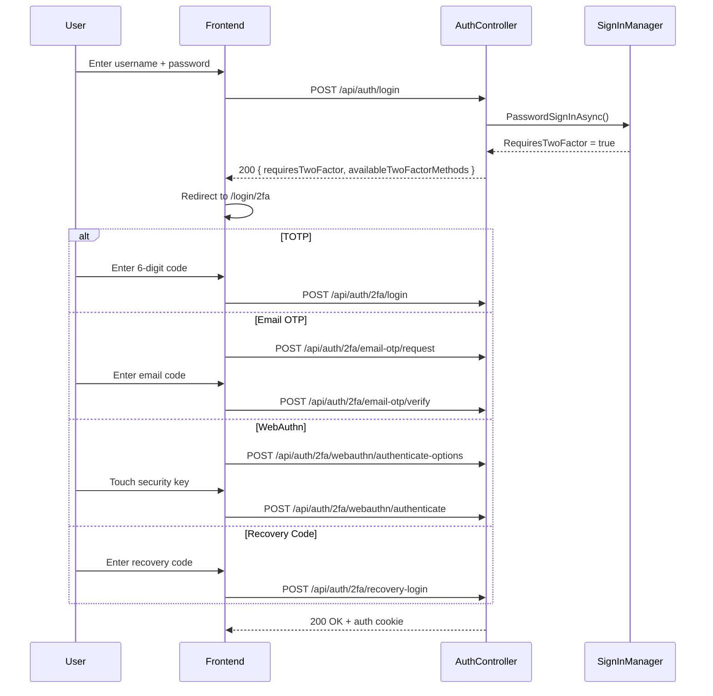

# Two-Factor Authentication

Cocoar.Auth supports multiple 2FA methods, all per-realm isolated. Each method is implemented as a separate service with its own challenge storage.

## Login Flow



When the initial login returns `requiresTwoFactor: true`, ASP.NET Core Identity stores the partially-authenticated user via the `TwoFactorUserIdScheme` cookie. This allows `GetTwoFactorAuthenticationUserAsync()` to retrieve the user for the second factor without requiring the password again.

## Supported Methods

### TOTP (Authenticator Apps)

Standard Time-based One-Time Passwords compatible with Google Authenticator, Authy, Microsoft Authenticator, etc.

#### Setup Flow

1. **Generate key**: `POST /api/auth/2fa/setup` calls `ResetAuthenticatorKeyAsync()` to generate a new authenticator key, then returns the shared key and an `otpauth://` URI for QR code scanning.

2. **Verify and enable**: `POST /api/auth/2fa/enable` with a 6-digit TOTP code. The code is verified using ASP.NET Core Identity's `VerifyTwoFactorTokenAsync()`. On success, 2FA is enabled and 10 recovery codes are generated.

3. **Disable**: `POST /api/auth/2fa/disable` requires a valid TOTP code for confirmation. Disabling resets the authenticator key.

```csharp
// TwoFactorService.GenerateSetupAsync
await _userManager.ResetAuthenticatorKeyAsync(user);
var key = await _userManager.GetAuthenticatorKeyAsync(user);
var authenticatorUri = string.Format(
    "otpauth://totp/{0}:{1}?secret={2}&issuer={0}&digits=6",
    urlEncoder.Encode("CocoarAuth"),
    urlEncoder.Encode(user.Email),
    key);
```

The shared key is formatted with spaces every 4 characters for manual entry (e.g., `abcd efgh ijkl mnop`).

### Email OTP

One-time codes sent to the user's verified email address.

#### How It Works

1. **Request OTP**: `POST /api/auth/2fa/email-otp/request` generates a cryptographically random 6-digit code, hashes it with SHA-256, and stores the hash in an ephemeral `EmailOtpChallenge` document.

2. **Send email**: The code is sent to the user's email via `IEmailSender.SendEmailOtpAsync()`.

3. **Verify**: `POST /api/auth/2fa/email-otp/verify` hashes the submitted code and compares it against the stored hash.

#### Protections

| Protection | Implementation |
|-----------|---------------|
| Rate limiting | Minimum 2 minutes between OTP requests (checked against `EmailOtpChallenge.CreatedAt`) |
| Expiry | OTP expires after 10 minutes |
| Attempt limiting | Maximum 3 verification attempts per challenge (`MaxAttempts = 3`) |
| Code not stored | Only the SHA-256 hash is stored, never the plaintext code |

The `EmailOtpChallenge` document is keyed by user ID (1:1 mapping), so requesting a new OTP replaces any existing challenge.

### WebAuthn / FIDO2

FIDO2-based hardware keys and platform authenticators (Touch ID, Windows Hello, passkeys). Implemented using the [Fido2NetLib](https://github.com/passwordless-lib/fido2-net-lib) library.

#### Registration Ceremony

1. **Get options**: `POST /api/auth/2fa/webauthn/register-options` creates a `CredentialCreateOptions` with:
   - `ResidentKey = Preferred` (supports discoverable credentials for passwordless)
   - `UserVerification = Preferred`
   - Excludes existing credentials to prevent duplicates

2. **Store challenge**: The challenge bytes and full options JSON are saved in a `WebAuthnChallenge` document (expires after 5 minutes).

3. **Complete registration**: `POST /api/auth/2fa/webauthn/register` verifies the attestation response against the stored challenge using `_fido2.MakeNewCredentialAsync()`. On success, a `WebAuthnCredential` is added to the user's `UserSecurityData`.

#### Authentication Ceremony

1. **Get options**: `POST /api/auth/2fa/webauthn/authenticate-options` creates `AssertionOptions` scoped to the user's existing credentials.

2. **Verify assertion**: `POST /api/auth/2fa/webauthn/authenticate` verifies the assertion response using `_fido2.MakeAssertionAsync()`, checks the signature counter for cloned authenticator detection, and updates the credential's `LastUsedAt` timestamp.

#### Passwordless Mode

When `GetAuthenticationOptionsAsync` is called without a user ID, it creates options with an empty `AllowedCredentials` list, enabling discoverable credential authentication. The user ID is extracted from the `UserHandle` in the assertion response.

#### Credential Storage

WebAuthn credentials are stored in the `WebAuthnCredentials` list within `UserSecurityData`:

| Field | Purpose |
|-------|---------|
| `CredentialId` | Unique identifier (base64 encoded) |
| `PublicKey` | COSE-format public key (byte array) |
| `UserHandle` | User ID in bytes (for discoverable credentials) |
| `SignCount` | Replay protection counter |
| `DeviceName` | User-assigned name (e.g., "YubiKey 5") |
| `Aaguid` | Authenticator model identifier |
| `Transports` | Supported transports (USB, NFC, BLE, internal) |

#### Configuration

WebAuthn settings are in `configs/webauthn-settings.json`:

```json
{
  "RelyingPartyId": "localhost",
  "RelyingPartyName": "Cocoar Auth",
  "Origins": ["http://localhost:4200"],
  "Timeout": 60000
}
```

### Recovery Codes

10 single-use backup codes generated when 2FA is enabled. These are the last resort for account access if all other 2FA methods are unavailable.

- Generated by ASP.NET Core Identity's `GenerateNewTwoFactorRecoveryCodesAsync()`
- Stored in `UserSecurityData.RecoveryCodes` (NOT in the event stream)
- Each code can only be used once (`RedeemTwoFactorRecoveryCodeAsync()`)
- Regenerating codes invalidates all previous codes
- Users can check remaining codes via `GET /api/auth/2fa/status` (`recoveryCodesRemaining` field)

## Security Data Separation

All 2FA secrets are stored in the `UserSecurityData` document, separate from the event stream:

| Data | Storage | Rationale |
|------|---------|-----------|
| Authenticator key | `UserSecurityData.AuthenticatorKey` | TOTP shared secret -- must not appear in event history |
| Recovery codes | `UserSecurityData.RecoveryCodes` | Single-use secrets |
| WebAuthn credentials | `UserSecurityData.WebAuthnCredentials` | Private keys and counters |
| Password hash | `UserSecurityData.PasswordHash` | Sensitive credential data |

Security-related domain events store metadata only:

- `UserTwoFactorEnabled(UserId)` -- records that 2FA was enabled, not the key
- `UserTwoFactorDisabled(UserId)` -- records that 2FA was disabled
- `UserRecoveryCodesRegenerated(UserId, CodeCount)` -- records count, not the codes
- `WebAuthnCredentialRegistered(UserId, CredentialId, DeviceName)` -- records the registration, not the public key

## 2FA with External Login

When a user authenticates via an external login provider (Google, GitHub, etc.) and has 2FA enabled, the flow requires special handling:

1. External login callback identifies the user
2. `StoreTwoFactorUserAsync()` stores the user's identity in the `TwoFactorUserIdScheme` cookie
3. The response returns `requiresTwoFactor: true` with available methods
4. Frontend redirects to `/login/2fa` where the user completes 2FA
5. `GetTwoFactorAuthenticationUserAsync()` retrieves the user from the temporary cookie
6. On successful 2FA verification, the full auth cookie is issued

```csharp
public async Task StoreTwoFactorUserAsync(ApplicationUser user, ...)
{
    var userId = await _userManager.GetUserIdAsync(user);
    var identity = new ClaimsIdentity(IdentityConstants.TwoFactorUserIdScheme);
    identity.AddClaim(new Claim(ClaimTypes.Name, userId));
    await context.SignInAsync(
        IdentityConstants.TwoFactorUserIdScheme,
        new ClaimsPrincipal(identity));
}
```

## API Reference

| Endpoint | Method | Purpose |
|----------|--------|---------|
| `/api/auth/2fa/status` | GET | Get 2FA status (enabled, methods, recovery codes remaining) |
| `/api/auth/2fa/setup` | POST | Generate authenticator key and QR URI |
| `/api/auth/2fa/enable` | POST | Enable 2FA with TOTP verification code |
| `/api/auth/2fa/disable` | POST | Disable 2FA (requires TOTP code) |
| `/api/auth/2fa/recovery-codes` | POST | Regenerate recovery codes |
| `/api/auth/2fa/login` | POST | Complete login with TOTP code |
| `/api/auth/2fa/recovery-login` | POST | Complete login with recovery code |
| `/api/auth/2fa/email-otp/request` | POST | Request email OTP |
| `/api/auth/2fa/email-otp/verify` | POST | Verify email OTP |
| `/api/auth/2fa/webauthn/register-options` | POST | Get WebAuthn registration options |
| `/api/auth/2fa/webauthn/register` | POST | Complete WebAuthn registration |
| `/api/auth/2fa/webauthn/authenticate-options` | POST | Get WebAuthn authentication options |
| `/api/auth/2fa/webauthn/authenticate` | POST | Complete WebAuthn authentication |
| `/api/auth/2fa/webauthn/credentials` | GET | List registered WebAuthn credentials |
| `/api/auth/2fa/webauthn/credentials/{id}` | DELETE | Delete a WebAuthn credential |
